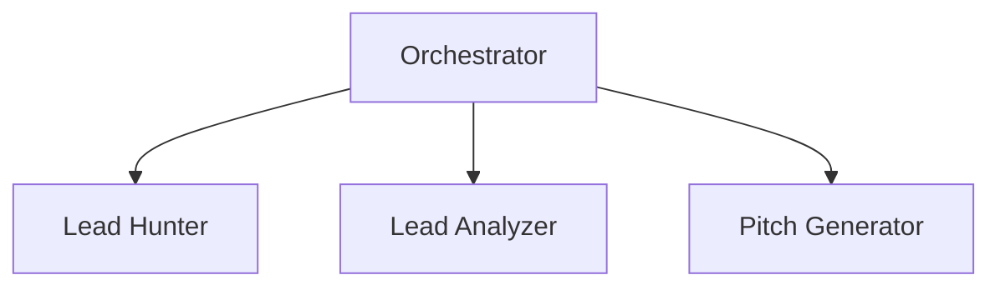

# ADR-04 — Backend Agent Architecture

| Campo | Valor |
|--------|-------|
| Código | ADR-04 |
| Clasificación | Architecture Decision Record |
| Versión | 1.3 |
| Estado | Approved |
| Fecha de creación | 2026-07-23 |
| Última actualización | 2026-07-29 |
| Responsable | AKVEZ Architecture Team |
| Nivel de confidencialidad | Interno |

---

# Historial de Versiones

| Versión | Fecha | Responsable | Descripción | Motivo |
|----------|------------|------------------|------------------------------|--------------------------------|
| 1.0 | 2026-07-23 | Architecture Team | Creación inicial, en borrador. Proponía sustituir "presentation" por "agent" como cuarta capa de los módulos backend. | Formalizar la organización backend necesaria para implementar los agentes de APS-03 |
| 1.1 | 2026-07-23 | Product Owner (revisión) | Se revierte la sustitución de capa: se mantiene "presentation" exactamente como la define ADR-01, reinterpretada como interfaz pública del módulo (Agent API). El Orchestrator pasa a ser obligatorio para todo workflow, sin excepción. Se añaden explícitamente las reglas de no comunicación directa entre agentes. | Preservar la simetría literal de capas entre frontend y backend, y eliminar cualquier ambigüedad sobre cuándo es opcional el Orchestrator |
| 1.2 | 2026-07-23 | Product Owner (aprobación) | Aprobación formal del documento sin cambios de contenido adicionales. | Habilitar el inicio de la migración de `server.ts` conforme a esta arquitectura |
| **1.3** | 2026-07-29 | AKVEZ Architecture Team | **Revisión aditiva de §11.** Se incorpora el servicio compartido **`shared/observability`** con su contenido y su regla de acceso, en el mismo formato que los cinco existentes, y una nota que declara que **`shared/logging/` no se crea**. **No se modifica ninguna otra sección**: ni §7 (principios), ni §8 (organización), ni §10 (Tools), ni ninguna de las cinco filas preexistentes de §11. **Ninguna decisión nueva**: la obligación de observar ya estaba aprobada en APS-16 §14 y APS-11 §4.5; lo que faltaba era su ubicación arquitectónica y su regla de acceso, materia propia de esta sección. | Sprint **GOV-04**, tarea 1. Ejecuta la revisión propuesta en **DP-02 §6** y ratificada en **DP-02 §8.1** (sprint GOV-03). **Cambio Menor** conforme a APS-13 §9. **Cierra la desviación A-04** de DEV-01A y el riesgo **RC-3** de AR-05 §8 |

---

# Tabla de Contenido

1. Resumen Ejecutivo
2. Objetivo
3. Alcance
4. Contexto
5. Problema
6. Decisión Arquitectónica
7. Principios
8. Organización del Backend
9. Contrato del Orchestrator
10. Ubicación de Tools
11. Servicios Compartidos
12. Alternativas Evaluadas
13. Decisiones Importantes
14. Riesgos
15. KPIs
16. Dependencias
17. Glosario
18. Referencias
19. Anexos
20. Definition of Done

---

# 1. Resumen Ejecutivo

Este documento define cómo se organiza físicamente el backend de AKVEZ para implementar los tres agentes de APS-03 (Lead Hunter, Lead Analyzer, Pitch Generator) bajo el modelo de orquestación ya aprobado en ADR-02, respetando la arquitectura modular de ADR-01 y la política de integraciones externas de ADR-03.

Los módulos de backend conservan **exactamente** las mismas cuatro capas que ADR-01 define para cualquier módulo de AKVEZ: `application`, `domain`, `infrastructure` y `presentation`. En backend, `presentation` no representa una interfaz gráfica sino la interfaz pública del módulo — su Agent API —, el único punto por el cual un agente expone sus capacidades hacia el exterior.

El Orchestrator es de uso **obligatorio** para todo workflow del backend, sin excepción. Ningún agente invoca a otro agente directamente, ni siquiera cuando un workflow involucra un único agente.

---

# 2. Objetivo

Definir una organización de backend implementable que permita extraer progresivamente la lógica hoy concentrada en `server.ts` hacia agentes independientes, sin violar ADR-01, ADR-02 ni ADR-03, y sin cambiar el comportamiento observable de la plataforma.

---

# 3. Alcance

Este ADR define:

- La forma de un módulo backend orientado a agentes, usando exactamente las capas de ADR-01.
- El contrato del Orchestrator y su carácter obligatorio.
- Las reglas de comunicación entre agentes.
- Dónde viven las Tools de cada agente.
- Dónde viven los servicios compartidos de IA y configuración.

No define:

- Los prompts ni la lógica interna de cada agente.
- La extracción concreta de código de `server.ts` (se ejecuta en sprints posteriores, tras la revisión de este documento).
- Persistencia ni la futura "Biblioteca de Leads" de APS-03.
- Proveedores de IA específicos más allá de los ya en uso (Gemini, Google Places), lo cual sigue gobernado por ADR-03.

---

# 4. Contexto

APS-03 exige tres agentes especializados (Lead Hunter, Lead Analyzer, Pitch Generator) comunicados de forma estrictamente secuencial. ADR-02 exige que esa comunicación nunca sea directa entre agentes, sino coordinada por un Orchestrator. ADR-01 exige que todo módulo del sistema siga una estructura de capas fija — la misma para frontend y backend. Hoy, toda esta lógica vive sin ninguna de estas separaciones, en un único archivo de 1024 líneas (`server.ts`), auditado en el Sprint anterior.

---

# 5. Problema

Una primera versión de este ADR propuso sustituir la capa `presentation` por una capa `agent`, asumiendo que "presentation" solo podía referirse a interfaz gráfica. Esa propuesta fue revisada y descartada: introduce una nomenclatura distinta entre frontend y backend sin necesidad real, y rompe la consistencia literal que ADR-01 exige para todo módulo de AKVEZ. El problema real no era que "presentation" no aplicara al backend, sino que su significado debía reinterpretarse explícitamente como interfaz pública del módulo — lo cual este documento resuelve sin cambiar el nombre de la capa.

---

# 6. Decisión Arquitectónica

Los módulos de backend orientados a IA seguirán **exactamente** la misma estructura de cuatro capas definida en ADR-01: `application`, `domain`, `infrastructure` y `presentation` — sin sustituir ni renombrar ninguna capa.

En el contexto de backend, `presentation` representa la interfaz pública del módulo (su **Agent API**): el conjunto de capacidades que el módulo expone hacia el exterior. No representa una interfaz gráfica.

La coordinación entre agentes es responsabilidad exclusiva del Orchestrator, conforme ADR-02. Ningún agente conoce ni invoca a otro agente directamente. El Orchestrator es de uso **obligatorio**: todo workflow del backend pasa por él, sin excepción, incluidos los workflows que involucran un único agente.

---

# 7. Principios

## 7.1 Simetría exacta con ADR-01

Un módulo backend conserva exactamente las mismas cuatro capas que cualquier otro módulo de AKVEZ, sin sustituciones ni capas adicionales. La capa `presentation` se reinterpreta como la interfaz pública del módulo (Agent API), no como interfaz gráfica.

---

## 7.2 Independencia del agente

Cada agente desconoce la existencia de los demás (hereda ADR-02 §7.2).

---

## 7.3 Coordinación centralizada

Todo proceso, sin excepción, es responsabilidad exclusiva del Orchestrator (hereda y refuerza ADR-02 §7.3).

---

## 7.4 Integraciones aisladas

Ningún SDK externo se usa fuera de `infrastructure/` (hereda ADR-03 §7.1-7.2).

---

## 7.5 Configuración centralizada

Las credenciales y variables de entorno se leen en un único lugar, nunca dispersas por el código (hereda ADR-03 §7.5).

---

## 7.6 Comunicación exclusivamente por Orchestrator

Los agentes nunca se comunican entre sí, bajo ninguna circunstancia, incluidos los workflows donde solo participa un único agente.

---

## 7.7 Exposición exclusiva mediante presentation

Los agentes solo exponen sus capacidades mediante su capa `presentation`. Ningún componente externo accede a `domain`, `application` o `infrastructure` de un módulo directamente.

---

## 7.8 Orquestación obligatoria y exclusiva

El Orchestrator es el único componente autorizado para coordinar agentes. Ninguna ruta HTTP ni ningún otro componente puede invocar la capa `presentation` de un agente sin pasar por un Orchestrator.

---

# 8. Organización del Backend

```text
server/
│
├── modules/
│   ├── lead-hunter/
│   │   ├── domain/           (reglas de negocio: zonas por ciudad, deduplicación)
│   │   ├── application/      (casos de uso: descubrir y deduplicar leads)
│   │   ├── infrastructure/   (adapters: Google Places, fuentes de grounding)
│   │   └── presentation/     (Agent API pública del módulo; el Orchestrator solo conoce esta capa)
│   │
│   ├── lead-analyzer/
│   │   ├── domain/           (calculateScore, reglas de clasificación)
│   │   ├── application/      (caso de uso: analizar lote de leads)
│   │   ├── infrastructure/   (adapter: llamada Gemini de análisis)
│   │   └── presentation/
│   │
│   └── pitch-generator/
│       ├── domain/
│       ├── application/      (caso de uso: generar outreach)
│       ├── infrastructure/   (adapter: llamada Gemini de outreach)
│       └── presentation/
│
├── orchestrators/             (único componente autorizado a coordinar más de un agente; también invoca a los agentes de un solo módulo, ya que es obligatorio para todo workflow)
│
├── shared/
│   ├── ai/                    (adapter genérico de Gemini + política de reintentos)
│   ├── errors/                (taxonomía común de errores, ver APS-03 §12)
│   ├── types/                 (contratos verdaderamente cruzados entre módulos)
│   ├── utils/                 (utilidades sin lógica de negocio)
│   └── config/                (lectura y validación centralizada de variables de entorno)
│
├── routes/                    (adaptadores HTTP delgados: reciben request, invocan al Orchestrator — nunca a un agente directamente — y responden)
│
└── bootstrap/                 (arranque de Express/Vite; lo que hoy hace startServer())
```

`server.ts`, en la raíz del repositorio, permanece sin cambios en esta fase y seguirá siendo el entry point real (lo exige el script `build` de `package.json`, fuera del alcance de este ADR). En una fase futura de extracción, `server.ts` se reducirá a invocar `server/bootstrap`.

---

# 9. Contrato del Orchestrator

El contrato inicial del Orchestrator se documenta en el Anexo 19.2, versionado junto con esta decisión.

---

# 10. Ubicación de Tools

Una **Tool** es una capacidad discreta e invocable que un agente utiliza para cumplir su responsabilidad. Su ubicación depende de si depende de un proveedor externo:

- **Tools de cálculo puro** (sin I/O, ej. `calculateScore`): viven en `domain/` del módulo. No dependen de ADR-03 porque no integran ningún proveedor.
- **Tools respaldadas por un proveedor externo** (ej. búsqueda en Google Places, llamada a Gemini): se implementan como Adapters en `infrastructure/`, conforme ADR-03 §6 y §10 regla 1. La capa `presentation/` nunca importa el SDK directamente — solo conoce la interfaz que expone `infrastructure/`.
- La capa `presentation/` es quien **declara y expone** las Tools de su módulo (sea cual sea su ubicación real) como parte de su Agent API, de modo que el Orchestrator solo interactúa con `presentation/`, nunca con `domain/` o `infrastructure/` directamente.

---

# 11. Servicios Compartidos

| Servicio | Contenido | Regla de acceso |
| --- | --- | --- |
| `shared/ai` | Cliente Gemini (`getAiClient`) + política de reintentos (`generateContentWithRetry`) | Accesible **únicamente** desde la capa `infrastructure/` de cada módulo — nunca desde `domain/` ni `application/` (regla exigida por ADR-03 §10 regla 1). |
| `shared/errors` | Taxonomía común de errores: error de entrada, error de datos externos, error interno del agente, error de comunicación (ya anticipada en APS-03 §12) | Accesible desde cualquier capa. |
| `shared/types` | Contratos de datos verdaderamente compartidos entre más de un módulo | Accesible desde cualquier capa. Mismo precedente ya aprobado para el Shared Kernel del frontend (`src/shared/types`). |
| `shared/utils` | Utilidades genéricas sin lógica de negocio (ej. deduplicación por clave normalizada) | Accesible desde cualquier capa. |
| `shared/config` | Lectura y validación centralizada de `GEMINI_API_KEY`, `GOOGLE_PLACES_API_KEY`, etc., reemplazando las lecturas dispersas de `process.env` que existen hoy en `server.ts` | Accesible desde cualquier capa. |
| **`shared/observability`** | **Instrumentación transversal.** Produce las cinco salidas que APS-16 §14 enumera como productos de **una sola** obligación —logs, métricas, eventos, errores y tiempos de respuesta— y los registros de comunicación con servicios externos de APS-11 §4.5. Comprende el reporte de ejecución de ámbito *request-scoped* y un **sink sustituible** que confina al proveedor concreto. **El logging es una de esas cinco salidas, no un servicio hermano** | Accesible desde `application/`, `infrastructure/`, `routes/`, `orchestrators/` y `shared/`. **Prohibida desde `domain/`** (ADR-07 §8 · ADR-05 §6 Principio 3). Es **instrumentación pura**: nunca altera el resultado de la operación observada, y un fallo suyo nunca interrumpe ni propaga. Nunca registra credenciales, prompts ni datos personales sin sanear, y el saneamiento se aplica **en el punto de registro**, no en el llamador (APS-10). Sus dependencias se limitan al runtime de Node y a `shared/errors` |

**Regla disciplinaria** (hereda el precedente ya aprobado para `src/shared/` en el frontend): `shared/` nunca contiene lógica de negocio ni código propio de un agente específico. Solo lo verdaderamente transversal.

> ## No se crea `shared/logging/`
>
> **`shared/observability` es el único servicio compartido de instrumentación.** APS-16 §14 no trata el logging como una preocupación distinta de la observabilidad: lo enumera como uno de sus cinco productos. Crear una carpeta `logging/` hermana **partiría en dos lo que el Blueprint declara uno**, y dejaría una frontera ambigua —un error registrado sería a la vez log y evento—.
>
> **Quien necesite escribir un log, lo hace a través de `shared/observability`.**
>
> El **proveedor** concreto —consola, Pino, Winston, OpenTelemetry— reside **solo en el sink**, y ninguna capa observada lo nombra. Sustituirlo debe ser un cambio confinado al sink. La elección del proveedor es una decisión posterior a este ADR; el sink por defecto es consola y no introduce ninguna dependencia nueva.
>
> *(Ratificado en **DP-02 §8.1**, sprint GOV-03. Fundamento: **APS-16 §14** · **APS-11 §4.5** · **APS-10** · **APS-04 §A.9 UI-9**.)*

---

# 12. Alternativas Evaluadas

## Alternativa A — Mantener "presentation" tal como la define ADR-01, reinterpretada como interfaz pública del módulo (Agent API)

**Resultado:** Aprobada.

### Motivo

Preserva la simetría exacta de capas entre frontend y backend exigida por ADR-01, sin introducir nomenclatura nueva. "Presentation" ya significa "cómo el módulo se expone hacia afuera", lo cual es directamente aplicable a una Agent API.

---

## Alternativa B — Omitir la cuarta capa en módulos backend

**Resultado:** Rechazada.

### Motivo

Rompe la simetría estructural con ADR-01 y elimina el lugar natural donde un agente se expone como punto de entrada del módulo, obligando a exponer `application/` directamente al exterior.

---

## Alternativa C — Introducir "agent" como capa de entrada de módulos backend orientados a IA

**Resultado:** Rechazada (en la versión 1.0 de este documento estaba aprobada; revertido en 1.1).

### Motivo

Introduce una nomenclatura distinta entre frontend y backend sin necesidad real. Se prioriza la consistencia literal con ADR-01 sobre la conveniencia semántica de un nombre nuevo.

---

# 13. Decisiones Importantes

1. Se mantiene exactamente la capa `presentation/` de ADR-01 en los módulos backend, reinterpretada como la interfaz pública del módulo (Agent API), sin introducir una capa nueva.
2. Ningún agente invocará a otro agente directamente, bajo ninguna circunstancia (extiende ADR-02, Decisión Importante 1).
3. El Orchestrator es **obligatorio** para todo workflow del backend, sin excepción — incluidos los que involucran un único agente. Ningún flujo invoca la capa `presentation` de un agente sin pasar por un Orchestrator.
4. Los agentes solo exponen capacidades mediante su capa `presentation`; ningún componente externo accede a `domain`, `application` o `infrastructure` directamente.
5. El Orchestrator es el único componente autorizado para coordinar agentes, sean uno o varios.
6. Ninguna Tool que dependa de un proveedor externo podrá implementarse fuera de `infrastructure/` (hereda ADR-03, Decisión Importante 1).
7. `shared/ai` es accesible únicamente desde `infrastructure/`; el resto de `shared/` es accesible desde cualquier capa siempre que no introduzca lógica de negocio.
8. `server.ts`, en la raíz del repositorio, permanece como punto de entrada del proceso mientras exista la dependencia del script de build; su contenido se reducirá progresivamente a bootstrap puro a medida que se extraiga lógica hacia `server/`.

---

# 14. Riesgos

| Riesgo | Mitigación |
| --- | --- |
| Que `presentation/` se confunda con interfaz gráfica por el nombre heredado del frontend | Este ADR documenta explícitamente la reinterpretación (Agent API) en la sección 6 y el árbol de la sección 8 |
| Que `shared/ai` termine importándose desde `domain/` o `application/`, violando ADR-03 | Revisión de Pull Requests; regla explícita en la sección 11 |
| Indirección constante al forzar todo flujo —incluso de un único agente— a pasar por el Orchestrator | Aceptado explícitamente como decisión del Product Owner en favor de la consistencia arquitectónica; el costo de indirección se considera menor que el riesgo de excepciones ad hoc |
| Riesgos ya identificados en la auditoría de `server.ts` (código muerto, reglas triplicadas, ausencia de persistencia, política de reintentos no unificada) | Se heredan sin cambios; se resuelven en las fases de extracción correspondientes, no en este ADR |

---

# 15. KPIs

Esta arquitectura se considerará exitosa cuando:

- Ningún agente importe código de otro agente.
- Ningún `domain/` ni `application/` importe un SDK externo directamente.
- Ninguna ruta HTTP invoque la capa `presentation` de un agente sin pasar por el Orchestrator.
- El Orchestrator no contenga reglas de negocio verificables en revisión de código.
- `server.ts` pueda reducirse a bootstrap puro sin romper los scripts de build existentes.

---

# 16. Dependencias

Este documento depende de:

- ADR-01 — Arquitectura Modular Orientada al Dominio.
- ADR-02 — Orquestación de Capacidades y Agentes.
- ADR-03 — Integraciones Externas y Proveedores Tecnológicos.
- APS-03 — Agent Architecture.
- AF-00 — Constitución de AKVEZ.
- ADS-00 — Documentation Standard.

Este documento impacta:

- La futura extracción de lógica de `server.ts`.
- Todo módulo de backend futuro (ej. CRM Agent, Follow-up Agent, mencionados en APS-03 §11).

---

# 17. Glosario

**Agente:** Componente encargado de ejecutar casos de uso pertenecientes a un único módulo (definición heredada de ADR-02).

**Agent API:** Interpretación de la capa `presentation` en un módulo backend: el conjunto de capacidades que el agente expone hacia el Orchestrator. No es una interfaz gráfica.

**Orchestrator:** Componente responsable de coordinar agentes sin implementar lógica de negocio, de uso obligatorio para todo workflow (definición heredada y reforzada de ADR-02).

**Tool:** Capacidad discreta e invocable que un agente utiliza para cumplir su responsabilidad; puede ser de cálculo puro (vive en `domain/`) o apoyarse en un proveedor externo mediante un Adapter (vive en `infrastructure/`).

**Workflow:** Secuencia ordenada de ejecución coordinada por un Orchestrator (definición heredada de ADR-02).

---

# 18. Referencias

- ADR-01 — Arquitectura Modular Orientada al Dominio.
- ADR-02 — Orquestación de Capacidades y Agentes.
- ADR-03 — Integraciones Externas y Proveedores Tecnológicos.
- APS-03 — Agent Architecture.
- ADS-00 — Documentation Standard.

---

# 19. Anexos

## 19.1 Diagrama — Modelo de coordinación



Ninguna flecha conecta directamente a Lead Hunter, Lead Analyzer o Pitch Generator entre sí — toda coordinación pasa por el Orchestrator, incluso si un workflow solo necesita uno de los tres.

## 19.2 Contrato inicial del Orchestrator (borrador)

**Recibe:** el nombre del workflow a ejecutar y un payload de entrada específico de ese workflow (ej., para el flujo de adquisición de leads: `{ industry, location, designerStyle, excludeNames }`).

**Devuelve:** un resultado estructurado del workflow completo, con la misma forma observable que expone hoy la API pública (ej. `{ success, prospects, references, message, debug }` o `{ success: false, error }`), para no cambiar el contrato HTTP existente.

**Qué agentes puede invocar:** únicamente los agentes registrados para ese workflow, exclusivamente a través de la interfaz pública expuesta por la capa `presentation/` de cada módulo — nunca sus capas internas (`domain/`, `application/`, `infrastructure/`).

**Es de uso obligatorio:** ningún workflow, incluidos los que requieren un único agente, invoca a un agente sin pasar por el Orchestrator.

**Qué responsabilidades NO tiene:**

- No calcula scores.
- No llama a Gemini ni a ningún proveedor externo directamente.
- No busca leads.
- No genera pitches.
- No construye prompts.
- No conserva estado entre invocaciones (stateless, conforme APS-03 §10).
- No conoce detalles de implementación interna de ningún agente — solo su interfaz pública (`presentation/`).

Este contrato es una definición de responsabilidad, no una implementación. No incluye código.

---

# 20. Definition of Done

Este ADR se considera finalizado cuando:

- Mantiene consistencia con ADR-01, ADR-02 y ADR-03.
- Cumple el estándar ADS-00.
- Preserva exactamente las cuatro capas de ADR-01 en módulos backend.
- Define el contrato del Orchestrator y su carácter obligatorio, sin implementarlo.
- Ha sido revisado y aprobado formalmente por el Product Owner antes de iniciar cualquier migración de `server.ts`.

---

## Control de Calidad (AQS)

| Criterio | Resultado |
|----------|-----------|
| Claridad | ✅ |
| Completitud | ✅ |
| Implementabilidad | ✅ |
| Consistencia | ✅ |
| Escalabilidad | ✅ |
| Calidad Editorial | ✅ |

**AKVEZ Quality Score (AQS): 98/100**

---

> **Nota de Gobernanza**
>
> Este documento constituye una decisión arquitectónica permanente, aprobada formalmente por el Product Owner tras dos rondas de revisión (v1.0 → v1.1 → v1.2).
>
> Una vez aprobado, no deberá modificarse directamente. Cualquier cambio futuro deberá formalizarse mediante un nuevo Architecture Decision Record, preservando el historial de decisiones arquitectónicas del proyecto — mismo criterio de gobernanza que ADR-01, ADR-02 y ADR-03.
