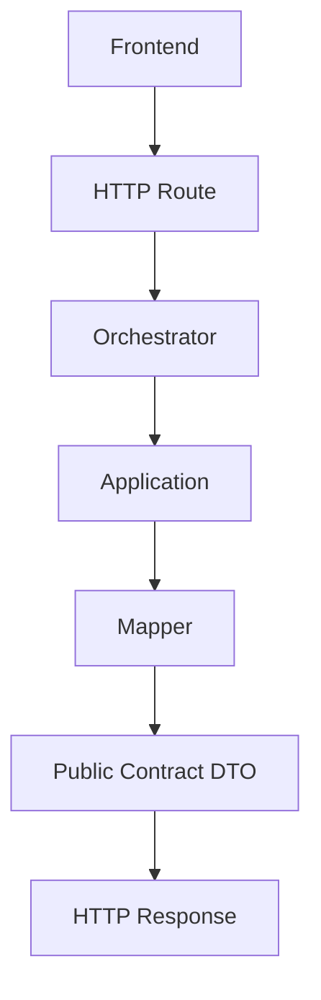

# ADR-07 — Public Contract Boundary Consolidation

| Campo | Valor |
| --- | --- |
| Código | ADR-07 |
| Clasificación | Architecture Decision Record |
| Versión | 1.1 |
| Estado | Approved |
| Fecha de creación | 2026-07-24 |
| Última actualización | 2026-07-24 |
| Responsable | AKVEZ Architecture Team |
| Nivel de confidencialidad | Interno |

---

# Historial de Versiones

| Versión | Fecha | Responsable | Descripción | Motivo |
| --- | --- | --- | --- | --- |
| 1.0 | 2026-07-24 | Architecture Team | Creación inicial. Formaliza la conexión real de `server/shared/contracts/` y `server/shared/mappers/` a las rutas HTTP y al frontend, ejecutada en el Sprint 12, Tareas 5, 6 y 7. | Cerrar la brecha documental entre ADR-06 (que definía los contratos sin conectarlos) y el estado real del código tras la migración. |
| 1.1 | 2026-07-24 | Architecture Team | Cambio de estado Draft → Approved, en conjunto con ADR-06. Sin modificaciones al contenido decisional. | El Product Owner aprobó formalmente el cierre de Sprint 12, incluyendo el contenido de este ADR. |

---

# Tabla de Contenido

1. Resumen Ejecutivo
2. Objetivo
3. Alcance
4. Contexto — Problema que Originó los Contratos Públicos
5. Estado Anterior de la Arquitectura
6. Decisión Arquitectónica
7. Nueva Frontera Entre Capas
8. Responsabilidades por Capa
9. Decisiones Registradas del Sprint 12 — Backend
10. Decisiones Registradas del Sprint 12 — Frontend
11. Decisión Operativa Formalizada: Identificador Temporal de Lead
12. Riesgos
13. KPIs
14. Dependencias
15. Glosario
16. Referencias
17. Anexos
18. Definition of Done

---

# 1. Resumen Ejecutivo

ADR-06 definió la estrategia y la forma concreta de los contratos públicos de AKVEZ (`server/shared/contracts/`) pero, por decisión explícita de su propio alcance, no conectó dichos contratos a las rutas HTTP reales ni al frontend. Esa conexión quedó registrada como riesgo abierto en ADR-06 (sección 17: *"Los contratos queden definidos pero nunca se conecten a las rutas reales"*).

Este ADR formaliza que dicha conexión ya fue ejecutada — Sprint 12, Tareas 5, 6 y 7 — y documenta, de forma vinculante, la frontera resultante entre `routes`, `mappers`, `contracts`, `orchestrators`, `application`, `domain` e `infrastructure`, así como las decisiones concretas tomadas durante la migración.

---

# 2. Objetivo

Formalizar como decisión arquitectónica documentada:

- El problema que originó la necesidad de una capa de contratos públicos.
- El estado de la arquitectura antes de la conexión (Sprint 12, Tarea 1 y Tarea 4).
- La decisión de conectar `contracts` y `mappers` a las rutas reales.
- La nueva frontera de responsabilidades entre las siete capas involucradas.
- Las decisiones concretas de backend y frontend ejecutadas durante la migración, con sus archivos afectados.

---

# 3. Alcance

## Incluye

- La consolidación documental del flujo `Route → Orchestrator → Application → Mapper → Public Contract DTO → HTTP Response`.
- El registro de responsabilidades de cada capa del flujo.
- El registro de los cambios de backend (Tarea 5) y frontend (Tareas 6 y 7) del Sprint 12.
- La formalización de una decisión operativa tomada durante la implementación (generación temporal de `id` de lead) que no estaba explícitamente resuelta por ningún ADR previo.

## No incluye

- Cambios al contenido de los contratos definidos en ADR-06 (sección 10). Este ADR no crea nuevos DTOs.
- La conexión a `server/shared/persistence/` (sigue fuera de alcance, ADR-05 §5).
- Autenticación, `User` o perfiles persistidos (sigue como fase futura, ADR-06 §15).

---

# 4. Contexto — Problema que Originó los Contratos Públicos

AKVEZ exponía sus endpoints devolviendo estructuras internas del dominio sin ninguna capa de traducción — confirmado por la auditoría de Sprint 12, Tarea 1, y documentado como el problema fundacional de ADR-06 (sección 4). Concretamente:

- `/api/prospect/search` devolvía el objeto interno producido por Lead Analyzer sin transformación, incluyendo un bloque `debug` con `rawNames`: los nombres crudos de todos los negocios encontrados antes de filtrar, una fuga real de información competitiva sin control de acceso.
- `/api/prospect/outreach` recibía y devolvía estructuras internas de Pitch Generator, con `isFallback` expuesto como propiedad suelta en vez de un campo explícito, y errores representados unas veces como string plano (`{ error: "..." }`) y otras como objeto con `success: false`.

ADR-06 resolvió el *diseño* del contrato. Este ADR resuelve y documenta su *conexión* real al sistema.

---

# 5. Estado Anterior de la Arquitectura

Antes del Sprint 12 (Tareas 5–7), `server/routes/prospectSearchRoute.ts` y `server/routes/prospectOutreachRoute.ts` construían el JSON de respuesta manualmente dentro del propio handler de la ruta, sin ninguna capa intermedia:

```text
Route
 |
 | construye el objeto de respuesta a mano
 v
res.json()
```

`server/shared/contracts/` y `server/shared/mappers/` existían como código (ADR-06) pero ningún archivo de `server/routes/` los importaba. El frontend, en consecuencia, seguía consumiendo la forma interna antigua (`data.prospects`, `data.debug`, `data.pitch.isFallback`, `error` como string).

---

# 6. Decisión Arquitectónica

> **Toda ruta HTTP pública de AKVEZ construye su respuesta exclusivamente a través de `shared/mappers/` y `shared/contracts/`. Ninguna ruta construye manualmente el objeto de respuesta ni accede a `domain/`, `application/` o `infrastructure/` de ningún módulo.**

Esta decisión ya fue implementada:

- `server/routes/prospectSearchRoute.ts` y `server/routes/prospectOutreachRoute.ts` usan `shared/mappers/*` y `shared/contracts/*` (Sprint 12, Tarea 5).
- El frontend (`lead-hunter`, `pitch-generator`) fue migrado para consumir exclusivamente la forma pública resultante (Sprint 12, Tareas 6 y 7).

---

# 7. Nueva Frontera Entre Capas

```text
Frontend
   ↓
HTTP Route
   ↓
Orchestrator
   ↓
Application
   ↓
Mapper
   ↓
Public Contract DTO
   ↓
HTTP Response
```

Aclaraciones vinculantes:

- Los **orchestrators no conocen HTTP**. No reciben `Request`/`Response`, no construyen respuestas, no importan `express`.
- Los **orchestrators no conocen DTOs públicos**. No importan `shared/contracts/` ni `shared/mappers/`.
- Los **mappers no conocen módulos internos**. No importan `domain/`, `application/` ni `infrastructure/` de ningún módulo — declaran su propia forma de entrada esperada (`InternalAnalyzedLead`, `InternalPitchGeneratorOutcome`) como tipos propios, independientes, verificados por lectura directa del código real que producen (ADR-06 §11; precedente ya aplicado en `leadResponseMapper.ts` y `outreachResponseMapper.ts`).
- Los **contratos representan modelos públicos futuros, no entidades de dominio**. `LeadResponseDTO` no es `Lead`; `OutreachResponseDTO` no es `OutreachPitch`. La correspondencia entre ambos es responsabilidad exclusiva del mapper correspondiente.

---

# 8. Responsabilidades por Capa

| Capa | Responsabilidad | Puede importar | No puede importar |
| --- | --- | --- | --- |
| **routes** | Recibir `Request`/`Response`, invocar el Orchestrator correspondiente, y construir la respuesta HTTP exclusivamente mediante `shared/mappers/` y `shared/contracts/`. | `orchestrators/`, `shared/mappers/`, `shared/contracts/`, `shared/config/` | `domain/`, `application/`, `infrastructure/`, SDKs externos (Gemini, etc.), módulos internos específicos |
| **mappers** | Traducir el resultado interno de un módulo hacia su DTO público correspondiente. Cada mapper declara su propio tipo de entrada esperado, sin importarlo del módulo dueño. | `shared/contracts/` | `domain/`, `application/`, `infrastructure/` de cualquier módulo |
| **contracts** | Definir la forma pública (DTO) que efectivamente cruza la frontera HTTP. No representan entidades de dominio ni de persistencia. | Tipos primitivos, otros archivos de `shared/contracts/` | `domain/`, `application/`, `infrastructure/`, `shared/persistence/`, SDKs, módulos específicos (ADR-06 §11) |
| **orchestrators** | Coordinar la secuencia de Agent APIs (capa `presentation`) necesaria para un workflow. No contienen lógica de negocio ni conocen HTTP ni DTOs públicos. | Agent APIs (`presentation/`) de los módulos del workflow | `express`, `shared/contracts/`, `shared/mappers/`, `domain/`/`application/`/`infrastructure/` de los módulos |
| **application** | Ejecutar el caso de uso del módulo (p. ej. `analyzeProspects`, `generateOutreachPitch`), devolviendo un resultado interno propio del módulo. | `domain/`, `infrastructure/` del propio módulo | `shared/contracts/`, `shared/mappers/`, HTTP |
| **domain** | Reglas de negocio puras (scoring, clasificación, fallback). No conoce frameworks, HTTP ni persistencia. | Nada externo al propio módulo | `shared/contracts/`, `shared/mappers/`, `infrastructure/`, HTTP |
| **infrastructure** | Integraciones externas (Gemini, Google Places). | SDKs externos | `shared/contracts/`, `shared/mappers/` |

Esta tabla consolida y hace explícitas reglas que ya estaban implícitas en ADR-01 (7.4, bajo acoplamiento vía contratos públicos), ADR-02/ADR-04 (orchestrators como Agent API) y ADR-06 (sección 11, reglas de aislamiento de `contracts/`) — no introduce excepciones nuevas.

---

# 9. Decisiones Registradas del Sprint 12 — Backend

**Tarea 5 — Contract Integration Implementation.**

Creado previamente (ADR-06) y conectado en esta tarea:

- `server/shared/contracts/apiError.ts`, `prospectSearch.ts`, `outreachPitch.ts`.
- `server/shared/mappers/leadResponseMapper.ts`, `outreachResponseMapper.ts`, `errorResponseMapper.ts`.

Integrado en:

- `server/routes/prospectSearchRoute.ts` — construye `SearchResponseDTO`/`ErrorResponseDTO` vía `mapToLeadResponseDTO` y `toErrorResponseDTO`/`fromException`. Eliminado el bloque `debug` (incluyendo `rawNames`) de la respuesta HTTP.
- `server/routes/prospectOutreachRoute.ts` — construye la respuesta vía `mapToOutreachResult` y `fromException`. Corregido el Contract Drift de `isFallback` (antes propiedad suelta, ahora `metadata.isFallback`).

Ningún Orchestrator, Agent, adapter de Gemini ni componente de `infrastructure/` fue modificado.

---

# 10. Decisiones Registradas del Sprint 12 — Frontend

**Tareas 6 y 7 — Frontend Contract Migration y Contract Consistency Cleanup.**

Cambios de forma de datos:

| Antes | Después |
| --- | --- |
| `data.prospects` | `data.leads` |
| `data.pitch.isFallback` (siempre `undefined` — bug) | `data.metadata.isFallback` |
| `error` como `string` | `error: { code, message, details }` (`ErrorResponseDTO`) |
| `data.debug` (`totalReturned`, `filteredOut`, `passedFilter`, `rawNames`) | Eliminado. Sin reemplazo público. |
| `data.message` (usado como substring `"Activado motor"`, ya inerte en producción) | `data.metadata.usedFallbackEngine` (boolean explícito, sin poblar aún por backend — ver sección 12) |

Archivos afectados:

- `src/modules/lead-hunter/application/searchProspects.ts`
- `src/modules/lead-hunter/application/searchMoreProspects.ts`
- `src/modules/lead-hunter/domain/prospectMapper.ts` (`raw.angle` → `raw.opportunity`, siguiendo el renombramiento confirmado en ADR-06, Decisión Importante 1)
- `src/modules/lead-hunter/presentation/LeadHunter.tsx`
- `src/modules/pitch-generator/presentation/PitchGenerator.tsx`

Eliminado como código muerto confirmado (Tarea 7):

- `src/modules/lead-hunter/presentation/components/DebugPanel.tsx` (huérfano; su única función era mostrar campos ahora prohibidos por ADR-06 §16.5).
- `Prospect.hasWebsite` (`src/shared/types/index.ts`) — no forma parte de `LeadResponseDTO` y no tenía consumidores en la UI.

El frontend mantiene su propio modelo de dominio interno (`Prospect`, en `src/shared/types/`), distinto del DTO público — no importa tipos desde `server/shared/contracts/`. Cada lado declara su propia forma esperada del wire format, replicando el mismo criterio de independencia que ya usan los mappers del backend (sección 8).

---

# 11. Decisión Operativa Formalizada: Identificador Temporal de Lead

ADR-06 (Decisión Importante 6) dejó `LeadResponseDTO.id` como campo futuro, dependiente de conectar `server/shared/persistence/` (fuera de alcance). Al conectar la ruta real (Tarea 5), `LeadResponseDTO.id` es un campo obligatorio (`string`, no opcional) que debía poblarse igualmente.

**Decisión:** `server/routes/prospectSearchRoute.ts` genera un identificador temporal mediante `crypto.randomUUID()` (módulo nativo de Node, sin nueva dependencia) al momento de mapear cada lead. Esta generación:

- Ocurre exclusivamente en la capa `routes`, no en `domain`, `application` ni en el mapper.
- No pretende ser un identificador persistente ni estable entre búsquedas.
- Deberá reemplazarse por el identificador real asignado por `server/shared/persistence/` cuando esa capa se conecte (ADR-05, Fase 2).

Esta decisión no estaba explícitamente resuelta por ningún ADR previo y se formaliza aquí para evitar que quede como una decisión implícita no documentada.

---

# 12. Riesgos

| Riesgo | Impacto | Mitigación |
| --- | --- | --- |
| ADR-06 permanece en estado Draft mientras su contenido ya está implementado en producción | Alto | Ver sección "Conflictos" del reporte de cierre de Tarea 8; requiere decisión del Product Owner, no de este ADR |
| `metadata.usedFallbackEngine` está definido en el contrato pero nunca se pobla — `analyzeProspects.ts` no expone la señal de si usó el motor de respaldo | Medio | Requiere tocar `application/` de Lead Analyzer; fuera de alcance de Tareas 5–7; queda como recomendación (sección 13, ADR-06 riesgo ya registrado) |
| El identificador temporal (`randomUUID()`) podría interpretarse erróneamente como un identificador estable si no se documenta | Medio | Documentado explícitamente en la sección 11 de este ADR |

---

# 13. KPIs

Heredados de ADR-06 (sección 18), ahora verificables sobre código real:

- 0 imports de `domain/`, `application/`, `infrastructure/` o SDKs dentro de `shared/contracts/` y `shared/mappers/` — verificado.
- 0 imports de `shared/contracts/` o `shared/mappers/` dentro de `orchestrators/` o `modules/*/domain|application|infrastructure` — verificado.
- 0 campos Sensibles (`rawNames` y equivalentes) presentes en cualquier respuesta HTTP — verificado.
- 0 referencias a `data.prospects`, `data.debug`, `data.pitch.isFallback` o `error` como string en `src/` — verificado.

---

# 14. Dependencias

Depende de:

- ADR-01 — Arquitectura Modular Orientada al Dominio.
- ADR-02 — Orquestación de Capacidades y Agentes.
- ADR-04 — Backend Agent Architecture.
- ADR-05 — Persistence Architecture & Data Layer.
- ADR-06 — Public API Contract Strategy.
- Sprint 12, Tareas 1, 2, 5, 6 y 7.

Impacta / habilita:

- Cualquier nuevo endpoint público futuro deberá seguir el flujo de la sección 7 desde su creación.
- La futura conexión de `id`/`leadId` a `server/shared/persistence/` (sección 11) deberá reemplazar la generación temporal aquí documentada.

---

# 15. Glosario

Se hereda el glosario de ADR-06 (sección 20) y ADR-05 (sección 19) sin cambios. Se añade:

**Frontera de contrato (Contract Boundary):** el punto exacto del flujo de una petición HTTP donde una entidad interna deja de ser válida y debe existir un DTO público equivalente, transformado por un mapper.

---

# 16. Referencias

- ADR-01, ADR-02, ADR-04, ADR-05, ADR-06.
- ADS-00 — Documentation Standard.
- Sprint 12, Tarea 1 (auditoría), Tarea 2 (`API-DTO-CATALOG.md`), Tarea 5 (Contract Integration Implementation), Tarea 6 (Frontend Contract Migration), Tarea 7 (Contract Consistency Cleanup).

---

# 17. Anexos

## 17.1 Diagrama — Flujo de una petición pública de AKVEZ



**Identificador:** ADR-07-DIAG-001
**Versión:** v1.0
**Fecha de actualización:** 2026-07-24

---

# 18. Definition of Done

Este ADR se considera finalizado cuando:

- Mantiene consistencia con ADR-01, ADR-02, ADR-04, ADR-05 y ADR-06.
- Cumple el estándar ADS-00 en estructura, clasificación y ubicación.
- Registra fielmente, sin inventar alcance adicional, lo efectivamente implementado en Sprint 12, Tareas 5, 6 y 7.
- No modifica el contenido de los contratos definidos en ADR-06.
- Ha sido revisado y aprobado formalmente por el Product Owner — junto con la resolución del estado Draft de ADR-06 (ver conflicto reportado en el cierre de Sprint 12, Tarea 8).

---

## Control de Calidad (AQS)

**Pendiente de evaluación**, consistente con el criterio ya aplicado a ADR-04 v1.0 y ADR-06 v1.0: no corresponde autoevaluar un documento propio antes de su revisión formal.

---

> **Nota de Gobernanza**
>
> Este ADR se encuentra en estado **Approved** (v1.1, 2026-07-24). Constituye una decisión arquitectónica permanente conforme a ADS-00.
>
> ADR-06, del cual este documento depende directamente, fue aprobado en la misma fecha y en el mismo cierre de Sprint 12. Ambos estados quedaron resueltos en conjunto, tal como se recomendaba en la versión 1.0 de este documento.
