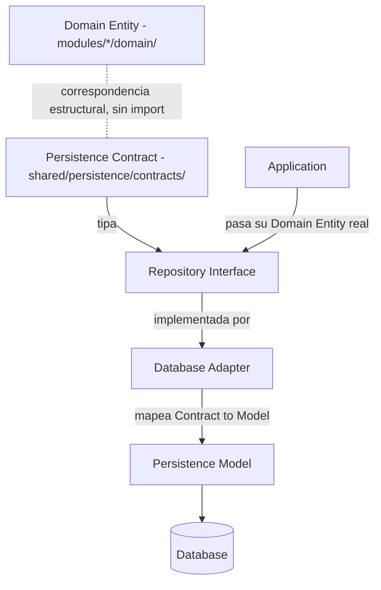

# ADR-08 — Persistence Boundary & Repository Isolation

| Campo | Valor |
| --- | --- |
| Código | ADR-08 |
| Clasificación | Architecture Decision Record |
| Versión | 1.2 |
| Estado | Approved |
| Fecha de creación | 2026-07-24 |
| Última actualización | 2026-07-24 |
| Responsable | AKVEZ Architecture Team |
| Nivel de confidencialidad | Interno |

---

# Historial de Versiones

| Versión | Fecha | Responsable | Descripción | Motivo |
| --- | --- | --- | --- | --- |
| 1.0 | 2026-07-24 | Architecture Team | Creación inicial. Define el mecanismo exacto por el cual `server/shared/persistence/` puede referenciar la forma de una entidad de dominio sin acceder directamente a `domain/` de un módulo específico. | Sprint 13, Tarea 1 (auditoría) encontró que `LeadRepository.ts`, `LeadAnalysisRepository.ts` y `OutreachPitchRepository.ts` importan directamente `modules/*/domain/*`, contradiciendo la regla de encapsulación de Agent API que el propio código declara en cada módulo (ADR-04). |
| 1.1 | 2026-07-24 | Architecture Team | Corrección de frontera (Sprint 13, Tarea 3). Elimina la estrategia de re-exportación de tipos desde `presentation/` (Agent API) adoptada en v1.0. En su lugar, define `shared/persistence/contracts/` como ubicación de tipos de persistencia declarados de forma independiente, sin importar ni depender de `presentation/`, `domain/`, `application/` ni `infrastructure/` de ningún módulo. Actualizados diagramas y tabla de dependencias permitidas/prohibidas en consecuencia. Sigue en estado Draft. | La estrategia de v1.0 obligaba a `presentation/` (Agent API) a asumir una responsabilidad nueva solo para satisfacer una necesidad interna de persistencia, acoplando la superficie pública de cada módulo a una capa (`shared/persistence/`) que hoy ni siquiera está conectada. Declarar el tipo de forma independiente en `shared/persistence/contracts/` — mismo patrón ya validado en `shared/mappers/` — logra el mismo aislamiento sin tocar ningún módulo. |
| 1.2 | 2026-07-24 | Architecture Team | Cambio de estado Draft → Approved. Sin modificaciones al contenido decisional de v1.1. | El Product Owner revisó la corrección de frontera de v1.1 (Sprint 13, Tarea 3) y aprobó formalmente este ADR en el cierre de Sprint 13, Tarea 4, habilitando el inicio de la planificación técnica de implementación (Persistence Foundation Planning). |

---

# Tabla de Contenido

1. Resumen Ejecutivo
2. Objetivo
3. Alcance
4. Contexto
5. Decisión Arquitectónica
6. Contratos
7. Mappers
8. Responsabilidades por Capa
9. Flujo Final
10. Dependencias Permitidas y Prohibidas
11. Riesgos
12. KPIs
13. Dependencias
14. Glosario
15. Referencias
16. Anexos
17. Definition of Done

---

# 1. Resumen Ejecutivo

La auditoría de Sprint 13, Tarea 1, encontró que las tres interfaces de Repository existentes en `server/shared/persistence/repositories/` importan directamente la entidad de dominio desde `modules/*/domain/*`, saltándose la Agent API (`presentation/`) que cada módulo declara textualmente como su única puerta de acceso externa (*"Ningún componente externo debe acceder a application/, domain/ o infrastructure/ directamente"* — presente en `LeadHunterAgent.ts`, `LeadAnalyzerAgent.ts` y `pitchGeneratorAgent.ts`).

Este ADR resuelve ese conflicto: define que la capa de persistencia declara su propia forma de cada entidad relacionada de forma **independiente**, en `shared/persistence/contracts/`, sin importar ni depender de `domain/`, `application/`, `infrastructure/` ni `presentation/` de ningún módulo. Además formaliza la separación entre Domain Entity, Persistence Contract, Persistence Model, Repository Interface y Database Adapter que ADR-05 §7 (Decisión 3) ya exigía en principio pero no especificaba en mecanismo.

> **Corrección (v1.1):** la versión 1.0 de este ADR proponía que cada módulo re-exportara el `type` de su entidad de dominio desde su Agent API (`presentation/`) para que `shared/persistence/` lo importara desde ahí. Esa estrategia fue descartada en revisión (Sprint 13, Tarea 3): obligaba a la superficie pública de cada módulo a asumir una responsabilidad nueva solo para satisfacer una necesidad interna de persistencia. La versión 1.1 logra el mismo aislamiento sin tocar ningún módulo, declarando el tipo de forma independiente en `shared/persistence/contracts/`.

Este ADR es de diseño únicamente — no implementa código, no crea modelos ni adapters, no conecta base de datos (Sprint 13, Tarea 1, restricciones).

---

# 2. Objetivo

- Resolver el conflicto de aislamiento encontrado en Sprint 13, Tarea 1, entre `shared/persistence/repositories/` y `modules/*/domain/*`.
- Definir el mecanismo exacto de exposición del tipo de entidad de dominio hacia `shared/persistence/`.
- Definir la separación de responsabilidades entre Domain Entity, Persistence Contract, Persistence Model, Repository Interface y Database Adapter.
- Definir el flujo final de una operación de persistencia, desde `Application` hasta `Database`.
- Definir explícitamente qué capa puede importar qué, ampliando (sin contradecir) las reglas ya vigentes de ADR-01, ADR-04 y ADR-05.

---

# 3. Alcance

## Incluye

- La definición de `shared/persistence/contracts/` como ubicación de los tipos de persistencia declarados de forma independiente, sin depender de ningún módulo.
- El mecanismo por el cual `shared/persistence/repositories/` y `shared/persistence/models/` obtienen la forma de una entidad relacionada con un módulo, sin acceder a ese módulo directamente.
- La definición conceptual de "Persistence Model" (`shared/persistence/models/`) como forma distinta del Domain Entity y del Persistence Contract.
- La ubicación y responsabilidad del mapper Domain/Persistence Contract ↔ Persistence Model.
- La tabla de responsabilidades por capa y el flujo final de una operación de guardado/consulta.
- Las reglas de dependencia permitida/prohibida para todas las capas involucradas.

## No incluye

- Ningún cambio a `modules/*/presentation/`, `domain/`, `application/` o `infrastructure/` de ningún módulo — la corrección de v1.1 elimina explícitamente la necesidad de tocarlos.
- El modelo de `User` y la estrategia de aislamiento por usuario (Sprint 13, Tarea 1, Decisión 4 pendiente — requiere su propio análisis, no se resuelve aquí).
- La elección del motor de base de datos, ORM o proveedor cloud (ADR-05 §5, "No incluye" — sigue sin resolverse).
- La estrategia de inyección de dependencias (cómo `application/` obtiene una instancia concreta de un Repository) — es una decisión de implementación, se resolverá en el Sprint que ejecute este ADR, no en este documento.
- La implementación real de `contracts/`, `models/`, `adapters/` o de cualquier Repository — sigue prohibido escribir código bajo esta tarea.
- Cualquier cambio a los contratos públicos de ADR-06/ADR-07 — este ADR no toca la frontera HTTP, solo la frontera interna de persistencia. `shared/persistence/contracts/` y `shared/contracts/` son namespaces distintos y no relacionados pese al nombre compartido — ver sección 6.

---

# 4. Contexto

ADR-05 §7 (Decisión 3) ya estableció el principio: *"Separar entidades de dominio y modelos persistentes... la transformación será mediante mappers"*, pero lo hizo con un ejemplo ilustrativo genérico (`Lead` / `LeadEntity`), sin especificar cómo el código de `shared/persistence/` obtendría la forma real de la entidad de dominio sin acoplarse a la estructura interna de un módulo específico.

Al construirse las interfaces reales (`LeadRepository.ts`, `LeadAnalysisRepository.ts`, `OutreachPitchRepository.ts`), esa ambigüedad se resolvió — sin ADR que lo respaldara — importando directamente `modules/lead-hunter/domain/Lead`, `modules/lead-analyzer/domain/LeadAnalysis` y `modules/pitch-generator/domain/OutreachPitch`. Esto contradice la regla de Agent API ya vigente desde ADR-04, citada verbatim en el código de los tres módulos.

Como estas interfaces no están conectadas a ningún flujo de ejecución real (Sprint 13, Tarea 1, sección "Grafo de dependencias"), el conflicto no se manifiesta hoy en producción — pero cualquier implementación futura sobre esta base heredaría la violación.

---

# 5. Decisión Arquitectónica

> **`server/shared/persistence/` nunca importa ni depende de `domain/`, `application/`, `infrastructure/` ni `presentation/` de un módulo, bajo ninguna circunstancia. Cuando necesita representar la forma de una entidad relacionada con un módulo, declara su propio tipo de forma independiente en `shared/persistence/contracts/`.**

Cada tipo persistible (`Lead`, `LeadAnalysis`, `OutreachPitch`) se declara en `shared/persistence/contracts/`, verificado por lectura directa del código real del módulo correspondiente — no importado de ningún archivo de ese módulo:

```ts
// shared/persistence/contracts/Lead.ts
/**
 * Forma real de la entidad de negocio de Lead Hunter, verificada por lectura
 * directa de modules/lead-hunter/domain/Lead.ts. No es un import de ese
 * módulo — declaración independiente, propiedad de shared/persistence/,
 * conforme ADR-08. Si Lead.ts cambia su forma, este tipo debe actualizarse
 * aquí explícitamente.
 */
export type LeadStatus = 'Prospect' | 'Audited' | 'Pitched' | 'Replied' | 'Won' | 'Stale';

export interface Lead {
  name: string;
  website: string;
  phone: string;
  googleMapsUrl: string;
  rating: number;
  reviewCount: number;
  source: string;
  status: LeadStatus;
}
```

`shared/persistence/repositories/LeadRepository.ts` importa `Lead` desde `shared/persistence/contracts/Lead`, nunca desde `modules/lead-hunter/domain/Lead` ni desde ningún archivo de `modules/lead-hunter/`. Ningún módulo cambia — `presentation/`, `domain/`, `application/` e `infrastructure/` de los tres módulos permanecen exactamente como estaban antes de este ADR.

Cuando `application/` de un módulo llama a un método del Repository (ej. `leadRepository.save(lead)`), pasa su entidad de dominio real (`Lead` de `modules/lead-hunter/domain/Lead`); TypeScript la acepta porque tiene la misma forma estructural que `Lead` de `shared/persistence/contracts/` — no se requiere ninguna conversión explícita en ese punto. Este es el mismo mecanismo estructural que ya usa `shared/mappers/leadResponseMapper.ts` con `InternalAnalyzedLead` (Sprint 12, Tarea 5) — no es una técnica nueva, es una aplicación consistente de un patrón ya validado en el proyecto.

Se descarta explícitamente la alternativa adoptada en v1.0 (re-exportar el tipo desde la Agent API de cada módulo): aunque también lograba el aislamiento, obligaba a `presentation/` de tres módulos a asumir una responsabilidad nueva únicamente para satisfacer una necesidad interna de `shared/persistence/`, una capa que hoy no está conectada a ningún flujo real. Declarar el tipo de forma independiente logra el mismo resultado sin modificar ningún módulo.

---

# 6. Contratos

Se reconocen tres conceptos distintos dentro de la capa de persistencia, que no deben confundirse:

- **Persistence Contract** (`shared/persistence/contracts/*.ts`, nuevo, definido por este ADR): la forma de una entidad relacionada con un módulo, declarada de forma independiente dentro de `shared/persistence/`, sin importar nada de ese módulo (sección 5). Es lo que hoy debería ocupar el lugar de los imports directos a `modules/*/domain/*` en los tres Repository existentes.
- **Repository Interface** (`shared/persistence/repositories/*.ts`, ya existen): expresados en términos de un Persistence Contract (`Lead`, `LeadAnalysis`, `OutreachPitch` de `shared/persistence/contracts/`). Es el contrato que `application/` consume. No cambia de forma con este ADR — solo cambia el origen del tipo que usa en su firma.
- **Persistence Model** (`shared/persistence/models/*.ts`, no existen aún): la forma efectivamente almacenada — incluye `id`, metadatos de propietario/auditoría (`userId`, `createdAt`, `updatedAt`) y cualquier campo técnico de almacenamiento que no pertenece al lenguaje de negocio. Declara su propio tipo, igual de independiente que el Persistence Contract (misma regla de la sección 5). Este ADR define su propósito y ubicación — no su contenido final, que depende del motor de base de datos elegido (fuera de alcance, sección 3).

**Nota de nomenclatura:** `shared/persistence/contracts/` no tiene relación con `shared/contracts/` (ADR-06/ADR-07). Ambos comparten la palabra "contracts" por describir el mismo patrón general (tipo declarado de forma independiente en la frontera de una capa), pero resuelven fronteras distintas: `shared/contracts/` es la frontera HTTP pública; `shared/persistence/contracts/` es la frontera interna hacia persistencia. No deben importarse entre sí (sección 10).

---

# 7. Mappers

La transformación Persistence Contract ↔ Persistence Model (ADR-05 §7, Decisión 3) es responsabilidad exclusiva del **Database Adapter** (`shared/persistence/adapters/`), no de `shared/persistence/repositories/` ni de `application/`. El Adapter recibe objetos con la forma del Persistence Contract (porque así los tipó la Repository Interface, sección 6) y los convierte a Persistence Model para almacenarlos — nunca al revés.

Esto es distinto del mapper de contratos públicos (`shared/mappers/`, ADR-06/ADR-07): ese mapper traduce hacia la frontera HTTP y vive en un espacio de nombres separado, sin relación con este. Un módulo no debe asumir que ambos mappers son intercambiables ni que comparten forma — cada uno resuelve una frontera distinta (persistencia interna vs. contrato público externo).

---

# 8. Responsabilidades por Capa

| Capa | Responsabilidad | Cambia con este ADR |
| --- | --- | --- |
| **Domain** (`modules/*/domain/`) | Define la entidad de negocio pura. No conoce persistencia. | No — sin cambios respecto a ADR-05 §6 Principio 2. |
| **Presentation / Agent API** (`modules/*/presentation/`) | Expone las funciones del Agent. No tiene ninguna responsabilidad respecto a persistencia. | **No** — la corrección v1.1 elimina la responsabilidad nueva que le asignaba v1.0. |
| **Persistence Contract** (`shared/persistence/contracts/`) | Declara, de forma independiente, la forma de cada entidad relacionada con un módulo. Verificado por lectura del código real; nunca importado. | **Sí** — capa nueva, introducida por este ADR (v1.1). |
| **Repository Interface** (`shared/persistence/repositories/`) | Define el contrato de guardado/consulta, expresado en términos de un Persistence Contract. | **Sí** — cambia el origen del import (de `domain/` a `shared/persistence/contracts/`), no la forma del contrato. |
| **Persistence Model** (`shared/persistence/models/`) | Define la forma almacenada (con `id`, metadatos técnicos). Tipo propio, independiente del Persistence Contract y del dominio. | Concepto formalizado por este ADR; sigue sin implementarse. |
| **Database Adapter** (`shared/persistence/adapters/`) | Implementa la Repository Interface; convierte Persistence Contract ↔ Persistence Model; conoce el driver de base de datos real. | Concepto formalizado por este ADR; sigue sin implementarse. |
| **Application** (`modules/*/application/`) | Coordina el caso de uso; llama a la Repository Interface (recibida como dependencia, mecanismo de inyección fuera de alcance, sección 3), pasándole su entidad de dominio real. No conoce el Adapter ni el Persistence Model. | No — sin cambios respecto a ADR-05 §9. |
| **Routes / Orchestrators** | Sin cambios: siguen sin conocer persistencia en ninguna forma (ADR-05 §6 Principio 1; confirmado sin excepción por Sprint 13, Tarea 1). | No. |

---

# 9. Flujo Final

```text
Domain Entity (modules/*/domain/)
   ‖ (misma forma estructural, sin import — sección 5)
Persistence Contract (shared/persistence/contracts/)
   ↓ usado como tipo por
Repository Interface (shared/persistence/repositories/)
   ↑ llamada por
Application (modules/*/application/) — construye/pasa su Domain Entity real
   ↓
Repository Interface
   ↓ implementada por
Database Adapter (shared/persistence/adapters/)
   ↓ mapea Persistence Contract ↔ Persistence Model
Persistence Model (shared/persistence/models/)
   ↓
Database
```

Este flujo es una especialización del flujo ya aprobado en ADR-05 §8 (`Application → Domain → Repository Interface → Persistence Adapter → Database`) — no lo reemplaza, precisa el mecanismo de acceso al tipo de dominio (sección 5) y separa explícitamente dónde vive cada responsabilidad (secciones 6-8). La línea doble (‖) indica correspondencia estructural sin dependencia de import — no es una relación de flujo de datos en tiempo de ejecución, es la garantía de tipos que permite a `application/` pasar su `Domain Entity` real donde se espera un `Persistence Contract`.

---

# 10. Dependencias Permitidas y Prohibidas

| Capa | Puede importar | No puede importar |
| --- | --- | --- |
| `shared/persistence/contracts/` | Tipos primitivos; otros archivos de `shared/persistence/contracts/` | `modules/*/domain/`, `application/`, `infrastructure/` o `presentation/` de cualquier módulo; `shared/contracts/`; `shared/mappers/`; `shared/persistence/models/`, `repositories/` o `adapters/` |
| `shared/persistence/repositories/` | `shared/persistence/contracts/`; `shared/persistence/repositories/Identified.ts` | `modules/*/domain/`, `application/`, `infrastructure/` o `presentation/` de cualquier módulo; `shared/contracts/`; `shared/mappers/`; SDKs externos |
| `shared/persistence/models/` | Tipos primitivos; otros archivos de `shared/persistence/models/` | `modules/*/domain/`, `application/`, `infrastructure/` o `presentation/` de cualquier módulo (mismo principio de la sección 5); `shared/contracts/`; `shared/mappers/` |
| `shared/persistence/adapters/` | `shared/persistence/repositories/` (interfaces que implementa); `shared/persistence/models/`; `shared/persistence/contracts/`; SDK/driver de base de datos | `domain/`, `application/`, `infrastructure/` o `presentation/` de cualquier módulo directamente; `shared/contracts/`; `shared/mappers/`; `express` |
| `modules/*/presentation/` (Agent API) | Sin cambios respecto a lo que ya podía importar antes de este ADR | `shared/persistence/` en cualquiera de sus cuatro subcarpetas — **sin excepción** (corrección v1.1) |
| `modules/*/application/` | La Repository Interface correspondiente (recibida como dependencia, no importada desde `adapters/`) | `shared/persistence/adapters/`; `shared/persistence/models/`; `shared/persistence/contracts/`; cualquier SDK de base de datos |
| `modules/*/domain/` | Nada de `shared/persistence/` | Sin cambios — ya prohibido por ADR-05 §6 Principio 2 |
| `routes/`, `orchestrators/` | Nada de `shared/persistence/` | Sin cambios — ya prohibido por ADR-05 §6 Principio 1 |

---

# 11. Riesgos

| Riesgo | Impacto | Mitigación |
| --- | --- | --- |
| Que un tipo declarado en `shared/persistence/contracts/` quede desactualizado respecto a la entidad de dominio real que representa, sin que nada lo detecte automáticamente (mismo riesgo ya aceptado y documentado para `shared/mappers/` en Sprint 12) | Alto | Cada tipo debe llevar el comentario de verificación por lectura directa (sección 5); revisión manual obligatoria cuando cambie el `domain/` correspondiente |
| Que se implemente `Database Adapter` antes de decidir motor de base de datos, forzando una migración temprana | Medio | Ya identificado en ADR-05 §16; este ADR no cambia esa mitigación |
| Que la inyección de dependencias (fuera de alcance aquí) se resuelva de forma distinta en cada módulo, generando inconsistencia | Medio | Debe resolverse en un ADR o decisión de diseño explícita antes de implementar el primer Adapter, no de forma ad hoc por módulo |
| Que el `Persistence Model` termine siendo una copia idéntica del Persistence Contract "por conveniencia", perdiendo el propósito de la separación (sección 6) | Bajo | Revisión arquitectónica al implementar el primer modelo |
| Que `shared/persistence/contracts/` se confunda con `shared/contracts/` por el nombre compartido | Bajo | Nota de nomenclatura explícita en sección 6; nombres de archivo y comentarios de cabecera deben dejar clara la distinción |

**Riesgo resuelto por esta corrección (v1.1):** el riesgo de v1.0 sobre re-exportación accidental de lógica de negocio desde `presentation/` queda eliminado — esa estrategia ya no forma parte de este ADR.

---

# 12. KPIs

- 0 imports de `modules/*/domain/`, `application/`, `infrastructure/` o `presentation/` dentro de cualquier subcarpeta de `shared/persistence/` (verificable por grep, igual que ADR-06/ADR-07).
- 100% de los tipos usados por `shared/persistence/repositories/` y `shared/persistence/models/` provienen de `shared/persistence/contracts/`.
- 0 cambios de código en `modules/*/presentation/` como consecuencia de este ADR.

---

# 13. Dependencias

Depende de:

- ADR-01 — Arquitectura Modular Orientada al Dominio.
- ADR-04 — Backend Agent Architecture (regla de encapsulación de Agent API).
- ADR-05 — Persistence Architecture & Data Layer (§7 Decisión 3, §8, §9).
- Sprint 13, Tarea 1 — Persistence Architecture Audit (hallazgo del conflicto que origina este ADR).

Impacta / habilita:

- La futura implementación de `shared/persistence/contracts/`, `shared/persistence/models/` y `shared/persistence/adapters/`.
- La conexión real de `LeadRepository`, `LeadAnalysisRepository` y `OutreachPitchRepository` a `application/` de cada módulo.
- Queda pendiente, explícitamente fuera de alcance: el modelo de `User` (Sprint 13, Tarea 1, Decisión 4) y la estrategia de inyección de dependencias.

---

# 14. Glosario

Se hereda el glosario de ADR-05 (sección 19). Se añade:

**Persistence Contract:** tipo declarado de forma independiente dentro de `shared/persistence/contracts/`, que representa la forma de una entidad relacionada con un módulo sin importar nada de ese módulo. Distinto de un contrato público (`shared/contracts/`, ADR-06) — ver nota de nomenclatura, sección 6.

**Persistence Model:** la forma de un dato tal como se almacena (incluye identificador y metadatos técnicos), distinta del Persistence Contract y de la entidad de dominio que representa el mismo concepto de negocio sin esos detalles.

**Database Adapter:** implementación concreta de una Repository Interface; único componente que conoce simultáneamente el Domain Entity, el Persistence Model y el driver de base de datos real.

---

# 15. Referencias

- ADR-01, ADR-04, ADR-05, ADR-06, ADR-07.
- ADS-00 — Documentation Standard.
- Sprint 13, Tarea 1 — Persistence Architecture Audit / Review.

---

# 16. Anexos

## 16.1 Diagrama — Frontera de persistencia



**Identificador:** ADR-08-DIAG-001
**Versión:** v1.1
**Fecha de actualización:** 2026-07-24 (corregido — ya no involucra `presentation/`)

---

# 17. Definition of Done

Este ADR se considera finalizado cuando:

- Mantiene consistencia con ADR-01, ADR-04 y ADR-05 — no contradice ninguna decisión previa, solo precisa un mecanismo que ADR-05 dejó abierto.
- Resuelve explícitamente el conflicto encontrado en Sprint 13, Tarea 1.
- No implementa código, modelos, adapters ni conexión de base de datos (restricción explícita de la tarea que lo origina).
- Deja explícitamente fuera de alcance el modelo de `User` y la estrategia de inyección de dependencias, sin resolverlos por omisión.
- Ha sido revisado y aprobado formalmente por el Product Owner antes de iniciar cualquier implementación (Sprint 14).

---

## Control de Calidad (AQS)

**Pendiente de evaluación**, consistente con el criterio ya aplicado a ADR-06 y ADR-07 antes de su aprobación formal.

---

> **Nota de Gobernanza**
>
> Este ADR se encuentra en estado **Approved** (v1.2, 2026-07-24). Constituye una decisión arquitectónica permanente conforme a ADS-00. La implementación de la capa de persistencia puede iniciarse siguiendo este ADR, sujeta al plan técnico de Sprint 13, Tarea 4 (Persistence Foundation Planning) y a las decisiones explícitamente dejadas fuera de alcance (sección 3): modelo de `User`, motor de base de datos y estrategia de inyección de dependencias.
