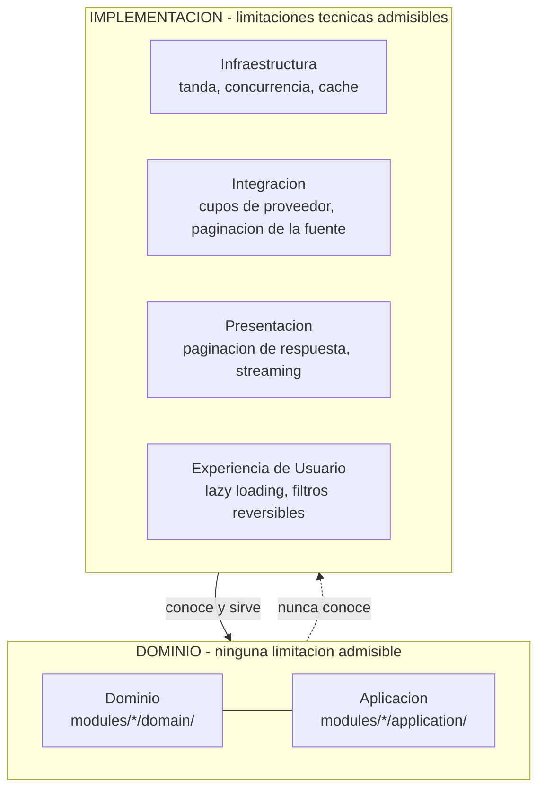
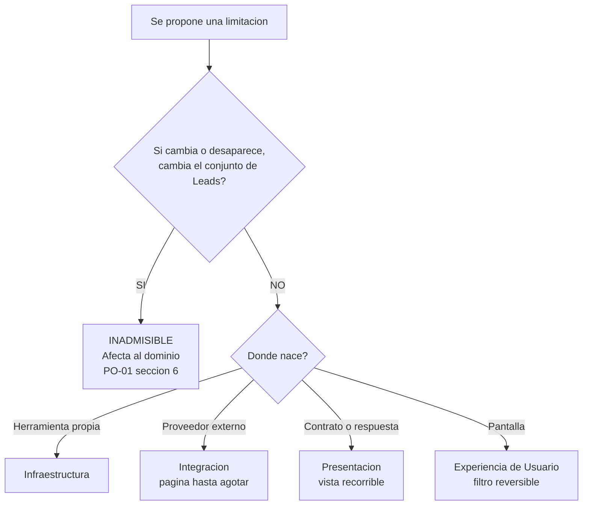

# ADR-11 — Frontera entre Dominio e Implementación

| Campo | Valor |
| --- | --- |
| Código | ADR-11 |
| Clasificación | Architecture Decision Record |
| Versión | 2.1 |
| Estado | **Approved** |
| Fecha de creación | 2026-07-28 |
| Última actualización | 2026-07-29 |
| Responsable | AKVEZ Architecture Team |
| Aprobado por | **AKVEZ Product Office** — sprint GOV-01, 2026-07-29 |
| Nivel de confidencialidad | Interno |
| Estándar aplicado | ADS-00 v1.2 |
| Autoridad de dominio | **PO-01** (Approved) · APS-07 v2.0 · APS-03 v3.0 |

> **Sobre esta versión.** ADR-11 ha sido **reescrito por completo**. Conserva su código y su historial documental; **ningún contenido técnico de la v1.0 se reutiliza**. El objeto que aquel documento pretendía decidir dejó de existir en el dominio por efecto de PO-01 §6 y §7, y su premisa central quedó refutada. Este documento decide una cuestión distinta y vigente, enunciada en §2.

---

# Historial de Versiones

| Versión | Fecha | Responsable | Descripción | Motivo |
| --- | --- | --- | --- | --- |
| 1.0 | 2026-07-28 | Architecture Team | Redacción inicial sobre la ubicación de una capacidad del flujo de adquisición. **Suspendido — nunca se incorporó al Blueprint como fichero.** Su premisa central fue refutada por AR-01 (R-04) y su objeto quedó sin materia por efecto de PO-01. | Resolver una divergencia con ADR-10 sobre el contenido del repositorio de Leads. |
| **2.1** | 2026-07-29 | AKVEZ Product Office | **Ratificación formal.** Estado `Review` → **`Approved`**. Se cierra la Definition of Done de §19. **No se modifica ningún contenido técnico:** ni el Criterio de Invariancia de §7.1, ni el reparto por capas de §8, ni las materias cerradas de §9, ni los KPI de §13. | Sprint **GOV-01**. Los puntos 1 a 3 de §19 son actos de ratificación, ejercidos por el Product Office. El punto 4 queda cerrado mediante asignación: los KPI de §13 y las revisiones de §14 se incorporan en **DEV-01 — Architecture Bootstrap**, por ser verificaciones que exigen implementación ejecutable. **Autoridad que aprueba: AKVEZ Product Office**, pronunciamiento del 2026-07-29. |
| **2.0** | 2026-07-29 | AKVEZ Architecture Team | **Reescritura completa.** Se conservan únicamente el código `ADR-11` y este historial. Nuevo objeto: la frontera entre dominio e implementación y la ubicación admisible de las limitaciones técnicas. Todo el contenido técnico anterior queda reemplazado, no actualizado. | PO-01 §6 dejó sin objeto la decisión original y, al mismo tiempo, abrió una cuestión arquitectónica nueva y no resuelta: admite límites técnicos y exige que residan «donde nacen», sin precisar dónde. Sprint P1.2. |

---

# Tabla de Contenido

1. Resumen Ejecutivo
2. Objetivo
3. Alcance
4. Contexto
5. Problema
6. Alternativas Consideradas
7. Decisión
8. Reparto de Responsabilidades por Capa
9. Lo que Nunca Podrá Regresar al Dominio
10. Consecuencias Positivas
11. Consecuencias Negativas
12. Riesgos
13. KPIs
14. Impacto en los APS
15. Dependencias
16. Glosario
17. Referencias
18. Anexos
19. Definition of Done

---

# 1. Resumen Ejecutivo

PO-01 estableció que el conjunto de Leads de un usuario lo determina exclusivamente el dominio, y que **ninguna limitación técnica podrá determinar qué Leads existen, cuáles se registran ni cuáles se conservan** (PO-01 §6).

Al mismo tiempo, PO-01 reconoció que las limitaciones técnicas son **legítimas y necesarias**, y ordenó que residan «donde nacen: en la integración o en la interfaz». No precisó dónde exactamente, ni ofreció un criterio para distinguir una limitación admisible de una inadmisible.

Ese vacío es el objeto de este ADR.

La decisión adoptada es declarar una **frontera verificable** mediante un criterio único y comprobable —el **Criterio de Invariancia del Conjunto** (§7.1)—, acompañada de un reparto explícito de responsabilidades por capa (§8) y de una lista cerrada de lo que nunca podrá reincorporarse al dominio (§9).

La frontera no es una recomendación de estilo. Es una **regla de admisibilidad**: una limitación que no la supera no puede implementarse en la capa en que se pretendía colocar.

---

# 2. Objetivo

Responder de forma oficial y verificable a la pregunta:

> **¿Dónde pueden existir limitaciones técnicas, una vez que el dominio ha dejado de contener limitación alguna sobre el conjunto de Leads?**

Y, derivadamente, establecer qué pertenece al dominio, a la infraestructura, a la integración, a la presentación y a la experiencia de usuario, así como qué queda permanentemente excluido del dominio.

---

# 3. Alcance

## 3.1 Incluye

- El criterio oficial que distingue una limitación de dominio de una limitación técnica.
- El reparto de responsabilidades entre Dominio, Aplicación, Infraestructura, Integración, Presentación y Experiencia de Usuario, en lo relativo a limitaciones y recortes.
- La enumeración cerrada de las materias que no podrán reincorporarse al dominio.
- Las reglas de verificación que permiten comprobar el cumplimiento de la frontera.

## 3.2 No incluye

Este ADR **no** decide, y ninguna de sus conclusiones debe interpretarse como decisión sobre:

- Valores concretos de tamaño de tanda, de página o de límite de peticiones. Son parámetros operativos, no decisiones arquitectónicas.
- El motor de base de datos, su modelado físico, sus índices o su rendimiento.
- La elección de proveedores externos concretos.
- La estrategia de inyección de dependencias, decidida en ADR-09.
- La frontera de persistencia, decidida en ADR-08.
- El diseño visual o la arquitectura de pantallas, competencia de APS-04.

## 3.3 Materias expresamente cerradas

Este ADR **no reabre, no reinterpreta y no menciona como cuestión abierta** ninguna de las materias que PO-01 §6 y §7 eliminaron del dominio. Están decididas por una autoridad superior en la jerarquía de ADS-00 v1.2 y quedan fuera del alcance de todo ADR presente o futuro (§9).

---

# 4. Contexto

## 4.1 De dónde viene esta decisión

Durante la investigación del dominio Empresa → Lead se detectó que restricciones nacidas de limitaciones de herramientas —tamaños de tanda, cupos de proveedor— habían llegado a determinar qué información conservaba el sistema y qué información llegaba al usuario. Una restricción técnica se había convertido, sin decisión que lo respaldase, en una regla de negocio.

PO-01 cerró esa cuestión en su §6, con una regla vinculante:

> «Ninguna limitación técnica podrá determinar qué Leads existen, cuáles se registran ni cuáles se conservan. Si mañana cambiamos de proveedor de análisis y su tanda admite el doble, el conjunto de Leads del usuario **no debe cambiar**.»

## 4.2 Qué quedó consolidado

La Fase 1 de PLAN-01 incorporó esa regla a los documentos de producto:

| Documento | Enunciado consolidado |
| --- | --- |
| **APS-07 v2.0** §7.2, reglas 5 y 6 | Ninguna limitación técnica determina el contenido de la Biblioteca de Leads. Ninguna puntuación excluye |
| **APS-03 v3.0** §8.2 | Prohibiciones del flujo. Los límites de tanda, de proveedor y de paginación «residen en la capa de integración o en la de interfaz, **nunca en el flujo de agentes**» |
| **APS-08 v1.1** §8.6 | El Opportunity Score clasifica y ordena; nunca crea, nunca elimina, nunca condiciona la persistencia |
| **APS-02 v2.1** §6 | La Biblioteca almacena todas las Empresas descubiertas |

## 4.3 Qué quedó sin decidir

Los cuatro documentos anteriores declaran **dónde no** pueden residir las limitaciones técnicas. Ninguno declara **dónde sí**, ni ofrece un criterio para resolver un caso concreto.

Un desarrollador que hoy deba limitar el número de peticiones simultáneas a un proveedor externo encuentra en el Blueprint la prohibición, pero no la autorización ni el lugar. La ausencia de esa contrapartida positiva produce dos efectos indeseables y opuestos: o bien la limitación se coloca donde resulte cómodo —reproduciendo el problema original—, o bien no se implementa en absoluto, comprometiendo la estabilidad del sistema frente a proveedores con cupos reales.

## 4.4 Arquitectura vigente sobre la que se decide

ADR-01 estableció una **Arquitectura Modular Orientada al Dominio**, con módulos independientes y capas de responsabilidad diferenciada. ADR-08 fijó la nomenclatura de capas y sus reglas de dependencia. Este ADR no introduce capas nuevas: aplica las existentes a una materia que hasta ahora no tenía asignación.

---

# 5. Problema

**El Blueprint prohíbe sin autorizar.**

Existe una prohibición clara y vinculante, y no existe el criterio que permita aplicarla. De ahí se derivan tres problemas concretos:

**P-1 — No hay prueba de admisibilidad.** Ante una limitación propuesta, nadie puede determinar de forma objetiva si vulnera PO-01 §6. La decisión queda al juicio de quien implementa, que es precisamente el mecanismo que produjo la desviación original.

**P-2 — La prohibición es enunciativa, no estructural.** Nada en la arquitectura impide hoy que una limitación técnica vuelva a colocarse en el dominio. Depende de que quien escriba el código recuerde la regla. Una regla que solo vive en la memoria de las personas se incumple por omisión, sin mala fe y sin dejar rastro.

**P-3 — El riesgo es de reaparición silenciosa.** A diferencia de un defecto funcional, esta clase de desviación no produce error visible: el sistema sigue funcionando y devolviendo resultados. El único síntoma es que el conjunto de Leads del usuario cambia por razones que no son de negocio, y ese síntoma solo es observable si alguien lo busca deliberadamente.

---

# 6. Alternativas Consideradas

## 6.1 Opción A — No declarar frontera

*Mantener la prohibición de PO-01 §6 como única norma, sin criterio ni reparto de capas.*

**Ventajas.** Coste nulo. No añade documentación ni reglas que mantener.

**Desventajas.**

- No resuelve ninguno de los tres problemas de §5.
- Deja la prohibición sin mecanismo de verificación, es decir, sin capacidad real de cumplirse.
- Perpetúa el vacío que originó la desviación. La causa raíz permanece intacta.

**Evaluación.** Rechazada. Equivale a repetir la situación previa a la investigación, con la diferencia de que ahora existe constancia documental de que el problema es conocido.

## 6.2 Opción B — Prohibir toda limitación técnica

*Ningún componente del sistema podrá aplicar límite alguno.*

**Ventajas.** Máxima simplicidad conceptual. Imposible de vulnerar por definición.

**Desventajas.**

- **Inviable.** Los proveedores externos imponen cupos que el sistema no controla. Prohibir acatarlos no los elimina: produce fallos en ejecución.
- Contradice a PO-01 §6, que califica esas restricciones de «legítimas y necesarias».
- Haría imposible la paginación de la interfaz, degradando la experiencia de usuario a medida que la Biblioteca crece —y la Biblioteca, por decisión de PO-01 §4, solo crece.

**Evaluación.** Rechazada por incompatible con PO-01 y con la realidad operativa.

## 6.3 Opción C — Resolver caso por caso en revisión de código

*Sin regla escrita; cada limitación se discute cuando aparece.*

**Ventajas.** Flexibilidad máxima. No exige anticipar casos futuros.

**Desventajas.**

- Traslada una decisión arquitectónica a un proceso de revisión, en contra de ADR-01, que reserva las decisiones estructurales a los ADR.
- Produce resoluciones inconsistentes entre casos análogos, según quién revise y cuándo.
- No deja trazabilidad: la razón de cada decisión se pierde en el historial de revisiones, incumpliendo ADS-00 (*Trazabilidad*).
- Depende de que el revisor advierta el problema, que es exactamente el supuesto que P-3 declara improbable.

**Evaluación.** Rechazada. Es la Opción A con una capa de proceso que no aporta garantía.

## 6.4 Opción D — Declarar una frontera verificable *(adoptada)*

*Un criterio único y comprobable, más un reparto explícito de responsabilidades por capa y una lista cerrada de materias excluidas.*

**Ventajas.**

- Resuelve P-1: proporciona una prueba objetiva, aplicable por cualquiera y con el mismo resultado.
- Resuelve P-2: convierte la prohibición en una regla estructural, asociada a capas concretas y a sus reglas de dependencia.
- Resuelve P-3: el criterio es formulable como comprobación automática (§13), de modo que la desviación deja de depender de que alguien la busque.
- Es **aditiva**: no modifica ninguna capa existente ni ninguna regla de ADR-01, ADR-08 o ADR-09. Solo asigna una materia que carecía de asignación.
- Da a los equipos la contrapartida positiva que hoy falta: dónde **sí** puede residir cada limitación.

**Desventajas.**

- Exige mantener el reparto de §8 actualizado cuando se incorporen capas o módulos nuevos.
- Introduce un criterio que debe aprenderse. Su valor depende de que se aplique de forma sistemática.

**Evaluación.** Adoptada. Es la única alternativa que convierte una prohibición enunciativa en una garantía verificable.

---

# 7. Decisión

> **Se adopta la Opción D: se declara una frontera verificable entre dominio e implementación.**

## 7.1 Criterio de Invariancia del Conjunto

Es el criterio oficial y único para clasificar cualquier limitación. Se deriva directamente de PO-01 §6.

> **Una limitación pertenece al dominio si, y solo si, su modificación o desaparición cambiaría el conjunto de Leads del usuario.**
>
> **Si al eliminarla el conjunto de Leads permanece idéntico, la limitación es técnica y no puede residir en el dominio.**

**Cómo se aplica.** Ante cualquier límite, cupo, recorte, tope o filtro, se formula una sola pregunta:

> *Si mañana este límite se duplicase, se redujese a la mitad o desapareciese, ¿tendría el usuario un conjunto de Leads distinto en su Biblioteca?*

- **Sí** → La limitación afecta al dominio. **Es inadmisible**, porque el dominio no contiene limitaciones sobre el conjunto (PO-01 §6; APS-07 v2.0 §7.2).
- **No** → La limitación es técnica. **Es admisible**, en la capa que le corresponda conforme a §8.

**Por qué este criterio y no otro.** Es el único que reproduce literalmente la prueba que PO-01 §6 enuncia —«si cambiamos de proveedor y su tanda admite el doble, el conjunto no debe cambiar»—, y es **observable**: no exige interpretar intenciones, sino comparar dos conjuntos.

## 7.2 Regla de Dirección

> **La frontera es unidireccional.**
>
> La implementación **conoce** el dominio y lo sirve. El dominio **no conoce** la implementación y no se adapta a ella.

Ninguna decisión de dominio podrá justificarse en una restricción de infraestructura, de integración, de presentación o de experiencia de usuario. Si una limitación técnica hace incómodo cumplir el dominio, se resuelve en la capa técnica: nunca modificando el dominio.

Esta regla es coherente con ADR-01 (*Arquitectura Modular Orientada al Dominio*) y con la regla de dependencias de ADR-08 §8.

## 7.3 Regla de Completitud del Conjunto

> **Toda operación del dominio opera sobre el conjunto completo.**

El dominio no recibe subconjuntos ni entrega subconjuntos. Cuando una limitación técnica obligue a fragmentar el trabajo —por tanda, por página o por cupo de proveedor—, la fragmentación será **interna a la capa técnica** y deberá reconstruir el conjunto completo antes de devolver el control al dominio.

Fragmentar para procesar es admisible. Fragmentar para decidir, no.

## 7.4 Regla de Reversibilidad

> **Toda limitación técnica deberá poder modificarse o eliminarse sin efecto observable sobre el dominio.**

Es la comprobación práctica del criterio de §7.1. Si al cambiar el valor de un parámetro técnico cambia el conjunto de Leads, la limitación está mal ubicada, con independencia de en qué fichero resida.

---

# 8. Reparto de Responsabilidades por Capa

Las capas y su nomenclatura son las establecidas por ADR-01 y ADR-08. Este ADR no crea ninguna capa nueva.

## 8.1 Dominio — `modules/*/domain/`

**Le pertenece.** Las entidades del negocio y sus reglas; el ciclo de vida de APS-07 v2.0 §7; el significado de cada estadio; las invariantes que deben cumplirse siempre.

**Nunca le pertenece.** Ningún límite de cantidad, ningún recorte, ningún tope, ningún cupo y ninguna condición de existencia basada en un valor calculado. El dominio **nunca selecciona, nunca elimina, nunca aplica umbrales y nunca limita resultados**.

**Prueba.** Ningún fichero de esta capa contiene constantes numéricas que acoten el número de entidades procesadas, devueltas o conservadas.

## 8.2 Aplicación — `modules/*/application/`

**Le pertenece.** La coordinación de los casos de uso; el orden de las operaciones; la orquestación entre capacidades.

**Nunca le pertenece.** Decidir qué entidades continúan en el flujo y cuáles no. La Aplicación coordina el trabajo sobre el conjunto completo; no lo reduce.

**Matiz.** La Aplicación puede solicitar a la Infraestructura que procese por tandas. Lo que no puede es quedarse con el resultado de una sola tanda.

## 8.3 Infraestructura — `modules/*/infrastructure/` · `shared/persistence/`

**Le pertenece.** El tamaño de tanda (*batching*); la concurrencia; los reintentos; los tiempos de espera; la caché; la estrategia de escritura y lectura del almacenamiento.

**Condición.** Toda fragmentación es interna. La capa deberá recomponer el conjunto completo antes de devolver el control (§7.3).

**Nunca le pertenece.** Decidir qué se conserva. La Infraestructura almacena lo que el dominio determina; no lo filtra.

## 8.4 Integración — adaptadores de proveedores externos

**Le pertenece.** Los cupos y límites de peticiones impuestos por terceros (*rate limits*); el número máximo de elementos por llamada; la paginación de la fuente externa; la degradación ante indisponibilidad del proveedor.

**Es la capa donde nacen la mayoría de las limitaciones técnicas reales, y es donde deben permanecer.**

**Condición.** Un límite de proveedor obliga a repetir la llamada, nunca a renunciar al resto. Si una fuente devuelve resultados de veinte en veinte, la Integración pagina hasta agotarlos; no entrega veinte.

**Nunca le pertenece.** Que las características de un proveedor concreto se propaguen al dominio. Sustituir el proveedor no deberá alterar el conjunto de Leads (PO-01 §6).

## 8.5 Presentación — `modules/*/presentation/` · `shared/contracts/`

**Le pertenece.** La forma de los datos expuestos; los contratos públicos; la paginación de la respuesta; el *streaming* y la entrega progresiva de resultados.

**Condición.** La paginación de la respuesta es una **vista** sobre el conjunto completo (APS-07 v2.0 §8.3). Deberá permitir al consumidor recorrer la totalidad; nunca ocultar de forma definitiva una parte.

**Nunca le pertenece.** Que la forma de presentar determine qué se ha registrado o qué se conserva.

## 8.6 Experiencia de Usuario — interfaz

**Le pertenece.** El *lazy loading*; el desplazamiento infinito; el número de elementos visibles simultáneamente; el orden de presentación por defecto; los filtros que el usuario activa y desactiva; la agrupación visual por banda.

**Condición.** Todo filtro de interfaz es **reversible y activado por el usuario**. Ningún filtro por defecto podrá ocultar información de forma que el usuario no pueda revertirla.

**Fundamento.** APS-01 §8.2: «la IA existirá para potenciar el criterio del usuario, no para sustituirlo». Un filtro que el usuario controla potencia su criterio; un filtro automático e irreversible lo sustituye.

**Nunca le pertenece.** Que lo que la interfaz muestre determine lo que el sistema conserva.

## 8.7 Tabla de síntesis

| Capa | Limitaciones admisibles | Condición de admisibilidad |
| --- | --- | --- |
| **Dominio** | **Ninguna** | — |
| **Aplicación** | Ninguna sobre el conjunto | Coordina; no reduce |
| **Infraestructura** | Tanda, concurrencia, reintentos, espera, caché | Fragmentación interna; recompone el conjunto |
| **Integración** | Cupos de proveedor, máximo por llamada, paginación de la fuente | Repite hasta agotar; nunca renuncia al resto |
| **Presentación** | Paginación de respuesta, *streaming* | Vista sobre el conjunto completo; recorrible en su totalidad |
| **Experiencia de Usuario** | *Lazy loading*, desplazamiento, filtros, orden | Reversibles y bajo control del usuario |

---

# 9. Lo que Nunca Podrá Regresar al Dominio

Esta enumeración es **cerrada y permanente**. Las materias que contiene fueron resueltas por PO-01 §6 y §7, documento de categoría **PO**, superior a **ADR** en la jerarquía de ADS-00 v1.2.

> **Ningún ADR presente o futuro podrá reintroducirlas, reinterpretarlas ni condicionarlas.** Conforme a ADS-00 R-2, un documento de categoría inferior no puede reinterpretar a uno superior.

| # | Materia excluida del dominio | Norma que la excluye |
| --- | --- | --- |
| **E-1** | Cualquier mecanismo que determine qué Leads existen a partir de un valor calculado | PO-01 §3, §5 |
| **E-2** | Cualquier limitación de cantidad sobre los Leads registrados, conservados o presentados | PO-01 §6 |
| **E-3** | Cualquier valor mínimo que condicione la permanencia o la visibilidad de un Lead | PO-01 §7 · APS-08 v1.1 §8.6 |
| **E-4** | Cualquier reducción del conjunto realizada por un componente del flujo de agentes | APS-03 v3.0 §8.2 |
| **E-5** | Cualquier eliminación de un Lead como consecuencia de una etapa del ciclo de vida | PO-01 §8 · APS-07 v2.0 §7.2, regla 3 |
| **E-6** | Cualquier propagación al dominio de una característica de un proveedor externo | PO-01 §6 · §7.2 de este ADR |

**Regla de reapertura.** Ninguna de estas materias podrá reabrirse mediante un ADR. Solo una decisión de Product Office de rango igual o superior a PO-01 podría modificarlas, y en tal caso este ADR deberá revisarse antes de que se implemente cambio alguno.

---

# 10. Consecuencias Positivas

- **La prohibición de PO-01 §6 pasa de enunciativa a verificable.** Existe una prueba objetiva, aplicable por cualquiera, con resultado idéntico con independencia de quién la aplique.
- **Los equipos obtienen la contrapartida positiva que faltaba.** El Blueprint ya no solo dice dónde no puede residir una limitación: dice dónde sí.
- **La sustitución de proveedores externos deja de ser un riesgo de dominio.** Por §7.2 y E-6, cambiar de proveedor no puede alterar el conjunto de Leads del usuario.
- **La causa raíz queda cerrada estructuralmente.** La desviación original fue posible porque no existía frontera declarada. Ahora existe, con criterio, reparto por capa y comprobaciones asociadas.
- **No se altera ninguna decisión arquitectónica vigente.** ADR-01, ADR-08 y ADR-09 permanecen íntegros. Este ADR asigna una materia huérfana empleando las capas que ya definieron.
- **La lista de §9 protege al dominio frente a la erosión progresiva**, que es la forma habitual en que un modelo pierde coherencia: no de una vez, sino por concesiones sucesivas y razonables por separado.

---

# 11. Consecuencias Negativas

- **El coste de ciertas limitaciones se desplaza a las capas técnicas.** Respetar un cupo de proveedor mediante paginación exhaustiva es más costoso en tiempo y en peticiones que truncar. Es el precio deliberado de la decisión y debe asumirse conscientemente.
- **El volumen de datos crece sin techo por diseño.** La Biblioteca solo crece (PO-01 §4) y ninguna limitación puede reducirla. Las estrategias de escalado deberán resolverse en Infraestructura, sin recurrir jamás al recorte.
- **Aparece una regla más que aprender y mantener.** El reparto de §8 deberá actualizarse cuando se incorporen capas o módulos nuevos, y su omisión reabriría parcialmente el vacío.
- **La frontera no se autoaplica.** Sin las comprobaciones de §13, el criterio de §7.1 sigue dependiendo de la disciplina de quien implementa. Su valor real se materializa cuando esas comprobaciones existan.
- **Los KPI de §13 no tienen hoy implementación.** Este ADR los define; construirlos corresponde a la planificación de sprint.

---

# 12. Riesgos

| # | Riesgo | Severidad | Mitigación |
| --- | --- | --- | --- |
| **R-1** | **Reaparición silenciosa de un límite en el dominio.** No produce error visible; el sistema sigue funcionando | **Alta** | KPI-1 y KPI-2 (§13). Es el riesgo que motiva este ADR |
| **R-2** | **Fuga por la capa de Integración.** Un cupo de proveedor se acata renunciando al resto en lugar de paginando | **Alta** | §8.4 y KPI-3. Es la vía más probable de reaparición, porque la renuncia parece la lectura natural de un límite externo |
| **R-3** | **Filtro de interfaz activado por defecto.** Una decisión de usabilidad oculta información sin que el usuario pueda revertirla | Media | §8.6. Requiere validación explícita en el diseño de APS-04 |
| **R-4** | **Erosión del reparto de §8.** Nuevos módulos o capas se incorporan sin asignación, recreando el vacío original | Media | Condición 4 de la Definition of Done (§19) |
| **R-5** | **Aplicación mecánica del criterio.** Se cita §7.1 sin comprobar realmente la invariancia del conjunto | Media | KPI-2 convierte la comprobación en observable, no declarativa |
| **R-6** | **Presión operativa.** Ante un incidente de rendimiento o de coste, truncar es la solución más rápida y se adopta como excepción temporal que se consolida | **Alta** | §9 declara la materia cerrada. Ninguna excepción operativa puede modificarla |

---

# 13. KPIs

Indicadores que permiten verificar el cumplimiento de esta decisión. Su construcción corresponde a la planificación de sprint; este ADR únicamente los define.

| # | Indicador | Definición | Valor exigido |
| --- | --- | --- | --- |
| **KPI-1** | **Ausencia de límites en el dominio** | Número de constantes o parámetros que acoten cantidades de entidades en `modules/*/domain/` y `modules/*/application/` | **0** |
| **KPI-2** | **Invariancia del conjunto** | Diferencia entre el conjunto de Leads obtenido con los parámetros técnicos por defecto y el obtenido tras duplicarlos y tras reducirlos a la mitad | **Conjuntos idénticos** |
| **KPI-3** | **Completitud de la integración** | Proporción de Empresas devueltas por la fuente externa que llegan al Registro, descontando únicamente los duplicados | **100 %** |
| **KPI-4** | **Reversibilidad de los filtros de interfaz** | Proporción de filtros de la interfaz que el usuario puede desactivar | **100 %** |
| **KPI-5** | **Cobertura del reparto** | Proporción de capas y módulos del sistema con asignación explícita en §8 | **100 %** |

**KPI-2 es el indicador central.** Es la traducción directa y ejecutable del criterio de §7.1 y de la regla de §7.4.

---

# 14. Impacto en los APS

Este ADR **no modifica ningún APS**. Los desarrolla y les proporciona el mecanismo de verificación del que hoy carecen.

| Documento | Naturaleza del impacto |
| --- | --- |
| **APS-07 v2.0** §7.2, reglas 5 y 6 | **Se refuerza.** Sus prohibiciones adquieren criterio de aplicación (§7.1) y comprobación asociada (KPI-2). No requiere enmienda |
| **APS-03 v3.0** §8.2 | **Se refuerza.** Su mandato de que los límites residan «en la integración o en la interfaz» queda desarrollado en §8.4, §8.5 y §8.6. No requiere enmienda |
| **APS-08 v1.1** §8.6 | **Se refuerza.** La ausencia de umbral queda protegida estructuralmente por E-3. No requiere enmienda |
| **APS-02 v2.1** §6 | **Se refuerza.** La integridad de la Biblioteca queda garantizada por E-2 y KPI-3. No requiere enmienda |
| **APS-04** — Human Interface System | **Afectado.** §8.6 y R-3 imponen una condición al diseño de interfaz: todo filtro deberá ser reversible y controlado por el usuario. **Deberá verificarse en su próxima revisión** |
| **APS-11** — Integration Architecture | **Afectado.** §8.4 asigna a la capa de integración la responsabilidad de agotar la fuente mediante paginación. **Deberá verificarse en su próxima revisión** |
| **APS-06** — Success Metrics | **Afectado de forma aditiva.** Los cinco KPI de §13 son candidatos a incorporarse a su marco de métricas |

> **Nota.** Los tres documentos marcados como *Afectados* **no se modifican en este sprint**, conforme al alcance recibido. Se enumeran para trazabilidad y deberán revisarse cuando el Product Office lo planifique.

---

# 15. Dependencias

**Depende de:**

- **AF-00 — Constitución de AKVEZ.** Nivel constitucional (ADS-00 v1.2, orden 1).
- **PO-01 §6, §7 y §8.** Autoridad funcional del dominio. Origen de la materia decidida aquí.
- **ADS-00 v1.2.** *Jerarquía Documental y Regla de Precedencia*, R-2 y R-3.
- **APS-07 v2.0** §7.2, §8.3 · **APS-03 v3.0** §8.2 · **APS-08 v1.1** §8.6 · **APS-02 v2.1** §6 · **APS-01** §8.2.
- **ADR-01** — Arquitectura Modular Orientada al Dominio. Aporta las capas y el principio de orientación al dominio.
- **ADR-08** — Persistence Boundary & Repository Isolation. Aporta la nomenclatura de capas y sus reglas de dependencia.

**Condiciona a:**

- Toda decisión futura sobre proveedores externos, escalado, paginación o experiencia de usuario que implique una limitación de cantidad.
- La revisión de APS-04, APS-11 y APS-06 enumerada en §14.

**No afecta a:** ADR-02, ADR-05, ADR-06, ADR-07 ni ADR-09, cuyas reglas permanecen íntegras.

---

# 16. Glosario

| Término | Definición |
| --- | --- |
| **Frontera dominio/implementación** | Línea que separa lo que el negocio decide de lo que la técnica ejecuta. Es unidireccional: la implementación conoce el dominio, no al revés (§7.2) |
| **Criterio de Invariancia del Conjunto** | Prueba oficial de clasificación: una limitación es de dominio si, y solo si, su modificación cambiaría el conjunto de Leads del usuario (§7.1) |
| **Limitación técnica** | Restricción cuyo origen está en una herramienta, un proveedor, un canal o una pantalla, y cuya modificación no altera el conjunto de Leads |
| **Fragmentación interna** | División del trabajo en partes por razones técnicas, con recomposición del conjunto completo antes de devolver el control al dominio (§7.3) |
| **Vista** | Presentación ordenada de un subconjunto de la Biblioteca de Leads. La vista cambia; la Biblioteca solo crece. *(APS-07 v2.0 §8.3)* |
| **Reversibilidad** | Propiedad por la que una limitación puede modificarse o eliminarse sin efecto observable sobre el dominio (§7.4) |
| **Materia cerrada** | Cuestión resuelta por una decisión de Product Office que ningún ADR puede reabrir (§9) |

---

# 17. Referencias

- **PO-01** — Decisión de Producto: Definición Canónica de Lead, §3, §4, §5, §6, §7, §8.
- **ADS-00 v1.2** — Documentation Standard: *Jerarquía Documental y Regla de Precedencia*, R-2, R-3.
- **PLAN-01** — Plan de Consolidación del Blueprint, §2, §4, §7 (Fase 2).
- **AF-00** — Constitución de AKVEZ.
- **APS-01** — Product Vision, §8.2.
- **APS-02 v2.1** — Product Scope, §6, §9.
- **APS-03 v3.0** — Agent Architecture, §7, §8.1, §8.2.
- **APS-07 v2.0** — Data & Knowledge Architecture, §7.2, §8.3.
- **APS-08 v1.1** — Opportunity Scoring Framework, §8.6.
- **ADR-01** — Arquitectura Modular Orientada al Dominio.
- **ADR-08** — Persistence Boundary & Repository Isolation, §8.
- **AR-01** — Final Architectural Assessment of the Empresa to Lead Domain, R-04.

---

# 18. Anexos

## 18.1 Diagrama — Frontera entre dominio e implementación

**Identificador:** ADR-11-DIAG-001

**Versión:** v1.0

**Fecha de actualización:** 2026-07-29

## 18.2 Diagrama — Árbol de decisión del Criterio de Invariancia

**Identificador:** ADR-11-DIAG-002

**Versión:** v1.0

**Fecha de actualización:** 2026-07-29

---

# 19. Definition of Done

Este ADR podrá considerarse completo cuando el Product Office:

1. **Ratifique el Criterio de Invariancia del Conjunto** de §7.1 como prueba oficial de clasificación.
2. **Apruebe el reparto de responsabilidades por capa** de §8, en particular la condición de agotamiento de la fuente en Integración (§8.4) y la de reversibilidad de los filtros de interfaz (§8.6).
3. **Confirme el carácter cerrado de la enumeración de §9** y la regla de reapertura que la acompaña.
4. **Determine cuándo se incorporan los KPI de §13** al marco de métricas de APS-06, y cuándo se revisan APS-04 y APS-11 conforme a §14.

Hasta que los cuatro puntos se cumplan, este documento permanece en estado **`Review`** y no habilita ninguna implementación.

> **Nota de estado.** La transición aplicada es `Draft → Review`, la única disponible conforme a `AF-01-DIAG-001`. El paso a `Approved` corresponde al Product Office una vez cumplidos los cuatro puntos anteriores.

---

> ## ✅ Definition of Done — cerrada (v2.1, 2026-07-29)
>
> **Los cuatro puntos quedaron cumplidos en el sprint GOV-01.** La condición de permanencia en `Review` dejó de tener efecto y el documento **habilita implementación**.
>
> | # | Condición | Cumplimiento |
> | --- | --- | --- |
> | 1 | Ratificación del Criterio de Invariancia del Conjunto (§7.1) | **Cumplida.** Ratificado como prueba oficial de clasificación |
> | 2 | Aprobación del reparto por capas (§8), con §8.4 y §8.6 | **Cumplida.** Incluidas la condición de agotamiento de la fuente y la reversibilidad de los filtros |
> | 3 | Confirmación del carácter cerrado de §9 y su regla de reapertura | **Cumplida.** La enumeración E-1 a E-6 queda cerrada |
> | 4 | Determinación del momento de los KPI de §13 y de las revisiones de §14 | **Cumplida — mediante asignación a DEV-01.** Son verificaciones sobre implementación ejecutable, no sobre diseño |
>
> **Autoridad:** AKVEZ Product Office, pronunciamiento del 2026-07-29.
>
> **Ningún contenido técnico fue modificado durante la ratificación.**
