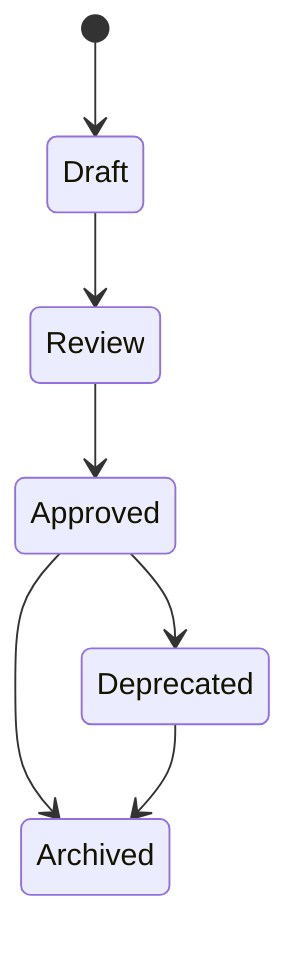
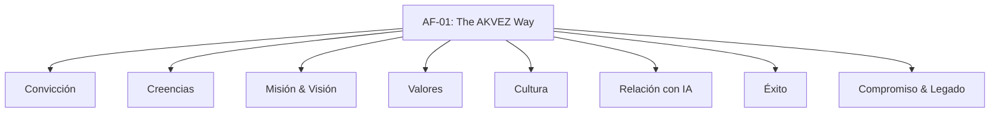

# AF-01 — The AKVEZ Way

## Portada

- **Nombre del documento:** The AKVEZ Way
- **Código:** AF-01
- **Versión:** v0.1
- **Estado:** Draft
- **Clasificación:** AF — AKVEZ Foundation
- **Fecha de creación:** 2026-07-21
- **Última actualización:** 2026-07-21
- **Responsable:** Garnet Jordan
- **Nivel de confidencialidad:** Interno

---

## Historial de versiones

| Versión | Fecha | Responsable | Descripción del cambio | Motivo |
| --- | --- | --- | --- | --- |
| v0.1 | 2026-07-21 | Garnet Jordan | Estandarización inicial según ADS-00 (estructura, secciones y formato). | Formalizar documento fundacional. |

---

## Tabla de contenido

1. Resumen ejecutivo  
2. Objetivos  
3. Alcance  
4. Desarrollo  
5. Decisiones importantes  
6. Riesgos  
7. KPIs  
8. Dependencias  
9. Glosario  
10. Referencias  
11. Anexos  

---

## Resumen ejecutivo

AF-01 define “The AKVEZ Way”: la convicción, misión, visión, valores y principios culturales que guían cómo AKVEZ construye producto, toma decisiones y se relaciona con la inteligencia artificial.

---

## Objetivos

1. Establecer un marco fundacional para la cultura y la toma de decisiones en AKVEZ.
2. Alinear al equipo y colaboradores sobre el propósito, valores y compromisos.
3. Servir como referencia para documentos derivados (APS/ADR/ADS) y para evaluar coherencia organizacional.

---

## Alcance

**Incluye:**

- Convicción, creencias, misión, visión.
- Valores y cultura.
- Relación con la IA como medio.
- Definición de éxito y compromiso.

**No incluye:**

- Especificaciones de producto (APS).
- Decisiones de arquitectura (ADR).
- Normas de documentación (ADS) más allá de la referencia obligatoria.

---

## Desarrollo

### 1) Principio guía (frase)

> *"No construimos herramientas para reemplazar a las personas. Construimos herramientas para potenciar aquello que las personas hacen mejor."*
> 

---

### 2) Nuestra convicción

Creemos que millones de profesionales independientes poseen un talento extraordinario. Sin embargo, demasiados fracasan porque nunca logran llegar a las personas que necesitan ese talento.

El problema no es la capacidad.  

El problema es la oportunidad.

AKVEZ existe para reducir esa distancia.

---

### 3) Lo que creemos

Conseguir clientes no debería depender únicamente de:

- suerte;
- contactos;
- publicidad costosa;
- algoritmos impredecibles.

Cualquier profesional merece acceder a mejores oportunidades si ofrece un trabajo de calidad.

---

### 4) Nuestra misión

Construir herramientas inteligentes que permitan a cualquier profesional independiente crecer de forma sostenible, utilizando inteligencia artificial para reducir tareas repetitivas y aumentar el tiempo dedicado a crear valor.

---

### 5) Nuestra visión

Aspiramos a convertirnos en la plataforma de referencia para profesionales independientes que desean hacer crecer su negocio mediante decisiones basadas en datos, inteligencia y estrategia.

Nuestro éxito no se medirá únicamente por el número de usuarios. Se medirá por el número de negocios que ayudemos a crecer.

---

### 6) Nuestros valores

#### 6.1. El usuario primero

Cada decisión comienza con una pregunta:

> ¿Esto mejora realmente la vida del usuario?
> 

Si la respuesta es no, la decisión debe replantearse.

#### 6.2. La simplicidad es una ventaja competitiva

La mejor solución no es la que tiene más funciones. Es la que elimina más fricción.

#### 6.3. La evidencia supera a la intuición

Las ideas son valiosas. Pero las decisiones importantes deben apoyarse en experimentos, métricas y aprendizaje.

#### 6.4. La inteligencia debe ser transparente

La IA debe ayudar al usuario a comprender mejor una oportunidad. No debe convertirse en una caja negra que tome decisiones inexplicables.

#### 6.5. El aprendizaje nunca termina

Cada cliente. Cada error. Cada experimento. Cada versión. Debe dejar un aprendizaje documentado.

#### 6.6. El conocimiento es un activo

El conocimiento que generamos vale tanto como el software. Por eso documentamos nuestras decisiones.

#### 6.7. Construimos desde la experiencia

AKVEZ nace porque su fundadora experimentó personalmente el desafío de conseguir clientes como diseñadora web independiente. Nuestra primera obligación será resolver ese problema de forma real antes de intentar resolver el de miles de personas.

La experiencia práctica tendrá prioridad sobre las suposiciones.

---

### 7) Nuestra cultura

Queremos construir una empresa donde las mejores ideas puedan venir de cualquier persona. Las decisiones no se impondrán por jerarquía: se defenderán con argumentos.

Preferimos una conversación difícil hoy antes que un problema costoso dentro de un año.

---

### 8) Relación con la inteligencia artificial

La IA no es el producto. La IA es un medio.

El verdadero producto es la capacidad del usuario para tomar mejores decisiones y hacer crecer su negocio.

Si algún día aparece una tecnología mejor que la IA actual, AKVEZ evolucionará con ella.

Nuestra lealtad es hacia el problema del usuario, no hacia una tecnología específica.

---

### 9) Definición de éxito

AKVEZ tendrá éxito cuando un profesional pueda decir:

> *"Hoy dedico más tiempo a trabajar con mis clientes que a buscarlos."*
> 

Ese será el indicador más importante.

---

### 10) El compromiso de AKVEZ

Prometemos construir tecnología que:

- respete el tiempo de las personas;
- simplifique procesos complejos;
- genere oportunidades reales;
- evolucione con responsabilidad;
- mantenga la transparencia en sus decisiones.

---

### 11) El legado que queremos dejar

No queremos ser recordados únicamente por el software que desarrollamos. Queremos ser recordados por haber ayudado a miles de profesionales independientes a construir negocios sostenibles, permitiéndoles dedicar más tiempo a aquello que mejor saben hacer.

El impacto de AKVEZ no se medirá por la cantidad de líneas de código escritas, sino por las oportunidades que haya contribuido a crear.

---

### 12) Declaración final

AKVEZ no existe para automatizar personas. Existe para liberar su potencial.

Cada decisión, cada línea de código y cada nueva versión deberán contribuir a ese propósito.

---

## Decisiones importantes

*No aplica aún (este documento es fundacional y no registra decisiones de arquitectura).*

---

## Riesgos

1. **Ambigüedad interpretativa:** valores redactados de forma inspiracional pueden prestarse a interpretaciones inconsistentes.  
    - Mitigación: ejemplos concretos y referencias cruzadas a APS/ADR cuando existan.
2. **Desalineación con la ejecución:** que la cultura declarada no se refleje en procesos reales.  
    - Mitigación: KPIs y rituales de revisión trimestral del AF-01.

---

## KPIs

1. **Coherencia documental:** % de APS/ADR que citan explícitamente AF-01 cuando una decisión esté motivada por un valor/convicción.  
2. **Tiempo a claridad:** reducción de preguntas recurrentes sobre “cómo decidimos” (medido por incidencias o temas repetidos).  
3. **Calidad de decisiones:** % de ADR con justificación explícita y trade-offs documentados.

---

## Dependencias

- ADS-00 — AKVEZ Documentation Standard (estándar de documentación obligatorio).

---

## Glosario

- **AF:** AKVEZ Foundation. Documentos estratégicos/fundacionales.
- **ADS:** AKVEZ Documentation Standards. Normas para documentación.
- **APS:** AKVEZ Product Specification. Especificación del producto.
- **ADR:** Architecture Decision Record. Decisiones permanentes de arquitectura.

---

## Referencias

- ADS-00 — AKVEZ Documentation Standard.

---

## Anexos

### A.1. Diagrama — Estados del documento (referencia ADS-00)

**Identificador:** AF-01-DIAG-001  

**Versión:** v0.1  

**Fecha de actualización:** 2026-07-21

### A.2. Diagrama — Mapa conceptual “The AKVEZ Way”

**Identificador:** AF-01-DIAG-002  

**Versión:** v0.1  

**Fecha de actualización:** 2026-07-21