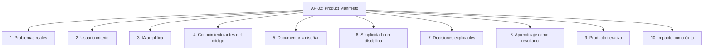

# AF-02 — The AKVEZ Product Manifesto

## Portada

- **Nombre del documento:** The AKVEZ Product Manifesto
- **Código:** AF-02
- **Versión:** v1.0
- **Estado:** Draft
- **Clasificación:** AF — AKVEZ Foundation
- **Fecha de creación:** 2026-07-21
- **Última actualización:** 2026-07-21
- **Responsable:** Garnet Jordan
- **Nivel de confidencialidad:** Interno

---

## Historial de versiones

| Versión | Fecha | Responsable | Descripción del cambio | Motivo |
| --- | --- | --- | --- | --- |
| v1.0 | 2026-07-21 | Garnet Jordan | Estandarización inicial según ADS-00 (estructura, secciones y formato). | Formalizar manifiesto de producto. |

---

## Tabla de contenido

1. Resumen ejecutivo  
2. Objetivos  
3. Alcance  
4. Desarrollo  
5. Decisiones importantes  
6. Riesgos  
7. KPIs  
8. Dependencias  
9. Glosario  
10. Referencias  
11. Anexos  

---

## Resumen ejecutivo

AF-02 establece el manifiesto de producto de AKVEZ: diez principios de diseño y construcción, más diez compromisos organizacionales, para asegurar decisiones coherentes a medida que el producto evoluciona.

---

## Objetivos

1. Definir los principios rectores que guían el diseño y evolución del producto AKVEZ.
2. Establecer un marco común para priorización y toma de decisiones de producto.
3. Asegurar consistencia entre investigación, documentación, implementación y medición.

---

## Alcance

**Incluye:**

- Principios de diseño/desarrollo de producto.
- Criterios de decisión y enfoque en usuario.
- Enfoque de IA como amplificador, no sustituto.
- Compromisos organizacionales asociados al desarrollo.

**No incluye:**

- Requisitos funcionales o no funcionales específicos (APS).
- Decisiones de arquitectura o tecnología (ADR).
- Roadmap o planes de entrega.

---

## Desarrollo

### Frase guía

> *"Cada producto refleja la forma de pensar de quienes lo construyen."*
> 

---

### Introducción

AKVEZ no nace con la intención de desarrollar una aplicación más dentro del mercado de herramientas impulsadas por inteligencia artificial. Nace con la convicción de que el conocimiento, cuando se estructura correctamente, puede convertirse en una ventaja competitiva sostenible.

Este manifiesto define los principios que orientarán todas las decisiones relacionadas con el diseño, desarrollo y evolución del producto. No describe funcionalidades: describe la forma en que pensamos.

---

### Principios del manifiesto

#### 1. Construimos para resolver problemas reales

Nunca desarrollaremos una funcionalidad únicamente porque sea técnicamente posible. Toda inversión en desarrollo deberá responder a una necesidad validada mediante investigación, experiencia o evidencia.

La tecnología será siempre un medio, nunca el objetivo.

#### 2. El usuario es nuestro principal criterio

No competiremos por tener más funciones. Competiremos por reducir la complejidad.

Cada nueva característica deberá justificar el tiempo, el esfuerzo y el espacio mental que exigirá al usuario.

#### 3. La inteligencia artificial amplifica al profesional

AKVEZ no pretende sustituir el criterio humano. Busca ampliar sus capacidades.

Las recomendaciones generadas por IA deberán fortalecer la capacidad del usuario para decidir, nunca limitarla.

#### 4. El conocimiento precede al código

Antes de desarrollar una funcionalidad debemos comprender:

- el problema;
- el contexto;
- las restricciones;
- los criterios de éxito;
- los riesgos.

Solo después comenzará la implementación.

#### 5. Documentar es diseñar

Para AKVEZ, documentar no es una tarea administrativa. Es una actividad de diseño.

Un documento bien escrito evita errores, acelera el desarrollo y preserva el conocimiento del equipo.

#### 6. La simplicidad requiere disciplina

La solución más sencilla rara vez aparece primero. La simplicidad es el resultado de eliminar todo aquello que no aporta valor.

#### 7. Las decisiones deben poder explicarse

Cada decisión importante deberá responder tres preguntas:

- ¿Qué problema resuelve?
- ¿Por qué elegimos esta solución?
- ¿Qué alternativas descartamos?

#### 8. El aprendizaje es parte del producto

Cada experimento genera conocimiento. Cada error aporta información. Cada versión debe dejar una enseñanza documentada.

El aprendizaje no es un subproducto del desarrollo: es uno de sus principales resultados.

#### 9. El producto nunca está terminado

Publicar una versión no significa finalizar un trabajo. Significa comenzar una nueva etapa de aprendizaje.

Cada interacción con un usuario representa una oportunidad para mejorar.

#### 10. El impacto define nuestro éxito

El verdadero éxito de AKVEZ no será el número de funcionalidades desarrolladas. Será el número de profesionales que logren construir negocios sostenibles gracias a las oportunidades generadas por la plataforma.

---

### Los diez compromisos de AKVEZ

Como organización nos comprometemos a:

1. Escuchar antes de construir.
2. Medir antes de decidir.
3. Documentar antes de desarrollar.
4. Validar antes de escalar.
5. Simplificar antes de añadir.
6. Aprender antes de repetir.
7. Explicar antes de automatizar.
8. Evolucionar sin perder el propósito.
9. Compartir el conocimiento.
10. Mantener siempre al usuario en el centro.

---

### Cierre

Este manifiesto no pretende limitar la creatividad del equipo. Su propósito es proporcionar un marco común para tomar decisiones coherentes incluso cuando el producto evolucione, cambie de tecnología o incorpore nuevos integrantes.

Mientras estos principios permanezcan, AKVEZ conservará su identidad.

---

## Decisiones importantes

*No aplica aún (este documento define principios; las decisiones específicas se registran en ADR).*

---

## Riesgos

1. **Principios demasiado abstractos:** pueden ser interpretados de forma inconsistente.  
    - Mitigación: ejemplos concretos y referencias cruzadas desde APS/ADR.
2. **Desalineación entre manifiesto y roadmap:** riesgo de priorizar entregables que no cumplan el manifiesto.  
    - Mitigación: checklist de validación del manifiesto en cada iniciativa relevante (APS/PRD).

---

## KPIs

1. **Trazabilidad de decisiones:** % de ADR que referencian explícitamente uno o más principios del AF-02.  
2. **Simplicidad percibida:** reducción del tiempo/etapas para completar el flujo principal del usuario (según analítica).  
3. **Calidad de aprendizaje:** % de experimentos/versiones con “enseñanza documentada” (ADR/APS/Notas de experimento).

---

## Dependencias

- ADS-00 — AKVEZ Documentation Standard (estándar de documentación obligatorio).

---

## Glosario

- **AF:** AKVEZ Foundation. Documentos estratégicos/fundacionales.
- **ADS:** AKVEZ Documentation Standards. Normas para documentación.
- **APS:** AKVEZ Product Specification. Especificación del producto.
- **ADR:** Architecture Decision Record. Decisiones permanentes de arquitectura.
- **Manifiesto:** conjunto de principios y compromisos que guían decisiones de producto.

---

## Referencias

- ADS-00 — AKVEZ Documentation Standard.

---

## Anexos

### A.1. Diagrama — Principios del manifiesto (mapa)

**Identificador:** AF-02-DIAG-001  

**Versión:** v1.0  

**Fecha de actualización:** 2026-07-21

### A.2. Diagrama — Ciclo de construcción (alineado al manifiesto)

**Identificador:** AF-02-DIAG-002  

**Versión:** v1.0  

**Fecha de actualización:** 2026-07-21