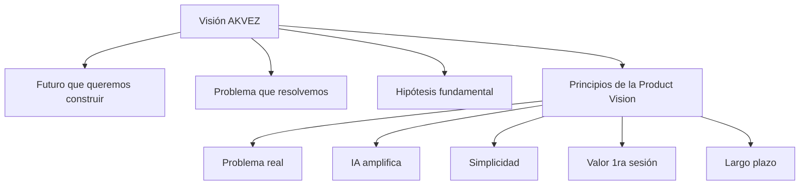

# APS-01 — Product Vision

# AKVEZ Blueprint

# APS-01 — Product Vision

**Versión:** 2.2

**Estado:** Approved

**Clasificación:** Core Document

**Propietario:** AKVEZ Product Office

**Estándar Aplicado:** ADS-00

---

# Historial de Versiones

| Versión | Estado | Descripción |
| --- | --- | --- |
| 1.0 | Archived | Primera definición de la visión del producto. |
| 2.0 | Approved | Reestructuración completa bajo el estándar ADS-00 e incorporación de principios estratégicos de largo plazo. |
| 2.1 | Draft | Se añadieron diagramas (mapa de visión, fases y flujo de evaluación) como anexos para mejorar comprensión y trazabilidad. |
| 2.2 | Approved | **Normalización del estado documental: `Draft` → `Approved`** (2026-07-29, AKVEZ Product Office). **Ningún contenido funcional modificado:** ninguna sección, principio, hipótesis ni diagrama resulta afectado. **Motivo:** el documento declaraba `Draft` en portada y `APPROVED` en su §Evaluación AQS, dos estados incompatibles de forma simultánea. La discrepancia se resuelve a favor de `Approved` porque la v2.0 ya estaba aprobada y el único delta de la v2.1 fue **aditivo** —tres diagramas incorporados como anexos—, sin alterar ninguna decisión. Es el mismo criterio aplicado a APS-03 v3.0. Hallazgo **H-07** de REV-03 y **DM-6** de AR-02 §4.3. |

---

# Tabla de Contenido

1. Resumen Ejecutivo
2. Product Quote
3. Propósito del Documento
4. La Visión de AKVEZ
5. El Problema que Resolvemos
6. El Futuro que Queremos Construir
7. Nuestra Hipótesis Fundamental
8. Principios de la Product Vision
9. Qué NO es AKVEZ
10. Horizonte de Evolución
11. Criterios para Evaluar Nuevas Funcionalidades
12. Riesgos Estratégicos
13. Dependencias
14. Glosario
15. Referencias
16. Anexos
17. Evaluación AQS

---

# 1. Resumen Ejecutivo

La Product Vision define el destino hacia el cual evolucionará AKVEZ durante los próximos años.

No describe únicamente las funcionalidades del producto.

Describe la transformación que AKVEZ pretende generar en la forma en que los profesionales independientes encuentran oportunidades comerciales.

Toda decisión técnica, funcional, comercial o de diseño deberá alinearse con esta visión.

Cuando exista un conflicto entre una funcionalidad y la Product Vision, prevalecerá siempre la visión.

---

# 2. Product Quote

> **"Toda decisión de producto comienza y termina con la visión."**
> 

---

# 3. Propósito del Documento

Este documento establece la visión oficial de AKVEZ y constituye el fundamento estratégico del Blueprint.

Define:

- la razón de existir del producto;
- el problema que busca resolver;
- el futuro que pretende construir;
- los principios que orientarán su evolución.

Su propósito es asegurar que todas las decisiones mantengan una dirección coherente a lo largo del tiempo.

---

# 4. La Visión de AKVEZ

AKVEZ aspira a convertirse en el sistema operativo de crecimiento para profesionales independientes y pequeñas empresas de servicios.

No será simplemente una herramienta para buscar clientes.

Será una plataforma capaz de identificar oportunidades comerciales, analizarlas mediante inteligencia artificial y acompañar al usuario durante todo el proceso de adquisición de clientes.

La visión de largo plazo es reducir la incertidumbre asociada a la prospección comercial y permitir que los profesionales dediquen más tiempo a crear valor para sus clientes y menos tiempo a buscarlos.

---

# 5. El Problema que Resolvemos

Miles de profesionales talentosos fracasan no por falta de capacidad técnica, sino por la dificultad para conseguir clientes de manera constante.

Actualmente, la prospección comercial suele caracterizarse por:

- procesos manuales;
- información dispersa;
- baja priorización de oportunidades;
- mensajes genéricos;
- pérdida de tiempo en empresas con baja probabilidad de conversión.

AKVEZ nace para transformar ese proceso en un sistema inteligente, estructurado y repetible.

---

# 6. El Futuro que Queremos Construir

Visualizamos un futuro en el que cualquier profesional pueda iniciar su jornada laboral sabiendo exactamente:

- qué empresas representan las mejores oportunidades;
- por qué son oportunidades relevantes;
- cuál es la mejor forma de iniciar una conversación;
- qué acciones realizar a continuación.

La búsqueda de clientes dejará de depender de la intuición y pasará a apoyarse en datos, inteligencia artificial y procesos consistentes.

---

# 7. Nuestra Hipótesis Fundamental

La hipótesis central de AKVEZ es la siguiente:

> Si reducimos el tiempo necesario para identificar oportunidades comerciales de alta calidad y facilitamos la personalización del primer contacto, los profesionales independientes aumentarán significativamente su capacidad para conseguir nuevos clientes.
> 

Todo el desarrollo del producto deberá validar o refinar esta hipótesis.

---

# 8. Principios de la Product Vision

## 8.1 Resolver un problema real

Cada funcionalidad deberá responder a una necesidad concreta del usuario.

---

## 8.2 La inteligencia artificial debe amplificar al profesional

La IA existirá para potenciar el criterio del usuario, no para sustituirlo.

---

## 8.3 Simplicidad antes que complejidad

La experiencia deberá mantenerse clara incluso cuando el producto incorpore nuevas capacidades.

---

## 8.4 El valor debe percibirse desde la primera sesión

El usuario deberá experimentar beneficios reales en sus primeros minutos de uso.

---

## 8.5 Construir para el largo plazo

Las decisiones de hoy no deberán limitar la evolución futura del producto.

---

# 9. Qué NO es AKVEZ

Para mantener el enfoque estratégico, AKVEZ no pretende convertirse en:

- un CRM tradicional;
- una plataforma de automatización masiva de correos;
- una red social profesional;
- un directorio de empresas;
- una agencia de marketing;
- un marketplace de freelancers.

Estas funcionalidades podrán integrarse con AKVEZ, pero no definirán su identidad.

---

# 10. Horizonte de Evolución

La evolución del producto seguirá una estrategia progresiva.

**Fase 1:** Conseguir clientes para diseñadores web independientes.

**Fase 2:** Expandirse a otros profesionales digitales.

**Fase 3:** Incorporar equipos y agencias.

**Fase 4:** Integrarse con herramientas comerciales externas.

**Fase 5:** Convertirse en una plataforma inteligente de crecimiento empresarial.

Cada etapa deberá completarse antes de avanzar a la siguiente.

---

# 11. Criterios para Evaluar Nuevas Funcionalidades

Toda nueva iniciativa deberá responder afirmativamente a las siguientes preguntas:

- ¿Contribuye a la visión del producto?
- ¿Resuelve un problema real del usuario?
- ¿Incrementa el valor del producto sin añadir complejidad innecesaria?
- ¿Puede mantenerse a largo plazo?
- ¿Fortalece el posicionamiento de AKVEZ?

Si la respuesta es negativa en alguno de estos puntos, la funcionalidad deberá reconsiderarse.

---

# 12. Riesgos Estratégicos

Los principales riesgos para la visión del producto son:

- pérdida del enfoque inicial;
- incorporación excesiva de funcionalidades;
- dependencia tecnológica de terceros;
- crecimiento más rápido que la validación del producto;
- desviación respecto a las necesidades reales de los usuarios.

La Product Vision actuará como mecanismo de protección frente a estos riesgos.

---

# 13. Dependencias

Este documento constituye el punto de partida del Blueprint y sirve de referencia para todos los documentos APS.

Se relaciona especialmente con:

- AF-00 — Constitution of AKVEZ.
- AF-01 — The AKVEZ Way.
- AF-02 — Product Manifesto.
- ADS-00 — Documentation Standard.
- APS-02 — Product Scope & Boundaries.
- APS-05 — Product Roadmap & Evolution Strategy.
- APS-13 — Product Governance Framework.

---

# 14. Glosario

**Product Vision:** Declaración estratégica que describe el futuro que el producto pretende construir.

**Propuesta de Valor:** Beneficio principal que AKVEZ ofrece a sus usuarios.

**Hipótesis de Producto:** Suposición fundamental que guía el desarrollo y que debe validarse mediante evidencia.

**Profesional Independiente:** Persona que ofrece servicios especializados y necesita generar oportunidades comerciales de forma constante.

---

# 15. Referencias

- AF-00 — Constitution of AKVEZ.
- AF-01 — The AKVEZ Way.
- AF-02 — Product Manifesto.
- ADS-00 — Documentation Standard.

---

# 16. Anexos

## 16.1 Diagrama — Mapa de la Product Vision (APS-01)



**Identificador:** APS-01-DIAG-001  

**Versión:** v2.1  

**Fecha de actualización:** 2026-07-21

---

## 16.2 Diagrama — Horizonte de evolución (Fases 1–5)


**Identificador:** APS-01-DIAG-002  

**Versión:** v2.1  

**Fecha de actualización:** 2026-07-21

---

## 16.3 Diagrama — Flujo para evaluar nuevas funcionalidades (sección 11)

```mermaid
flowchart TD
  S[Iniciativa propuesta] --> Q1{Alineada a la vision}
  Q1 -->|No| R[Reconsiderar / descartar]
  Q1 -->|Si| Q2{Resuelve problema real}
  Q2 -->|No| R
  Q2 -->|Si| Q3{Aumenta valor sin complejidad}
  Q3 -->|No| R
  Q3 -->|Si| Q4{Sostenible a largo plazo}
  Q4 -->|No| R
  Q4 -->|Si| Q5{Fortalece posicionamiento}
  Q5 -->|No| R
  Q5 -->|Si| A[Aprobar para discovery / diseno detallado (APS/ADR)]
```

**Identificador:** APS-01-DIAG-003  

**Versión:** v2.1  

**Fecha de actualización:** 2026-07-21

---

# 16. Evaluación AQS

| Criterio | Puntaje |
| --- | --- |
| Claridad | 20/20 |
| Completitud | 20/20 |
| Implementabilidad | 20/20 |
| Consistencia | 15/15 |
| Escalabilidad | 15/15 |
| Calidad Editorial | 10/10 |

**AQS Total:** **100/100**

**Estado:** **APPROVED**