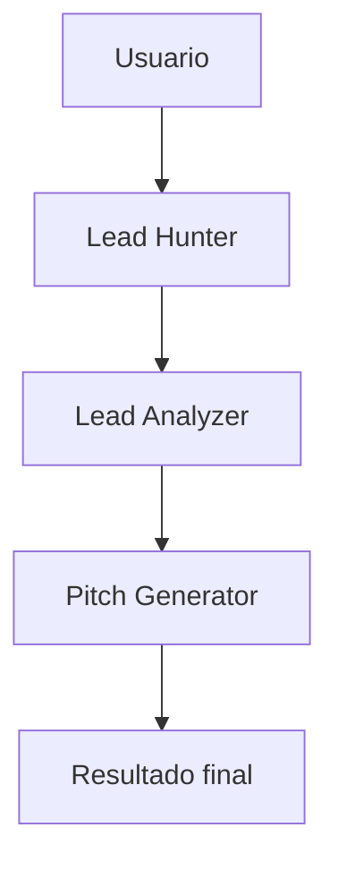
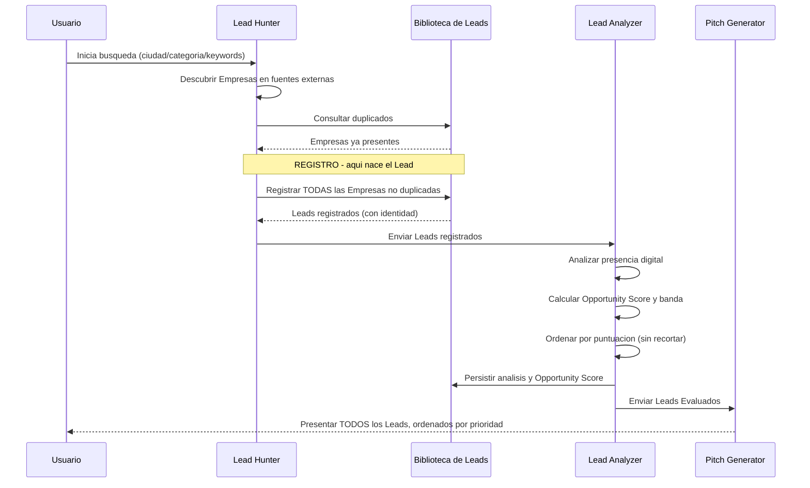
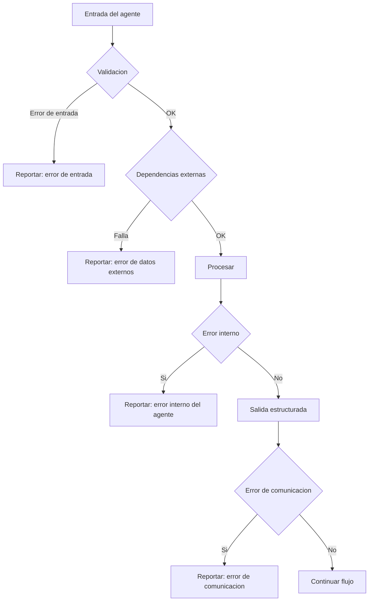

# APS-03 — Agent Architecture

## APS-03 — Agent Architecture

**Versión:** 3.1

**Estado:** Approved

**Clasificación:** Interno

**Propietario:** AKVEZ Product Office

**Estándar Aplicado:** ADS-00

**Autoridad de dominio:** PO-01 · APS-07 (Approved)

---

# Historial de Versiones

| Versión | Fecha | Responsable | Descripción | Motivo |
| --- | --- | --- | --- | --- |
| 1.0 | — | AKVEZ Product Office | Definición inicial de la arquitectura de agentes. | Establecer la arquitectura de agentes de la V1. |
| 2.0 | — | AKVEZ Product Office | Reestructuración completa bajo el estándar ADS-00. | Cumplimiento del estándar documental. |
| 2.1 | 2026-07-21 | AKVEZ Product Office | Se añadieron diagramas (arquitectura general, flujo entre agentes y manejo de errores) como anexos. | Mejorar comprensión e implementabilidad. |
| **3.1** | 2026-07-30 | AKVEZ Product Office | **Alineación con PO-01 v1.2 y APS-07 v2.1.** Se redefine la **salida del Pitch Generator**, que pasa a ser **doble** —*Secuencia Comercial diseñada* y *Propuesta Comercial por contacto*— y **deja de producir transición de estadio** (§7.3). Se incorporan dos responsabilidades: **diagnosticar comercialmente** y **diseñar la Secuencia**. En la tabla de §7 el estadio resultante del agente pasa a «—» y se añade una fila para la **declaración del usuario**. En §8.1 el paso 8 deja de cambiar el estadio y se incorpora el **paso 9**, ejecutado por el usuario; el antiguo paso 9 pasa a **10**. **No se modifica ninguna otra sección: las prohibiciones P-1, P-2 y P-3 de §8.2 permanecen literalmente intactas**, igual que §7.1 y §7.2. **El nombre del agente no cambia.** | Sprint **COM-09**, tarea 4. Aplica **PO-02 §5 y §8**, que resolvió el conflicto **Q-5** entre §7.3 de este documento y APS-18 §9 — irresoluble entre dos documentos de orden 3 y decidido por un documento de orden 2. La salida singular de §7.3 era una **transcripción de PO-01 §8**, corregido en su v1.2. **Se conserva «Pitch Generator» como nombre oficial**; el renombrado exige un acto de *naming* separado (PO-02 §1). |
| 3.0 | 2026-07-29 | AKVEZ Product Office | **Alineación con PO-01 y APS-07 v2.0.** Se reescriben §7 (responsabilidades de los tres agentes) y §8 (flujo canónico, con incorporación del paso de **Registro** y declaración de prohibiciones del flujo). Diagrama APS-03-DIAG-002 actualizado a v3.0. Glosario ampliado con la terminología canónica del dominio. Estado `Draft` → `Approved`, resolviendo la discrepancia con §19. | Fase 1 de PLAN-01. El flujo de §8 v2.1 omitía el Registro y describía la selección como paso implícito, en contradicción con PO-01 §3, §6 y §8. |

---

> **Autoridad.** Las definiciones del dominio Empresa → Lead que este documento utiliza proceden de **APS-07 §5-§8**, que a su vez reproduce **PO-01**. Este documento no define el dominio: define **qué agente ejecuta cada transición**. En caso de discrepancia, prevalecen PO-01 y APS-07, por este orden (ADS-00, *Jerarquía Documental*).

---

# Tabla de Contenido

1. Resumen Ejecutivo
2. Product Quote
3. Propósito del Documento
4. Filosofía Arquitectónica
5. Principios de Diseño
6. Arquitectura General
7. Agentes de la V1
8. Flujo de Trabajo entre Agentes
9. Comunicación entre Agentes
10. Gestión del Estado
11. Escalabilidad
12. Manejo de Errores
13. Requisitos Técnicos
14. Riesgos
15. Dependencias
16. Glosario
17. Referencias
18. Anexos
19. Evaluación AQS

---

# 1. Resumen Ejecutivo

La primera versión de AKVEZ utilizará una arquitectura basada en agentes especializados.

En lugar de construir un único sistema encargado de realizar todas las tareas, la plataforma dividirá el proceso de prospección comercial en componentes independientes, cada uno responsable de una función claramente definida.

Esta decisión busca maximizar la mantenibilidad, facilitar la evolución del producto y permitir que nuevas capacidades puedan incorporarse sin afectar el funcionamiento del sistema existente.

Durante la V1 se implementarán únicamente tres agentes, suficientes para validar la propuesta de valor del producto.

---

# 2. Product Quote

> **"La inteligencia emerge cuando cada agente domina una sola responsabilidad."**
> 

---

# 3. Propósito del Documento

Este documento define la arquitectura oficial de agentes de AKVEZ.

Su objetivo es establecer:

- qué agentes existen;
- cuáles son sus responsabilidades;
- cómo interactúan entre sí;
- cómo fluye la información dentro del sistema;
- cuáles son los principios que regirán futuras ampliaciones.

---

# 4. Filosofía Arquitectónica

AKVEZ adopta una arquitectura modular basada en agentes especializados.

Cada agente deberá tener una única responsabilidad claramente definida.

Los agentes no competirán entre sí ni duplicarán funciones.

Cada uno resolverá un problema específico dentro del flujo de generación de oportunidades comerciales.

Esta filosofía reduce el acoplamiento entre componentes y facilita la evolución independiente de cada agente.

---

# 5. Principios de Diseño

La arquitectura de agentes se fundamenta en los siguientes principios:

## 4.1 Una responsabilidad por agente

Cada agente deberá resolver un único problema.

No se permitirán agentes con múltiples responsabilidades.

---

## 4.2 Comunicación mediante información estructurada

Los agentes intercambiarán únicamente información necesaria para continuar el flujo.

No compartirán estados internos innecesarios.

---

## 4.3 Independencia

Cada agente deberá poder evolucionar sin requerir modificaciones importantes en los demás componentes.

---

## 4.4 Sustituibilidad

Cualquier agente podrá ser reemplazado por una nueva implementación sin afectar el comportamiento esperado del sistema.

---

## 4.5 Escalabilidad

La incorporación de nuevos agentes no deberá modificar el flujo principal existente.

---

# 6. Arquitectura General

La V1 estará compuesta por tres agentes principales:

```
Usuario

↓

Lead Hunter

↓

Lead Analyzer

↓

Pitch Generator

↓

Resultado Final
```

Cada agente recibe información, la transforma y entrega un resultado estructurado al siguiente.

---

# 7. Agentes de la V1

Cada agente ejecuta una o más transiciones del ciclo de vida definido en APS-07 §7. Ningún agente define el dominio; todos lo aplican.

| Agente | Transición que ejecuta | Estadio resultante |
| --- | --- | --- |
| Lead Hunter | Descubrimiento · **Registro** | **Lead** |
| Lead Analyzer | Análisis · Evaluación | **Lead Analizado** → **Lead Evaluado** |
| Pitch Generator *(Sistema Comercial)* | Diagnóstico · Estrategia · Secuencia · Propuesta | **—** *(ninguno)* |
| — *(el usuario)* | **Declaración de contacto** | **Lead Contactado** |

> **La transición a *Lead Contactado* no la ejecuta ningún agente.** Contactar es un acto en el mundo que AKVEZ no realiza y no puede observar: lo ejecuta el usuario y lo produce su declaración *(PO-01 §8 · PO-02 §5)*. Es la única transición del ciclo de vida cuyo autor no es un agente, y por eso figura en esta tabla con agente «—», igual que el paso 1 de §8.1.

---

## 7.1 Lead Hunter

### Objetivo

Descubrir Empresas en las fuentes externas e **incorporarlas a la Biblioteca de Leads del usuario**.

El Lead Hunter es el agente que ejecuta el **Registro**, único evento que convierte una Empresa en Lead (APS-07 §7.1).

### Responsabilidades

- Buscar Empresas según los criterios definidos por el usuario.
- Obtener la información pública disponible.
- Consultar la Biblioteca de Leads para detectar duplicados.
- **Registrar en la Biblioteca de Leads todas las Empresas descubiertas que no estuviesen ya presentes.**
- Entregar al siguiente agente el conjunto de Leads registrados, con su identidad ya asignada.

### Responsabilidades que NO le corresponden

- **No juzga.** No evalúa calidad, potencial ni relevancia comercial.
- **No selecciona.** No decide qué Empresas merecen registrarse.
- **No recorta.** No aplica cupos, topes ni cantidades máximas.

### Entradas

- Ciudad.
- Categoría.
- Palabras clave.
- Parámetros de búsqueda.

### Salidas

Conjunto de **Leads registrados**, cada uno con identificador único.

El conjunto de salida es exhaustivo: contiene **todas** las Empresas descubiertas y no duplicadas, sin excepción.

---

## 7.2 Lead Analyzer

### Objetivo

Enriquecer los Leads ya registrados con el diagnóstico de su presencia digital y con su Opportunity Score, y **ordenarlos** por prioridad.

### Responsabilidades

- Analizar la existencia del sitio web.
- Evaluar la calidad de la presencia digital.
- Revisar reseñas y calificación.
- Identificar oportunidades de mejora.
- Generar observaciones relevantes para el usuario.
- Calcular el Opportunity Score **a partir del análisis previo**, conforme al orden canónico de APS-07 §6.3.
- Asignar la banda correspondiente conforme a APS-08.
- **Ordenar los Leads de mayor a menor Opportunity Score.**

### Responsabilidades que NO le corresponden

- **No crea Leads.** Opera sobre Leads que ya existen en la Biblioteca.
- **No expulsa.** Ninguna puntuación excluye a un Lead de la Biblioteca ni de la vista del usuario.
- **No trunca.** La priorización se ejerce **ordenando**, nunca recortando (PO-01 §6 y §7).

### Entradas

Leads registrados en la Biblioteca de Leads.

### Salidas

**Leads Evaluados**, ordenados por Opportunity Score. El conjunto de salida tiene la misma cardinalidad que el de entrada.

---

## 7.3 Pitch Generator

### Objetivo

Generar una propuesta comercial inicial adaptada a cada Lead.

### Responsabilidades

- Interpretar el análisis realizado.
- Identificar los principales problemas detectados.
- Construir un mensaje personalizado.
- Adaptar el tono de comunicación.
- Preparar un primer acercamiento comercial.
- **Diagnosticar comercialmente al Lead.**
- **Diseñar la Secuencia Comercial.**

### Entradas

**Lead Evaluado.**

### Salidas

**Secuencia Comercial diseñada**: plan de contactos propuesto para el Lead.

**Propuesta Comercial**: una por contacto — estrategia, evidencia y texto *(PO-02 §3)*.

> **Este agente no produce ninguna transición de estadio.** El paso a *Lead Contactado* lo produce **la declaración del usuario** *(PO-01 §8 · PO-02 §5)*. Una Propuesta generada y no enviada es un estado válido y **no convierte al Lead en Contactado**.
>
> **La Secuencia se diseña; nunca se ejecuta automáticamente.** Cada contacto exige una acción explícita del usuario *(PO-02 §2)*.

---

# 8. Flujo de Trabajo entre Agentes

## 8.1 Flujo canónico

El flujo de información será estrictamente secuencial y coincide con el ciclo de vida de APS-07 §7.

| # | Paso | Agente | Efecto sobre el dominio |
| --- | --- | --- | --- |
| 1 | El usuario inicia una búsqueda | — | — |
| 2 | Se descubren Empresas en las fuentes externas | Lead Hunter | Empresa |
| 3 | Se consulta la Biblioteca de Leads para detectar duplicados | Lead Hunter | — |
| 4 | **Se registran en la Biblioteca todas las Empresas no duplicadas** | Lead Hunter | **Empresa → Lead** |
| 5 | Se analiza la presencia digital de cada Lead | Lead Analyzer | Lead → Lead Analizado |
| 6 | Se calcula el Opportunity Score y se asigna su banda | Lead Analyzer | Lead Analizado → Lead Evaluado |
| 7 | Se ordenan los Leads de mayor a menor puntuación | Lead Analyzer | — *(ordena, no filtra)* |
| 8 | Se diseña la secuencia y se emite la propuesta comercial | Pitch Generator | **Propuesta emitida** *(sin cambio de estadio)* |
| **9** | **El usuario emite el contacto y lo declara** | **—** *(el usuario)* | **Lead Evaluado → Lead Contactado** |
| 10 | El sistema presenta al usuario los Leads, ordenados por prioridad | — | — |

Cada etapa deberá finalizar correctamente antes de iniciar la siguiente.

**El paso 4 es el punto crítico del flujo.** Es el único paso que crea Leads y debe ejecutarse antes de cualquier juicio comercial. Ningún paso posterior podrá alterar qué Leads existen.

---

## 8.2 Prohibiciones del flujo

Las siguientes reglas son vinculantes y no admiten excepción. Derivan de PO-01 §6 y §7 y de APS-07 §7.2.

**P-1. No existe selección.**

Ningún paso del flujo decide qué Empresas descubiertas se registran. Se registran todas las no duplicadas.

---

**P-2. No existe Top N.**

Ningún paso del flujo limita la cantidad de Leads que existen, se registran, se analizan o se presentan.

Los límites de tanda, de llamada a proveedores externos o de paginación de la interfaz son restricciones de infraestructura. Son legítimos y necesarios, pero residen en la capa de integración o en la de interfaz, **nunca en el flujo de agentes**, y no podrán determinar el contenido de la Biblioteca.

---

**P-3. No existe persistencia parcial.**

El Registro escribe el conjunto completo de Empresas descubiertas y no duplicadas. No se admite ninguna variante que almacene únicamente las analizadas, las mejor puntuadas o las entregadas al usuario.

---

**P-4. No existe umbral de exclusión.**

Ninguna puntuación mínima retira un Lead de la Biblioteca ni de la vista del usuario. La priorización se expresa mediante orden y etiqueta de banda.

---

**P-5. La Evaluación nunca precede al Análisis.**

El Opportunity Score se calcula sobre el conocimiento producido por el Análisis (APS-07 §6.3).

---

# 9. Comunicación entre Agentes

Los agentes intercambiarán únicamente datos estructurados.

Cada salida deberá contener la información necesaria para el siguiente proceso, evitando dependencias innecesarias.

La comunicación será desacoplada, permitiendo reemplazar un agente sin modificar el resto del flujo.

---

# 10. Gestión del Estado

Los agentes serán, preferiblemente, componentes sin estado persistente.

La persistencia de la información recaerá sobre la Biblioteca de Leads y los servicios de almacenamiento del sistema.

Esta decisión reduce la complejidad y facilita la escalabilidad.

---

# 11. Escalabilidad

La arquitectura deberá permitir incorporar nuevos agentes sin alterar los existentes.

Ejemplos de futuras incorporaciones:

- CRM Agent.
- Follow-up Agent.
- Email Agent.
- Proposal Optimizer.
- Meeting Assistant.
- Analytics Agent.
- Market Research Agent.
- Pricing Advisor.

Todos ellos deberán integrarse respetando los principios establecidos en este documento.

---

# 12. Manejo de Errores

Cada agente deberá ser capaz de identificar y reportar errores sin comprometer el funcionamiento global del sistema.

Los errores deberán clasificarse como:

- Error de entrada.
- Error de datos externos.
- Error interno del agente.
- Error de comunicación.

Siempre que sea posible, el sistema deberá continuar procesando el resto de empresas.

---

# 13. Requisitos Técnicos

La arquitectura deberá cumplir los siguientes requisitos:

**FR-A01** Arquitectura modular.

**FR-A02** Separación clara de responsabilidades.

**FR-A03** Comunicación estructurada.

**FR-A04** Registro de actividad.

**FR-A05** Persistencia independiente.

**FR-A06** Escalabilidad horizontal.

**FR-A07** Compatibilidad con múltiples proveedores de IA.

**FR-A08** Sustitución independiente de agentes.

---

# 14. Riesgos

Los principales riesgos identificados son:

- Dependencia excesiva de un único modelo de IA.
- Acoplamiento entre agentes.
- Crecimiento descontrolado de responsabilidades.
- Cambios en las fuentes de datos.
- Aumento del costo computacional al incorporar nuevos agentes.

La arquitectura deberá revisarse periódicamente para garantizar que estos riesgos permanezcan controlados.

---

# 15. Dependencias

Este documento depende de:

- **PO-01 — Decisión Canónica de Lead.** Autoridad funcional del dominio.
- **APS-07 — Data & Knowledge Architecture.** Referencia oficial del dominio Empresa → Lead. Este documento aplica sus definiciones; no las establece.
- AF-00 — Constitución de AKVEZ.
- AF-01 — The AKVEZ Way.
- AF-02 — Product Manifesto.
- ADS-00 — Documentation Standard.
- APS-01 — Product Vision.
- APS-02 — Product Scope.
- APS-08 — Opportunity Scoring Framework.

Los documentos posteriores de arquitectura e implementación deberán respetar la asignación de responsabilidades y el flujo canónico establecidos aquí.

---

# 16. Glosario

Las definiciones del dominio proceden de APS-07 §16, que reproduce PO-01. Se incluyen aquí por conveniencia de lectura; en caso de discrepancia prevalece APS-07.

**Agente:** Componente especializado encargado de ejecutar una responsabilidad específica dentro del sistema.

**Empresa:** Negocio real que AKVEZ ha encontrado y sobre el que dispone de información pública. No pertenece a ningún usuario. *(APS-07 §5)*

**Lead:** Empresa que AKVEZ ha incorporado al espacio de trabajo comercial de un usuario concreto. *(APS-07 §5)*

**Registro:** Evento por el que el Lead Hunter incorpora una Empresa a la Biblioteca de Leads del usuario, tras comprobar que no estaba ya presente. Es el **único** evento que convierte una Empresa en Lead. *(APS-07 §7.1)*

**Lead Hunter:** Agente responsable del descubrimiento de Empresas y de su **Registro** en la Biblioteca de Leads. No juzga, no selecciona y no recorta. *(§7.1)*

**Lead Analyzer:** Agente encargado del Análisis, de la Evaluación y de la **ordenación** de los Leads registrados. Prioriza ordenando, nunca excluyendo. *(§7.2)*

**Pitch Generator:** Agente responsable de generar propuestas comerciales personalizadas. *(§7.3)*

**Biblioteca de Leads:** Memoria comercial del usuario. Contiene **todas** las Empresas descubiertas para él, cada una con su conocimiento acumulado. Todo su contenido es, por definición, un Lead. *(APS-07 §8)*

> **Definición derogada.** La versión 2.1 de este documento definía la Biblioteca de Leads como «Repositorio persistente donde se almacenan las empresas ya procesadas». Esa definición queda **sustituida** por la anterior, conforme a PO-01 §4 y APS-07 §8.1.

**Opportunity Score:** Valor de 0 a 100 que expresa el potencial comercial de un Lead para un usuario concreto. Es un **atributo** del Lead, no un estadio de su ciclo de vida. *(APS-07 §16)*

**Vista:** Presentación ordenada de un subconjunto de la Biblioteca de Leads. No debe confundirse con la Biblioteca. *(APS-07 §8.3)*

---

# 17. Referencias

- PO-01 — Decisión de Producto: Definición Canónica de Lead, §3, §5, §6, §7, §8.
- PLAN-01 — Plan de Consolidación del Blueprint, §4, §7 (Fase 1).
- ADS-00 — Documentation Standard (*Jerarquía Documental y Regla de Precedencia*).
- APS-01 — Product Vision.
- APS-02 — Product Scope.
- APS-04 — Human Interface System.
- APS-07 — Data & Knowledge Architecture, §5, §6.3, §7, §7.1, §7.2, §8, §16.
- APS-08 — Opportunity Scoring Framework, §8.

---

# 18. Anexos

## 17.1 Diagrama — Arquitectura general (V1)



**Identificador:** APS-03-DIAG-001  

**Versión:** v2.1  

**Fecha de actualización:** 2026-07-21

---

## 17.2 Diagrama — Flujo de trabajo entre agentes (secuencial)



**Identificador:** APS-03-DIAG-002  

**Versión:** v3.0  

**Fecha de actualización:** 2026-07-29

**Cambios respecto de v2.1:** se incorpora el paso de **Registro** como escritura explícita en la Biblioteca de Leads (ausente en v2.1); se desdobla la operación del Lead Analyzer en Análisis → Evaluación → Ordenación, conforme al orden canónico de APS-07 §6.3; se explicita que la presentación al usuario abarca **todos** los Leads y no una selección.

---

## 17.3 Diagrama — Manejo de errores (por agente)



**Identificador:** APS-03-DIAG-003  

**Versión:** v2.1  

**Fecha de actualización:** 2026-07-21

---

# 19. Evaluación AQS

| Criterio | Puntaje |
| --- | --- |
| Claridad | 20/20 |
| Completitud | 20/20 |
| Implementabilidad | 20/20 |
| Consistencia | 15/15 |
| Escalabilidad | 15/15 |
| Calidad Editorial | 10/10 |

**AQS Total:** **100/100**

**Estado:** **APPROVED**