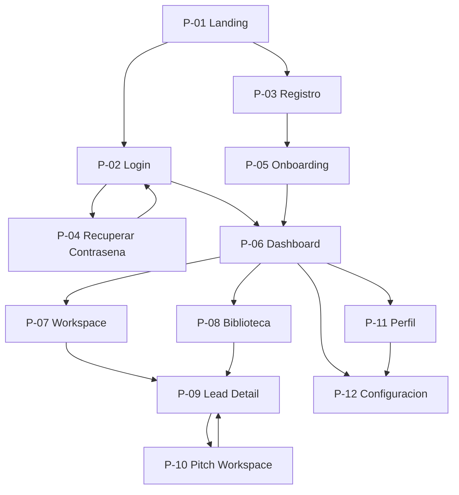

# APS-04 — Human Interface System

# AKVEZ Blueprint

# APS-04 — Human Interface System

**Versión:** 4.0

**Estado:** Approved

**Clasificación:** Core Document

**Propietario:** AKVEZ Product Office

**Estándar Aplicado:** ADS-00 v1.2

**Autoridad de dominio:** PO-01 (Approved) · APS-07 v2.0 · APS-03 v3.0

---

> ## Estructura del documento
>
> APS-04 se organiza en **dos partes independientes y complementarias**:
>
> | Parte | Contenido | Secciones |
> | --- | --- | --- |
> | **A — Arquitectura Funcional de Interfaz** | Pantallas, navegación, responsabilidades, estados, relación con los agentes y componentes conceptuales. **Qué existe y cómo se conecta.** | A.1 – A.9 |
> | **B — Design System** | Especificación visual: tipografía, color, tokens, espaciado, forma, componentes y motion. **Cómo se ve.** | 1 – 29 |
>
> **La Parte B no ha sido modificada.** Conserva íntegras sus 29 secciones, su numeración y todas sus decisiones visuales.
>
> **La Parte A no contiene diseño.** No define maquetación, wireframes, composición ni valores visuales: esos pertenecen a la Parte B y a la implementación.

---

# Historial de Versiones

| Versión | Estado | Descripción |
| --- | --- | --- |
| 1.0 | Archived | Definición inicial de la interfaz del producto. |
| 2.0 | Archived | Rediseño completo bajo el estándar ADS-00 y consolidación como Human Interface System (HIS), enfocado en arquitectura de pantallas, navegación y principios de interacción. |
| 3.0 | Archived | Reemplazo íntegro del documento. Cambio de alcance: de Human Interface System (arquitectura de pantallas) a **Design System** (especificación visual). Se documentan por primera vez tipografías, paleta de colores, design tokens, espaciado, border radius, elevaciones, grid, breakpoints, iconografía, componentes, estados, motion y accesibilidad, tomando como fuente de verdad la referencia visual oficial de producto. Los valores de color y tipografía que no pudieron confirmarse con precisión absoluta se documentaron con el valor más cercano y coherente observado, marcados explícitamente para validación manual posterior. |
| 3.1 | Review | Revisión de calidad final previa a implementación. Se agrega la sección "Filosofía del Design System", se amplía la nota de precisión de los valores visuales, se documenta la jerarquía tipográfica completa (sección 9.4), se completa la tabla de Design Tokens con tokens semánticos adicionales (Border Strong, Text Secondary, Text Tertiary), se amplía la escala de espaciado hasta 96px con su regla general del sistema de 8px, se agrega el estado de cobertura de componentes (sección 18.1), la sección "Fuera del Alcance de este Documento" y la sección "Definition of Done". El documento deja de considerarse borrador; queda pendiente únicamente la validación manual de los valores marcados como [ESTIMADO] durante la implementación. |

**Motivo del cambio (v3.0):** APS-04 no contenía especificaciones visuales implementables (colores sin valores hexadecimales, tipografía descrita solo en términos genéricos). Se recibió una referencia visual oficial de producto y la instrucción explícita de documentar un Design System completo a partir de ella.

| 4.0 | Approved | **Restitución de la arquitectura de interfaz.** El documento recupera su denominación *Human Interface System* y se estructura en dos partes. Se incorpora la **Parte A** (secciones A.1 a A.9): arquitectura global de pantallas, flujo de navegación, responsabilidades, relación con los agentes, estados, componentes conceptuales, reglas vinculantes de interfaz y trazabilidad. Se actualizan §4 y §5 para reflejar el nuevo alcance. **La Parte B (secciones 1 a 29) no se modifica en ningún punto.** |

**Motivo del cambio (v3.1):** Revisión de calidad final solicitada antes de considerar APS-04 terminado, para dejarlo como especificación definitiva del Design System. No se modifica ninguna decisión visual ya tomada en la v3.0; se completan vacíos de documentación detectados en la revisión.

**Motivo del cambio (v4.0):** La v3.0 retiró la arquitectura de pantallas del documento y, según declaró su propia §4, ese contenido dejó de estar documentado **en ninguna parte del Blueprint**. AR-02 lo clasificó como deuda crítica **DC-1**, con impacto máximo: sin él, el frontend de la V1 no puede construirse. Este sprint restituye esa arquitectura como especificación funcional oficial, alineada con el dominio consolidado en PO-01.

---

# Tabla de Contenido

## Parte A — Arquitectura Funcional de Interfaz

- A.1 Propósito y Alcance de la Parte A
- A.2 Principios de Arquitectura de Interfaz
- A.3 Arquitectura Global de Pantallas
- A.4 Flujo de Navegación
- A.5 Responsabilidad de Cada Pantalla
- A.6 Relación con los Agentes
- A.7 Estados de Pantalla
- A.8 Componentes Conceptuales
- A.9 Reglas Vinculantes de Interfaz

## Parte B — Design System

1. Resumen Ejecutivo
2. Filosofía del Design System
3. Propósito del Documento
4. Alcance
5. Fuera del Alcance de este Documento
6. Filosofía de Diseño
7. Principios UX
8. Identidad Visual
9. Tipografía
10. Paleta de Colores
11. Design Tokens
12. Espaciado
13. Border Radius
14. Elevaciones y Sombras
15. Grid
16. Breakpoints
17. Iconografía
18. Componentes Base
19. Estados de los Componentes
20. Motion
21. Accesibilidad
22. Reglas de Consistencia para el Desarrollo
23. Riesgos
24. Dependencias
25. Glosario
26. Referencias
27. Pendiente de Implementar
28. Evaluación AQS
29. Definition of Done

---

# PARTE A — ARQUITECTURA FUNCIONAL DE INTERFAZ

---

# A.1 Propósito y Alcance de la Parte A

## A.1.1 Propósito

Establecer la **especificación oficial de navegación de AKVEZ V1**: qué pantallas existen, qué resuelve cada una, cómo se conectan entre sí, qué estados debe contemplar cada una y qué agente interviene en cada caso.

Es la referencia única para construir el frontend de la V1. Ningún desarrollador debería necesitar inferir una pantalla, una transición o una restricción que no esté aquí.

## A.1.2 Incluye

- La arquitectura global de pantallas de la V1 (A.3).
- Entrada, salida, pantallas alcanzables y restricciones de cada pantalla (A.4).
- Problema que resuelve, información que muestra, acciones permitidas y **acciones expresamente no permitidas** de cada pantalla (A.5).
- La correspondencia entre cada pantalla y los agentes de APS-03 v3.0 (A.6).
- Los estados mínimos obligatorios (A.7).
- La enumeración de los componentes conceptuales que deben existir (A.8).
- Las reglas de interfaz que derivan del dominio y son vinculantes (A.9).

## A.1.3 No incluye

Esta parte es de **arquitectura funcional**. No define, y no debe inferirse de ella:

- Maquetación, composición, wireframes ni prototipos.
- Valores visuales de ningún tipo — pertenecen a la Parte B.
- Textos definitivos de interfaz (*copy*).
- Diseño de los componentes conceptuales de A.8: **se declara que existen; no se diseñan**.
- Reglas de negocio. Pertenecen a PO-01, APS-02 v2.1 y APS-07 v2.0.
- Arquitectura técnica del frontend. Pertenece a ADR-01 y ADR-11.

---

# A.2 Principios de Arquitectura de Interfaz

## A.2.1 La interfaz es una vista, nunca la fuente

Lo que la interfaz muestra es una **vista** sobre la Biblioteca de Leads, ordenada por prioridad. La vista cambia; la Biblioteca solo crece (APS-07 v2.0 §8.3).

**Ninguna decisión de interfaz podrá determinar qué Leads existen, cuáles se registran o cuáles se conservan** (PO-01 §6; ADR-11 §8.6).

## A.2.2 Ordenar y explicar, nunca ocultar

La interfaz presenta **todos** los Leads del usuario, ordenados de mayor a menor Opportunity Score, cada uno con su banda visible.

Ningún Lead se oculta por su puntuación. La banda «Oportunidad Muy Baja» (0-39) se muestra igual que las demás, en las últimas posiciones (APS-08 v1.1 §8.6).

## A.2.3 Todo filtro es del usuario y es reversible

Ningún filtro se aplica por defecto. Todo filtro que el usuario active deberá poder desactivarse, y la interfaz deberá indicar en todo momento que hay un filtro activo y cuántos elementos oculta.

**Fundamento:** APS-01 §8.2 — «la IA existirá para potenciar el criterio del usuario, **no para sustituirlo**». Regla vinculante en ADR-11 §8.6.

## A.2.4 La ausencia de datos es información

Un Lead sin análisis y sin Opportunity Score es un **estado válido y esperado** (PO-01 §5; APS-07 v2.0 §8.4). La interfaz deberá representarlo como tal, nunca como error, dato faltante ni registro incompleto.

Lo mismo aplica a una Empresa sin sitio web o sin teléfono: la ausencia es un hallazgo comercial, no un vacío que disimular.

## A.2.5 Descartar no es eliminar

Cuando el usuario descarta un Lead, la interfaz registra su decisión como conocimiento y lo retira de la vista principal. **El Lead permanece en la Biblioteca** y debe seguir siendo alcanzable (APS-07 v2.0 §7, etapa *Acción*).

## A.2.6 Una acción principal por pantalla

Cada pantalla tendrá una única acción principal, siempre visible (Parte B, §7.4).

---

# A.3 Arquitectura Global de Pantallas

## A.3.1 Zonas

| Zona | Acceso | Pantallas |
| --- | --- | --- |
| **Pública** | Sin sesión | Landing · Login · Registro · Recuperar Contraseña |
| **Incorporación** | Con sesión, perfil incompleto | Onboarding |
| **Producto** | Con sesión y perfil completo | Dashboard · Workspace · Biblioteca · Lead Detail · Pitch Workspace |
| **Cuenta** | Con sesión | Perfil · Configuración |
| **Transversal** | Cualquiera | Error · No Encontrado |

## A.3.2 Inventario oficial

**Trece pantallas.** Once corresponden al encargo; dos se incorporan como indispensables y se justifican en A.3.3.

| # | Pantalla | Zona | Indispensable para la V1 |
| --- | --- | --- | --- |
| **P-01** | Landing | Pública | Sí — punto de entrada del producto |
| **P-02** | Login | Pública | Sí — la sesión es requisito de APS-10 §9 |
| **P-03** | Registro | Pública | Sí — sin cuenta no hay Biblioteca de usuario |
| **P-04** | Recuperar Contraseña | Pública | Sí — *(añadida, A.3.3)* |
| **P-05** | Onboarding | Incorporación | Sí — recoge el perfil profesional que exige APS-08 §6.6 |
| **P-06** | Dashboard | Producto | Sí |
| **P-07** | Workspace | Producto | Sí — origen de toda búsqueda |
| **P-08** | Biblioteca | Producto | Sí — criterio de éxito de la V1 (APS-02 §9) |
| **P-09** | Lead Detail | Producto | Sí |
| **P-10** | Pitch Workspace | Producto | Sí |
| **P-11** | Perfil | Cuenta | Sí — el perfil condiciona el Opportunity Score |
| **P-12** | Configuración | Cuenta | Sí |
| **P-13** | Error / No Encontrado | Transversal | Sí — *(añadida, A.3.3)* |

## A.3.3 Justificación de las dos pantallas añadidas

**P-04 — Recuperar Contraseña.** APS-10 §9 exige autenticación segura y gestión de sesiones. Un sistema con credenciales y sin vía de recuperación deja al usuario sin acceso permanente a su Biblioteca, que es su activo en el producto. No es una funcionalidad nueva: es la condición mínima de operabilidad de P-02.

**P-13 — Error / No Encontrado.** A.7 exige un estado de error en toda pantalla. Los fallos que impiden resolver una ruta o una sesión no ocurren *dentro* de una pantalla, por lo que necesitan destino propio.

## A.3.4 Distinción entre Workspace, Biblioteca y Dashboard

Las tres muestran Leads. Se diferencian por su **propósito**, y confundirlas reintroduciría la ambigüedad que PO-01 cerró.

| Pantalla | Responde a | Ámbito |
| --- | --- | --- |
| **Workspace** | «¿Qué ha encontrado AKVEZ **en esta búsqueda**?» | Resultado de una ejecución concreta |
| **Biblioteca** | «¿Qué sé yo **de todo el mercado** que he explorado?» | Memoria comercial completa del usuario |
| **Dashboard** | «¿Por dónde sigo **hoy**?» | Resumen y accesos directos |

**Regla vinculante.** El Workspace muestra el resultado de una ejecución; la Biblioteca contiene **todo**. Un Lead visible en el Workspace ya está en la Biblioteca desde su Registro, sin excepción (PO-01 §3).

## A.3.5 Fuera del alcance de la V1

No existirán pantallas para las capacidades que APS-02 §7 excluye: CRM, seguimiento, correo, agenda, contratos, **facturación**, integraciones de venta, colaboración multiusuario, aplicación móvil ni panel financiero.

> **Nota.** ADR-05 §10 contempla un campo `subscriptionPlan` en la entidad `User`. Su existencia en el modelo **no habilita** pantallas de facturación ni de gestión de planes en la V1.

---

# A.4 Flujo de Navegación

## A.4.1 Mapa general

**Identificador:** APS-04-DIAG-001

**Versión:** v1.0

**Fecha de actualización:** 2026-07-29

## A.4.2 Tabla de navegación

| Pantalla | Entrada desde | Salida hacia | Pantallas alcanzables | Restricciones |
| --- | --- | --- | --- | --- |
| **P-01 Landing** | Acceso directo | Login · Registro | P-02, P-03 | Ninguna. Única pantalla sin requisitos |
| **P-02 Login** | Landing · sesión expirada · P-04 | Dashboard · Onboarding | P-03, P-04, P-06, P-05 | Redirige a P-05 si el perfil está incompleto |
| **P-03 Registro** | Landing · Login | Onboarding | P-02, P-05 | Tras el alta, **siempre** conduce a P-05 |
| **P-04 Recuperar Contraseña** | Login | Login | P-02 | Sin sesión activa |
| **P-05 Onboarding** | Registro · Login con perfil incompleto | Dashboard | P-06 | **Bloqueante.** No permite acceder a la zona de Producto hasta completarse |
| **P-06 Dashboard** | Login · Onboarding · toda la zona de Producto | Workspace · Biblioteca · Perfil · Configuración | P-07, P-08, P-09, P-11, P-12 | Requiere sesión y perfil completo |
| **P-07 Workspace** | Dashboard | Lead Detail · Biblioteca | P-06, P-08, P-09 | Requiere criterios de búsqueda válidos para ejecutar |
| **P-08 Biblioteca** | Dashboard · Workspace | Lead Detail | P-06, P-07, P-09 | Ninguna restricción de contenido: muestra **todos** los Leads |
| **P-09 Lead Detail** | Workspace · Biblioteca | Pitch Workspace · pantalla de origen | P-07, P-08, P-10 | Requiere un Lead existente. **No** requiere que esté analizado |
| **P-10 Pitch Workspace** | Lead Detail | Lead Detail | P-09 | Requiere un Lead **Evaluado** (con análisis y Opportunity Score) |
| **P-11 Perfil** | Dashboard · Configuración | Dashboard · Configuración | P-06, P-12 | Requiere sesión |
| **P-12 Configuración** | Dashboard · Perfil | Dashboard · Perfil | P-06, P-11 | Requiere sesión |
| **P-13 Error / No Encontrado** | Cualquiera | Dashboard o Landing según sesión | P-01, P-06 | Ninguna |

## A.4.3 Reglas de navegación

**N-1. El Onboarding es la única barrera bloqueante.** Ninguna otra pantalla impide el avance.

**N-2. Lead Detail conserva su origen.** Al volver, el usuario regresa a la pantalla desde la que entró —Workspace o Biblioteca—, con su orden y sus filtros intactos.

**N-3. La única precondición de dominio es la de P-10.** El Pitch Workspace exige un Lead Evaluado, porque el Pitch Generator opera sobre el análisis (APS-03 v3.0 §7.3). Ninguna otra pantalla impone condiciones sobre el estado del Lead.

**N-4. La pérdida de sesión conduce a P-02**, conservando el destino solicitado para reanudarlo tras autenticarse.

**N-5. Ninguna transición elimina información.** Salir de una pantalla nunca descarta un Lead ni altera la Biblioteca.

---

# A.5 Responsabilidad de Cada Pantalla

## P-01 — Landing

- **¿Qué problema resuelve?** Que un visitante entienda qué es AKVEZ y decida crear una cuenta.
- **¿Qué información muestra?** Propuesta de valor, funcionamiento general y accesos a Login y Registro.
- **¿Qué acciones permite?** Registrarse · Iniciar sesión.
- **¿Qué acciones NO permite?** Ninguna operación sobre el dominio. No muestra Leads reales ni ejecuta agentes.

## P-02 — Login

- **¿Qué problema resuelve?** Devolver al usuario el acceso a su espacio de trabajo.
- **¿Qué información muestra?** Formulario de credenciales y resultado de la validación.
- **¿Qué acciones permite?** Autenticarse · Ir a Registro · Ir a Recuperar Contraseña.
- **¿Qué acciones NO permite?** Crear cuenta. Revelar si un correo existe: el mensaje de error no distinguirá entre credencial inexistente e incorrecta (APS-10).

## P-03 — Registro

- **¿Qué problema resuelve?** Crear la cuenta que hace posible tener una Biblioteca propia.
- **¿Qué información muestra?** Formulario de alta y condiciones de uso.
- **¿Qué acciones permite?** Crear cuenta · Ir a Login.
- **¿Qué acciones NO permite?** Acceder al producto sin completar el Onboarding. Recoger el perfil profesional: eso corresponde a P-05.

## P-04 — Recuperar Contraseña

- **¿Qué problema resuelve?** Restituir el acceso sin intervención manual.
- **¿Qué información muestra?** Formulario de solicitud y confirmación de envío.
- **¿Qué acciones permite?** Solicitar recuperación · Volver a Login.
- **¿Qué acciones NO permite?** Confirmar si una cuenta existe. La confirmación será idéntica en todos los casos.

## P-05 — Onboarding

- **¿Qué problema resuelve?** Recoger el perfil profesional del usuario, del que depende la categoría *Compatibilidad* del Opportunity Score (APS-08 §6.6). Sin él, la puntuación no puede personalizarse.
- **¿Qué información muestra?** Preguntas sobre servicios ofrecidos, tipo de cliente objetivo y ámbito geográfico.
- **¿Qué acciones permite?** Completar el perfil · Avanzar y retroceder entre pasos.
- **¿Qué acciones NO permite?** Omitirse. Ejecutar búsquedas ni acceder a la zona de Producto antes de completarse.

## P-06 — Dashboard

- **¿Qué problema resuelve?** Que el usuario sepa por dónde continuar sin tener que recordarlo.
- **¿Qué información muestra?** Resumen de la Biblioteca —total de Leads, distribución por banda, cuántos sin analizar—, actividad reciente y accesos directos.
- **¿Qué acciones permite?** Iniciar una búsqueda · Abrir la Biblioteca · Abrir un Lead reciente · Ir a Perfil y Configuración.
- **¿Qué acciones NO permite?** Ejecutar agentes directamente. Modificar Leads. **Ocultar Leads de los recuentos**: los totales incluyen todas las bandas.

## P-07 — Workspace

- **¿Qué problema resuelve?** Ejecutar una búsqueda y mostrar lo que AKVEZ ha encontrado y registrado en ella.
- **¿Qué información muestra?** Criterios de búsqueda; progreso de la ejecución por etapas —Descubrimiento, Registro, Análisis, Evaluación—; y el conjunto de Leads resultante, ordenado por Opportunity Score, con su banda.
- **¿Qué acciones permite?** Definir criterios · Ejecutar la búsqueda · Ordenar · Aplicar y **retirar** filtros · Abrir un Lead · Ir a la Biblioteca.
- **¿Qué acciones NO permite?** **Limitar cuántos Leads se registran o se conservan.** Elegir qué Empresas se registran: se registran todas las no duplicadas (PO-01 §3). Descartar en bloque.

## P-08 — Biblioteca

- **¿Qué problema resuelve?** Dar acceso a la memoria comercial completa del usuario: todo lo que AKVEZ ha visto para él, con lo que sabe de cada cosa.
- **¿Qué información muestra?** **Todos** los Leads del usuario, ordenados por Opportunity Score, con banda, estado del ciclo de vida y fecha de descubrimiento. Incluye los no analizados y los descartados.
- **¿Qué acciones permite?** Ordenar · Filtrar y **retirar filtros** · Buscar · Abrir un Lead · Recuperar un Lead descartado.
- **¿Qué acciones NO permite?** **Eliminar un Lead.** **Ocultar Leads por su puntuación.** Aplicar filtros por defecto. Truncar el conjunto: la paginación es una vista recorrible en su totalidad (ADR-11 §8.5).

## P-09 — Lead Detail

- **¿Qué problema resuelve?** Que el usuario comprenda una oportunidad concreta y decida qué hacer con ella.
- **¿Qué información muestra?** Datos públicos de la Empresa; diagnóstico de presencia digital si existe; Opportunity Score, banda y su explicación (APS-08 §9); estado del ciclo de vida; historial.
- **¿Qué acciones permite?** Solicitar análisis si aún no lo tiene · Generar propuesta si está Evaluado · Descartar · Recuperar si estaba descartado · Volver al origen.
- **¿Qué acciones NO permite?** **Eliminar el Lead.** Editar los datos públicos de la Empresa. Modificar el Opportunity Score manualmente.

## P-10 — Pitch Workspace

- **¿Qué problema resuelve?** Convertir el análisis en un primer contacto listo para enviar.
- **¿Qué información muestra?** Propuesta generada, hallazgos del análisis que la fundamentan y opciones de tono.
- **¿Qué acciones permite?** Generar · Regenerar · Editar el texto · Copiar · Volver al Lead.
- **¿Qué acciones NO permite?** **Enviar el mensaje**: la automatización de correo está excluida de la V1 (APS-02 §7). Operar sobre un Lead no Evaluado.

## P-11 — Perfil

- **¿Qué problema resuelve?** Mantener actualizado el perfil profesional que condiciona la puntuación.
- **¿Qué información muestra?** Datos del profesional, servicios, cliente objetivo y ámbito geográfico.
- **¿Qué acciones permite?** Editar y guardar el perfil.
- **¿Qué acciones NO permite?** Modificar Leads. **Recalcular retroactivamente** los Opportunity Score ya asignados: un cambio de perfil afecta a las evaluaciones futuras, no a las emitidas.

## P-12 — Configuración

- **¿Qué problema resuelve?** Gestionar cuenta y preferencias.
- **¿Qué información muestra?** Credenciales, preferencias de la aplicación y opciones de datos personales.
- **¿Qué acciones permite?** Cambiar contraseña · Ajustar preferencias · Cerrar sesión · Ejercer derechos sobre datos personales (APS-10).
- **¿Qué acciones NO permite?** Gestión de planes o facturación. Configurar umbrales, cupos o límites sobre los Leads: **no existen** (PO-01 §6 y §7).

## P-13 — Error / No Encontrado

- **¿Qué problema resuelve?** Informar de un fallo sin dejar al usuario sin salida.
- **¿Qué información muestra?** Naturaleza del error en lenguaje comprensible y vía de retorno.
- **¿Qué acciones permite?** Volver al Dashboard o a la Landing · Reintentar cuando proceda.
- **¿Qué acciones NO permite?** Exponer trazas técnicas, identificadores internos o detalles de infraestructura.

---

# A.6 Relación con los Agentes

Los agentes son exclusivamente los tres definidos en APS-03 v3.0. **No existe ningún otro.**

| Pantalla | Lead Hunter | Lead Analyzer | Pitch Generator |
| --- | --- | --- | --- |
| **P-01 Landing** | — | — | — |
| **P-02 Login** | — | — | — |
| **P-03 Registro** | — | — | — |
| **P-04 Recuperar Contraseña** | — | — | — |
| **P-05 Onboarding** | — | — | — |
| **P-06 Dashboard** | — | — | — |
| **P-07 Workspace** | **Sí** — descubre y registra | **Sí** — analiza, evalúa y ordena | — |
| **P-08 Biblioteca** | — *(consulta lectora)* | — *(consulta lectora)* | — |
| **P-09 Lead Detail** | — | **Sí** — análisis y evaluación bajo demanda | — |
| **P-10 Pitch Workspace** | — | — | **Sí** — genera la propuesta |
| **P-11 Perfil** | — | — | — |
| **P-12 Configuración** | — | — | — |
| **P-13 Error** | — | — | — |

## A.6.1 Precisiones

**Solo tres pantallas invocan agentes:** P-07, P-09 y P-10. Las diez restantes no ejecutan ninguno.

**P-08 no invoca agentes.** Lee la Biblioteca; no la produce. Es la distinción de A.3.4.

**El Registro ocurre en P-07, dentro del Lead Hunter.** Es el único punto de la interfaz donde nacen Leads (PO-01 §3; APS-03 v3.0 §8.1, paso 4).

**El orden es siempre Análisis → Evaluación**, tanto en P-07 como en P-09 (APS-07 v2.0 §6.3).

**Ninguna pantalla puede alterar el reparto de responsabilidades de APS-03 v3.0 §7.** La interfaz invoca capacidades; no las redefine.

---

# A.7 Estados de Pantalla

## A.7.1 Estados obligatorios

Toda pantalla deberá contemplar los estados que le apliquen. La tabla indica cuáles son exigibles en cada una.

| Pantalla | Vacío | Cargando | Con datos | Sin resultados | Error | Sin conexión |
| --- | :-: | :-: | :-: | :-: | :-: | :-: |
| **P-01 Landing** | — | ✔ | ✔ | — | ✔ | — |
| **P-02 Login** | — | ✔ | ✔ | — | ✔ | ✔ |
| **P-03 Registro** | — | ✔ | ✔ | — | ✔ | ✔ |
| **P-04 Recuperar** | — | ✔ | ✔ | — | ✔ | ✔ |
| **P-05 Onboarding** | ✔ | ✔ | ✔ | — | ✔ | ✔ |
| **P-06 Dashboard** | ✔ | ✔ | ✔ | — | ✔ | ✔ |
| **P-07 Workspace** | ✔ | ✔ | ✔ | ✔ | ✔ | ✔ |
| **P-08 Biblioteca** | ✔ | ✔ | ✔ | ✔ | ✔ | ✔ |
| **P-09 Lead Detail** | — | ✔ | ✔ | — | ✔ | ✔ |
| **P-10 Pitch Workspace** | ✔ | ✔ | ✔ | — | ✔ | ✔ |
| **P-11 Perfil** | — | ✔ | ✔ | — | ✔ | ✔ |
| **P-12 Configuración** | — | ✔ | ✔ | — | ✔ | ✔ |
| **P-13 Error** | — | — | ✔ | — | — | — |

## A.7.2 Definición de cada estado

| Estado | Significado | Regla |
| --- | --- | --- |
| **Vacío** | La pantalla es válida pero el usuario aún no ha generado contenido | Deberá orientar hacia la acción que lo genera. Nunca presentarse como error |
| **Cargando** | Hay una operación en curso | El progreso de P-07 se mostrará **por etapas** (Descubrimiento → Registro → Análisis → Evaluación), no como espera indiferenciada |
| **Con datos** | Estado nominal | — |
| **Sin resultados** | La operación terminó correctamente y no produjo elementos | **Distinto de Vacío y de Error.** Deberá diferenciar «la fuente no devolvió Empresas» de «todas eran duplicados» |
| **Error** | La operación falló | Deberá indicar si es recuperable y ofrecer reintento. Nunca exponer detalle técnico |
| **Sin conexión** | No hay red disponible | Deberá impedir operaciones de escritura y conservar el trabajo no guardado |

## A.7.3 Estados de dominio que no son estados de interfaz

**Regla vinculante.** Los siguientes casos **no** son estados Vacío, Sin resultados ni Error. Son estados **válidos del dominio** y deben representarse como información:

| Caso | Representación exigida |
| --- | --- |
| Lead registrado y **sin analizar** | Estado del ciclo de vida «Lead», con la acción de solicitar análisis disponible |
| Lead **sin Opportunity Score** | Ausencia de puntuación explícita, nunca `0` ni «sin datos» |
| Empresa **sin sitio web** | Hallazgo del análisis y oportunidad comercial, no dato faltante |
| Empresa **sin teléfono o sin correo** | Ausencia informativa |
| Lead con banda **«Oportunidad Muy Baja»** | Visible, en las últimas posiciones del orden |

**Fundamento:** PO-01 §5 y §7; APS-07 v2.0 §8.4; APS-08 v1.1 §8.6. Confundir un estado de dominio con un estado de error reintroduciría por la interfaz el modelo que PO-01 derogó.

---

# A.8 Componentes Conceptuales

**Se declara que existen. No se diseñan.** Su especificación visual corresponde a la Parte B; su composición, a la implementación.

## A.8.1 Componentes de dominio

| Componente | Responsabilidad | Aparece en |
| --- | --- | --- |
| **Lead Card** | Representar un Lead en forma compacta | P-06, P-07, P-08 |
| **Lead List** | Presentar un conjunto ordenado de Leads | P-07, P-08 |
| **Score Badge** | Mostrar el Opportunity Score. Deberá contemplar su **ausencia** | P-07, P-08, P-09 |
| **Band Label** | Mostrar la banda de las cinco de APS-08 §8 | P-07, P-08, P-09 |
| **Lifecycle Indicator** | Mostrar el estadio: Lead · Analizado · Evaluado · Contactado | P-08, P-09 |
| **Analysis Panel** | Presentar el diagnóstico de presencia digital | P-09 |
| **Score Explanation** | Explicar la puntuación conforme a APS-08 §9 | P-09 |
| **Company Info Block** | Datos públicos de la Empresa, incluidas sus ausencias | P-09 |
| **Lead History** | Historial acumulado del Lead | P-09 |

## A.8.2 Componentes de operación

| Componente | Responsabilidad | Aparece en |
| --- | --- | --- |
| **Search Form** | Recoger los criterios de búsqueda | P-07 |
| **Execution Progress** | Mostrar el avance por etapas | P-07 |
| **Sort Control** | Controlar el orden. Por defecto, Opportunity Score descendente | P-07, P-08 |
| **Filter Bar** | Gestionar filtros. **Deberá indicar cuántos elementos oculta y permitir retirarlos** | P-07, P-08 |
| **Pitch Editor** | Editar la propuesta generada | P-10 |
| **Tone Selector** | Seleccionar el tono | P-10 |
| **Library Summary** | Recuentos y distribución por banda | P-06 |

## A.8.3 Componentes transversales

| Componente | Responsabilidad |
| --- | --- |
| **Empty State** | Representar el estado Vacío |
| **No Results State** | Representar Sin resultados, distinguible del anterior |
| **Error State** | Representar Error, con reintento cuando proceda |
| **Offline Banner** | Señalar la ausencia de conexión |
| **Loading Indicator** | Señalar operación en curso |
| **Navigation Shell** | Estructura de navegación de la zona de Producto |
| **Confirmation Dialog** | Confirmar acciones con consecuencia, como descartar |

---

# A.9 Reglas Vinculantes de Interfaz

Derivan del dominio y **no admiten excepción**. Su incumplimiento reintroduciría por la interfaz un modelo derogado.

| # | Regla | Fundamento |
| --- | --- | --- |
| **UI-1** | Ninguna pantalla podrá determinar qué Leads existen, se registran o se conservan | PO-01 §6 · ADR-11 §8.6 |
| **UI-2** | Ningún Lead se ocultará por su Opportunity Score. Todas las bandas son visibles | PO-01 §7 · APS-08 v1.1 §8.6 |
| **UI-3** | Ningún filtro se aplicará por defecto. Todo filtro será reversible e indicará cuánto oculta | APS-01 §8.2 · ADR-11 §8.6 |
| **UI-4** | La paginación y el desplazamiento serán vistas recorribles en su totalidad. Nunca truncarán el conjunto | ADR-11 §8.5, §8.6 |
| **UI-5** | Ninguna pantalla permitirá eliminar un Lead de la Biblioteca | PO-01 §8 · APS-07 v2.0 §7.2, regla 3 |
| **UI-6** | Descartar retirará el Lead de la vista principal y lo conservará en la Biblioteca, recuperable | APS-07 v2.0 §7 |
| **UI-7** | La ausencia de análisis o de puntuación se representará como estado válido, nunca como error | PO-01 §5 · APS-07 v2.0 §8.4 |
| **UI-8** | El orden por defecto será Opportunity Score descendente, y el usuario podrá cambiarlo | PO-01 §7 · APS-08 §8 |
| **UI-9** | La interfaz no expondrá información interna, identificadores técnicos ni trazas | APS-10 · ADR-07 |
| **UI-10** | Ninguna pantalla ofrecerá configurar umbrales, cupos o límites sobre Leads: no existen | PO-01 §6, §7 · ADR-11 §9 |

---

# PARTE B — DESIGN SYSTEM

---

# 1. Resumen Ejecutivo

Este documento reemplaza por completo la versión 2.0 de APS-04 y redefine su alcance: deja de ser un documento de arquitectura de pantallas (Human Interface System) para convertirse en el **Design System** oficial de AKVEZ — la especificación visual única que deberá utilizar cualquier persona o IA que construya o modifique interfaz.

La fuente de verdad de este documento es una referencia visual oficial de producto (captura de la interfaz de AKVEZ PRO, vista "Lead Detail" / "Oportunidades"), suministrada explícitamente como guía de diseño.

Los valores de color y tipografía se documentaron con la mayor precisión posible a partir de esa referencia. Donde no fue posible obtener un valor exacto, se utilizó el valor más cercano y coherente con el resto del sistema, dejándolo marcado con la etiqueta **[ESTIMADO — pendiente de validación manual]**. Ninguna sección quedó incompleta.

Este documento no modifica ningún archivo de código. La comparación contra la implementación actual (`src/index.css`) se documenta únicamente como una lista de diferencias a resolver en una tarea de implementación posterior (ver sección 27).

---

# 2. Filosofía del Design System

El Design System de AKVEZ no es un ejercicio estético: existe para que un profesional independiente consiga clientes de la forma más rápida y eficiente posible. Toda decisión visual documentada en este documento se subordina a ese objetivo — ningún elemento de interfaz se justifica únicamente por su apariencia.

AKVEZ es una plataforma SaaS moderna y su lenguaje visual se comporta como tal: ligero, predecible y orientado a la acción. La interfaz no compite por la atención del usuario; la libera para que la ponga en la decisión de negocio que tiene delante (¿es esta una buena oportunidad?, ¿a quién contacto primero?).

## 2.1 Pilares del Design System

| Pilar | Qué significa en la práctica |
| --- | --- |
| Claridad | Cada pantalla comunica una sola idea principal a la vez; la jerarquía visual nunca es ambigua. |
| Simplicidad | Se prefiere siempre un patrón conocido y reutilizado sobre uno nuevo. |
| Velocidad | El usuario interpreta el estado de una oportunidad o de una acción en segundos, no en minutos. |
| Consistencia | Un mismo significado se representa siempre con el mismo color, componente y patrón (ver sección 7, Principios UX). |
| Baja carga cognitiva | La densidad de información nunca se traduce en ruido visual. |
| Profesionalismo | Tono serio y confiable — sin ilustraciones decorativas ni motion lúdico. |
| Escalabilidad | Todo patrón nuevo puede repetirse sin rediseñarse; de ahí la obligatoriedad de los Design Tokens (sección 11). |
| Enfoque SaaS moderno | Interfaz oscura, densa en datos, con la acción primaria siempre visible. |

## 2.2 Principio rector

Cualquier elemento visual —color, sombra, animación, ícono— debe tener un propósito funcional: ayudar al usuario a entender más rápido, decidir más rápido o actuar más rápido. Si un elemento no cumple ninguno de esos tres propósitos, no pertenece al Design System de AKVEZ, sin importar cuán atractivo resulte visualmente.

Los principios visuales específicos que derivan de esta filosofía (dark-mode first, color funcional, densidad sin ruido) se documentan en la sección 6 (Filosofía de Diseño) y la sección 7 (Principios UX).

---

# 3. Propósito del Documento

Definir de forma completa, precisa y trazable el lenguaje visual de AKVEZ: tipografía, color, espaciado, forma, elevación, iconografía, comportamiento de componentes y reglas de consistencia.

Su propósito es que cualquier interfaz futura de AKVEZ —construida por una persona o por una IA— pueda implementarse sin ambigüedad y sin depender de decisiones visuales improvisadas.

---

# 4. Alcance

## Incluye

- Especificación visual completa: tipografía, color, tokens, espaciado, radios, elevación, grid, breakpoints, iconografía, componentes base, estados y motion.
- Principios UX y de identidad visual que sustentan esas decisiones.
- Comparación formal contra la implementación actual del código (`src/index.css`).

## No incluye

La arquitectura de pantallas, el sistema de navegación y la definición de las cinco pantallas de la V1 (Dashboard, Lead Explorer, Lead Detail, Pitch Generator, Settings), que sí formaban parte de la v2.0 de este documento bajo el nombre "Human Interface System", **quedan fuera del alcance de esta versión** y no se documentan en ninguna otra parte del Blueprint actual.

Este contenido no fue eliminado por considerarse incorrecto, sino porque excede el alcance de "Design System" solicitado para esta tarea. Se reporta como riesgo abierto en la sección 23.

> ### ⛔ Enunciado derogado — Sustituido por la Parte A (v4.0)
>
> **Los dos párrafos anteriores dejaron de ser ciertos el 2026-07-29.** Se conservan como registro del alcance de la v3.1.
>
> **La arquitectura de pantallas y el sistema de navegación están documentados en la Parte A de este mismo documento** (secciones A.1 a A.9), que define **trece** pantallas para la V1 —no cinco—, su navegación, sus responsabilidades, sus estados, su relación con los agentes y diez reglas vinculantes de interfaz.
>
> **El alcance vigente de APS-04 es el declarado en el bloque *Estructura del documento* de la portada:** Parte A, arquitectura funcional de interfaz; Parte B, especificación visual.
>
> **Riesgo cerrado.** El riesgo abierto que menciona el párrafo anterior, clasificado como deuda crítica **DC-1** en AR-02 §4.1, queda resuelto por esta versión.

---

# 5. Fuera del Alcance de este Documento

Para evitar ambigüedad a cualquier persona o IA que utilice este documento como referencia de implementación, se deja explícito que APS-04 **no define**:

- Arquitectura del sistema.
- Arquitectura de agentes.
- ~~Navegación.~~ *(derogado en v4.0 — véase la Parte A)*
- Casos de uso.
- Reglas de negocio.
- Roadmap.
- Especificaciones funcionales.

Estos temas pertenecen a otros documentos del Blueprint (ver sección 24, Dependencias, y sección 26, Referencias) y no deben inferirse ni completarse a partir de este documento. APS-04 es exclusivamente la especificación visual: tipografía, color, tokens, espaciado, forma, componentes y su comportamiento visual.

> ### Corrección de alcance (v4.0)
>
> **La *Navegación* sí pertenece a APS-04** desde la v4.0, y se define en la **Parte A, sección A.4**. El resto de la lista sigue vigente.
>
> **Precisión sobre la Parte B.** El párrafo final describe correctamente el alcance de la **Parte B**, no el del documento completo. Lo que la Parte B no define sigue sin definirlo.
>
> **Frontera entre las dos partes:**
>
> | Materia | Parte |
> | --- | --- |
> | Qué pantallas existen, cómo se conectan, qué hacen, qué estados tienen | **A** |
> | Qué componentes conceptuales existen | **A** *(se declaran, no se diseñan)* |
> | Cómo se ven esos componentes: color, tipografía, espaciado, forma, motion | **B** |
>
> **Sigue sin pertenecer a APS-04**, ni a la Parte A ni a la Parte B: la arquitectura de agentes (APS-03 v3.0), las reglas de negocio (PO-01, APS-07 v2.0) y la arquitectura técnica (ADR-01, ADR-11).

---

# 6. Filosofía de Diseño

La interfaz de AKVEZ deberá transmitir tecnología, confianza y claridad mediante un lenguaje visual oscuro, denso en información pero nunca saturado.

El diseño prioriza la lectura rápida de datos de negocio (scores, métricas, estados) sobre la decoración. El color se usa como código funcional —no como ornamento—: cada color tiene un significado fijo (marca, éxito, alerta, error, información) y ese significado nunca se reutiliza para otro propósito.

La superficie de la interfaz es oscura por defecto. El contraste se logra por capas (fondo → superficie → superficie elevada) y por acentos de color puntuales, no por bloques de color amplios.

---

# 7. Principios UX

## 7.1 El dato es el protagonista

Los números de negocio (Opportunity Score, cantidad de oportunidades, valor potencial) siempre tienen la mayor jerarquía visual de la pantalla.

---

## 7.2 Un color, un significado

Ningún color se reutiliza con un significado distinto al definido en la sección 10. El color verde siempre es éxito/positivo; el rojo siempre es error; nunca se invierten.

---

## 7.3 Densidad sin ruido

La interfaz puede mostrar muchos datos simultáneamente (tarjetas, chips, métricas) siempre que cada agrupación esté claramente delimitada por superficie, borde o espaciado — nunca por líneas divisorias decorativas.

---

## 7.4 Acción principal siempre visible

Cada pantalla mantiene una única acción primaria (botón de acento color marca) siempre visible y distinguible del resto de acciones secundarias (botones outline/neutros).

---

## 7.5 Feedback inmediato y honesto

Todo estado del sistema (cargando, éxito, error, vacío) se comunica visualmente de inmediato, utilizando los tokens de estado definidos en este documento.

---

# 8. Identidad Visual

## 8.1 Descripción general

Interfaz oscura ("dark-mode first"), de alto contraste, con un acento cromático cálido (naranja) como color de marca y un acento frío (violeta) como color secundario/informativo. La marca se refuerza mediante un isotipo circular ("AK") en naranja sólido, ubicado siempre en la esquina superior izquierda.

## 8.2 Logotipo

Isotipo circular sólido con las iniciales "AK" en blanco, seguido del nombre de marca en mayúsculas con tracking amplio ("VEZ") y una etiqueta de nivel de producto ("PRO") en un chip con borde.

## 8.3 Tono visual

Profesional, tecnológico, orientado a datos. Evita ilustraciones decorativas; se apoya en iconografía lineal, tipografía y color funcional.

---

# 9. Tipografía

**[ESTIMADO — pendiente de validación manual]** La referencia visual no permite identificar el nombre exacto de la fuente con certeza absoluta. Se documenta la familia tipográfica ya declarada en el código base (`src/index.css`), por ser visualmente compatible con la referencia (sans-serif geométrica para títulos, grotesk neutra para texto) y por ser la única fuente de verdad tipográfica verificable hoy en el proyecto.

## 9.1 Familias

| Token | Familia | Fallback | Uso |
| --- | --- | --- | --- |
| `font-display` | Clash Display | Outfit, sans-serif | Títulos, cifras destacadas (Opportunity Score), nombres de negocio, botones primarios |
| `font-sans` | Cabinet Grotesk | Space Grotesk, Inter, sans-serif | Texto de cuerpo, labels, navegación, texto de formularios |

## 9.2 Escala tipográfica

| Nivel | Tamaño | Peso | Uso observado en la referencia |
| --- | --- | --- | --- |
| Display / Score | 56–64px | Bold / 700 | Cifra del Opportunity Score ("87") |
| H1 | 28–32px | Bold / 700 | Título de sección de página |
| H2 | 18–20px | Bold / 700 | Nombre del negocio ("Estudio Fotográfico La Candelaria") |
| H3 / Label destacado | 13–14px | SemiBold / 600 | Encabezados de tarjeta ("¿Por qué es una excelente oportunidad?") |
| Body | 13–14px | Regular / 400 | Texto descriptivo dentro de tarjetas |
| Caption / Meta | 11–12px | Medium / 500, uppercase, tracking amplio | Labels superiores ("OPPORTUNITY SCORE", tabs de navegación) |
| Numérico tabular | 13–32px | SemiBold–Bold | Cifras (score, conteos, montos) — uso preferente de números tabulares para alineación en tablas y comparaciones |

## 9.3 Reglas de uso

- `font-display` se reserva para cifras y títulos de alto peso visual. Nunca se usa en párrafos largos.
- `font-sans` es la familia por defecto de toda la interfaz.
- El texto en mayúsculas (labels, tabs) siempre usa tracking (letter-spacing) amplio para mantener legibilidad.

## 9.4 Jerarquía Tipográfica Completa

Tabla de referencia única para implementar cualquier texto de la interfaz. Consolida y extiende la escala descrita en 9.2, usando exclusivamente las familias definidas en 9.1.

| Estilo | Fuente | Peso | Tamaño | Line Height | Uso recomendado |
| --- | --- | --- | --- | --- | --- |
| Display XL | `font-display` | Bold / 700 | 56–64px | 1.05 | Opportunity Score y cualquier cifra de máxima jerarquía en pantalla |
| H1 | `font-display` | Bold / 700 | 28–32px | 1.2 | Título principal de una sección de página |
| H2 | `font-display` | Bold / 700 | 18–20px | 1.3 | Nombre de negocio/entidad, títulos de tarjeta de alta jerarquía |
| H3 | `font-sans` | SemiBold / 600 | 13–14px | 1.4 | Encabezados de tarjeta o de bloque interno |
| Body Large | `font-sans` | Regular / 400 | 15–16px | 1.5 | Mensajes o descripciones destacadas dentro de una tarjeta principal |
| Body | `font-sans` | Regular / 400 | 13–14px | 1.5 | Texto descriptivo estándar, contenido de formularios |
| Small | `font-sans` | Regular / 400 | 12px | 1.4 | Texto secundario, ayuda contextual, notas al pie de un componente |
| Caption | `font-sans` | Medium / 500, uppercase, tracking amplio | 11–12px | 1.3 | Labels superiores en mayúsculas, tabs de navegación |
| Label | `font-sans` | Medium / 500 | 12–13px | 1.3 | Nombres de campo en formularios, etiquetas de filtros |

**[ESTIMADO — pendiente de validación manual]** Los valores de line-height no eran verificables desde la referencia visual estática; se documentan siguiendo la proporción estándar de la industria para cada tamaño (líneas más ajustadas en títulos grandes, más holgadas en texto de lectura), y deben confirmarse durante la implementación junto con el resto de valores marcados con esta etiqueta.

---

# 10. Paleta de Colores

**Nota sobre la precisión de los valores visuales.** Los colores, tipografías y otros valores visuales documentados en este documento fueron obtenidos tomando como referencia la imagen oficial del producto (ver sección 26, Referencias). Cuando no fue posible determinar un valor con precisión absoluta, se documentó la aproximación más fiel posible, marcada explícitamente con la etiqueta **[ESTIMADO — pendiente de validación manual]**. Durante la implementación del Design System estos valores podrán validarse y ajustarse contra la fuente original del diseño (Figma u origen equivalente). Hasta entonces, los valores documentados en este capítulo deben considerarse la referencia oficial para el desarrollo; ningún valor marcado como [ESTIMADO] debe sustituirse por una interpretación distinta sin registrar el cambio (ver sección 22, regla 6).

## 10.1 Color de Marca — Primario (Naranja)

`#F97316`

Representa la acción, la energía comercial y la oportunidad. Se usa en: isotipo, tab activo, cifra del Opportunity Score, botones de acción primaria ("Buscar oportunidades", "Generar mensaje personalizado", "Buscar más oportunidades").

## 10.2 Color de Marca — Secundario (Violeta)

`#8B5CF6`

Representa análisis e inteligencia artificial. Se usa en: iconos de insight dentro de tarjetas, barra de confianza del análisis, estado seleccionado de filtros en el panel lateral (nicho y ciudad activos).

## 10.3 Color de Éxito

`#22C55E`

Indica oportunidades positivas, valores monetarios y confirmaciones. Se usa en: rango de valor potencial del proyecto ("USD 800 – 1,500"), badge "Excelente oportunidad", íconos de check dentro de las tarjetas de razones.

## 10.4 Color de Advertencia

`#F59E0B` **[ESTIMADO — no observado directamente en la referencia; extrapolado por consistencia de escala cromática con el resto de la paleta]**

Reservado para elementos que requieren atención sin ser un error.

## 10.5 Color de Error

`#EF4444` **[ESTIMADO — no observado directamente en la referencia; extrapolado por consistencia de escala cromática con el resto de la paleta]**

Reservado exclusivamente para errores y acciones destructivas.

## 10.6 Color de Información

`#3B82F6` **[ESTIMADO — no observado directamente en la referencia; extrapolado por consistencia de escala cromática con el resto de la paleta]**

Reservado para mensajes informativos neutros (tooltips, ayudas contextuales).

## 10.7 Neutros — Fondos

| Nombre | Valor | Uso |
| --- | --- | --- |
| Fondo base | `#0A0A0F` | Fondo general de la aplicación |
| Superficie | `#121218` | Tarjetas, panel lateral, header |
| Superficie elevada | `#181820` | Elementos sobre una superficie (dropdowns, tarjetas dentro de tarjetas) |

## 10.8 Neutros — Bordes y Texto

| Nombre | Valor | Uso |
| --- | --- | --- |
| Borde | `#22222C` | Separación sutil entre superficies |
| Texto primario | `#FAFAFA` | Texto principal sobre fondo oscuro |
| Texto secundario / muted | `#9CA3AF` | Labels, metadatos, texto de apoyo |
| Texto deshabilitado | `#6B7280` **[ESTIMADO]** | Elementos inactivos |

---

# 11. Design Tokens

Nomenclatura oficial de tokens. Todo color, tipografía, espaciado o radio usado en la interfaz debe referenciar un token de esta tabla — nunca un valor hexadecimal o numérico "suelto" en el componente.

Regla de implementación de Design Tokens

Todos los componentes de AKVEZ deberán consumir exclusivamente los Design Tokens definidos en este documento. Se prohíbe el uso de valores visuales hardcodeados (colores HEX, radios, espaciados, sombras o tamaños) fuera del sistema de tokens, salvo que exista una excepción documentada y aprobada.

Los Design Tokens constituyen la única fuente oficial de verdad para la implementación visual del producto y deberán mantenerse sincronizados con el tema global de la aplicación.

## 11.1 Color

El nombre de cada token es semántico (describe su función), nunca literal (nunca "orange", "purple", etc.), conforme a la regla de la sección 22.

| Token | Valor HEX | Uso principal |
| --- | --- | --- |
| `--akvez-color-brand-primary` | `#F97316` | Marca, acción primaria, isotipo, tab activo, cifra del Opportunity Score |
| `--akvez-color-brand-secondary` | `#8B5CF6` | Análisis/IA, iconos de insight, barra de confianza, filtros seleccionados |
| `--akvez-color-bg-base` | `#0A0A0F` | Fondo general de la aplicación (Background) |
| `--akvez-color-bg-surface` | `#121218` | Tarjetas, panel lateral, header (Surface) |
| `--akvez-color-bg-surface-elevated` | `#181820` | Dropdowns, modales, tarjetas dentro de tarjetas (Surface Elevated) |
| `--akvez-color-border` | `#22222C` | Separación sutil entre superficies (Border) |
| `--akvez-color-border-strong` | `#333342` **[NUEVO — derivado escalando Border ~1.5x para mayor contraste; pendiente de validación manual]** | Divisores que requieren mayor contraste, bordes de elementos seleccionados o en foco (Border Strong) |
| `--akvez-color-text-primary` | `#FAFAFA` | Texto principal sobre fondo oscuro (Text Primary) |
| `--akvez-color-text-secondary` | `#9CA3AF` | Labels, metadatos, texto de apoyo (Text Secondary — mismo valor documentado en 10.8 como "Texto secundario / muted") |
| `--akvez-color-text-tertiary` | `#848B98` **[NUEVO — derivado como punto medio entre Text Secondary y Text Disabled; pendiente de validación manual]** | Texto de menor énfasis dentro de un mismo bloque: timestamps, contadores secundarios, placeholders (Text Tertiary) |
| `--akvez-color-text-disabled` | `#6B7280` | Elementos inactivos/deshabilitados (Text Disabled — estado, no nivel de jerarquía) |
| `--akvez-color-success` | `#22C55E` | Oportunidades positivas, valores monetarios, confirmaciones (Success) |
| `--akvez-color-warning` | `#F59E0B` | Elementos que requieren atención sin ser un error (Warning) |
| `--akvez-color-error` | `#EF4444` | Errores y acciones destructivas (Error) |
| `--akvez-color-info` | `#3B82F6` | Mensajes informativos neutros (Info) |

**Nota:** `--akvez-color-text-disabled` es un token de **estado** (elemento inactivo), distinto de `--akvez-color-text-tertiary`, que es un nivel de **jerarquía** (texto activo pero de menor énfasis). No deben usarse indistintamente.

## 11.2 Tipografía

| Token | Valor |
| --- | --- |
| `--akvez-font-display` | "Clash Display", "Outfit", sans-serif |
| `--akvez-font-sans` | "Cabinet Grotesk", "Space Grotesk", "Inter", sans-serif |

## 11.3 Espaciado y Forma

Ver secciones 12 y 13 para el detalle de la escala; los tokens siguen el patrón `--akvez-space-{n}` y `--akvez-radius-{tamaño}`.

---

# 12. Espaciado

Escala base de 4px, consistente con el ritmo de separación observado entre tarjetas, chips e íconos en la referencia.

## 12.1 Regla general del sistema

El sistema de espaciado de AKVEZ se construye sobre una unidad base de 4px. A partir de 8px, la escala se rige por múltiplos de 8px (regla del "sistema de 8px"), el estándar de la industria para mantener un ritmo vertical y horizontal predecible entre componentes. Los valores de 4px y 12px se reservan como ajustes finos dentro de un mismo componente (por ejemplo, la separación entre un ícono y su texto) y no deben usarse para separar bloques o secciones completas.

## 12.2 Escala oficial

| Token | Valor | Cuándo usarlo |
| --- | --- | --- |
| `--akvez-space-1` | 4px | Ajuste fino: separación entre ícono y texto adyacente dentro del mismo elemento |
| `--akvez-space-2` | 8px | Padding interno de chips/badges; separación entre elementos muy relacionados |
| `--akvez-space-3` | 12px | Ajuste fino: separación entre elementos relacionados dentro de una tarjeta |
| `--akvez-space-4` | 16px | Padding interno estándar de tarjetas y controles |
| `--akvez-space-5` | 20px | Separación entre bloques dentro de una misma sección |
| `--akvez-space-6` | 24px | Padding de contenedores principales; separación entre grupos de campos |
| `--akvez-space-8` | 32px | Separación entre secciones dentro de una misma pantalla |
| `--akvez-space-10` | 40px | Separación entre el header y el contenido principal |
| `--akvez-space-12` | 48px | Separación entre bloques de página de alta jerarquía |
| `--akvez-space-16` | 64px | Márgenes de layout de alto nivel |
| `--akvez-space-20` | 80px | Separación entre secciones mayores de una pantalla larga (ej. landing, settings) |
| `--akvez-space-24` | 96px | Márgenes exteriores de página en pantallas anchas (ver breakpoints `xl`/`2xl`, sección 16) |

---

# 13. Border Radius

| Token | Valor | Uso observado |
| --- | --- | --- |
| `--akvez-radius-sm` | 6px | Inputs pequeños, checkboxes |
| `--akvez-radius-md` | 10px | Botones rectangulares, iconos contenedores |
| `--akvez-radius-lg` | 16px | Tarjetas (Lead Detail, tarjetas de razones, sidebar) |
| `--akvez-radius-xl` | 20px | Tarjetas contenedoras de mayor jerarquía |
| `--akvez-radius-full` | 9999px | Botones de acción primaria/secundaria, chips, badges de estado, avatar/isotipo |

Regla observada: entre más pequeño y accionable es el elemento (botón, chip, badge), más se acerca a `radius-full`. Entre más grande y contenedor es el elemento (tarjeta, panel), se mantiene entre `radius-lg` y `radius-xl`.

---

# 14. Elevaciones y Sombras

La interfaz no utiliza sombras pronunciadas — la jerarquía se logra principalmente por diferencia de color de fondo entre capas (sección 10.7) y por un borde de 1px sutil, no por `box-shadow` intenso. Esto es consistente con la clase `.neon-glow` ya presente en `src/index.css`.

| Nivel | Composición | Uso |
| --- | --- | --- |
| Elevation 0 | Sin sombra. Solo `--akvez-color-bg-base`. | Fondo general |
| Elevation 1 | `--akvez-color-bg-surface` + borde 1px `--akvez-color-border` | Tarjetas, panel lateral, header |
| Elevation 2 | `--akvez-color-bg-surface-elevated` + `box-shadow: 0 4px 12px rgba(0,0,0,0.4)` + borde 1px con tinte del color de marca al 3–5% de opacidad | Elementos flotantes: dropdowns, modales, tooltips |
| Elevation focus | Igual a Elevation 1/2 + `box-shadow: 0 0 0 2px` con el color de marca al 8% de opacidad | Estado `:focus` de inputs y controles interactivos |

---

# 15. Grid

**[ESTIMADO — pendiente de validación manual]** Estructura inferida por proporciones visuales de la referencia, no medida con herramienta de diseño.

- Layout de aplicación en dos columnas: panel lateral fijo (~280–300px) + contenido principal fluido.
- El contenido principal utiliza un grid interno de 12 columnas para la composición de tarjetas (ej. las 4 tarjetas de "¿Por qué es una excelente oportunidad?" se distribuyen en 4 columnas iguales dentro de ese grid).
- Ancho máximo de contenido (`max-width`) recomendado: 1440px, centrado, con padding lateral de `--akvez-space-6` a `--akvez-space-8`.
- Separación estándar entre columnas del grid (`gutter`): `--akvez-space-4` a `--akvez-space-5`.

---

# 16. Breakpoints

**[ESTIMADO — no verificable desde una captura estática; se documentan los breakpoints estándar de la industria como base de trabajo, consistente con la nota de APS-04 v2.0 de que la V1 está optimizada para escritorio.]**

| Token | Valor | Uso |
| --- | --- | --- |
| `--akvez-bp-sm` | 640px | Móvil grande |
| `--akvez-bp-md` | 768px | Tablet |
| `--akvez-bp-lg` | 1024px | Laptop — punto donde el panel lateral pasa a fijo/expandido |
| `--akvez-bp-xl` | 1280px | Escritorio estándar (referencia de diseño principal) |
| `--akvez-bp-2xl` | 1536px | Pantallas grandes |

La V1 se diseña y valida principalmente en `lg`/`xl`. El comportamiento en `sm`/`md` queda pendiente de definición específica, tal como ya advertía la v2.0 de este documento.

---

# 17. Iconografía

El set de iconos observado es de estilo lineal (stroke), peso de trazo uniforme y esquinas redondeadas — consistente con **Lucide Icons**, librería ya utilizada en el código base del proyecto (`lucide-react`, ver `src/App.tsx`).

## 17.1 Reglas

- Tamaño estándar: 16px (contextos de texto/label) y 20px (contextos de botón/acción).
- Grosor de trazo uniforme en toda la interfaz; no se mezclan íconos outline con íconos filled.
- Color del ícono heredado del contexto: `--akvez-color-text-secondary` por defecto, `--akvez-color-brand-primary` o `--akvez-color-brand-secondary` cuando el ícono comunica estado o pertenece a un elemento activo.
- Los íconos dentro de contenedores circulares de color (ej. tarjetas de "razones") usan el ícono en blanco sobre un fondo de superficie elevada con tinte del color semántico correspondiente.

---

# 18. Componentes Base

| Componente | Descripción | Variantes observadas |
| --- | --- | --- |
| Botón primario | Fondo `--akvez-color-brand-primary`, texto blanco, `radius-full` | "Buscar oportunidades", "Generar mensaje personalizado" |
| Botón secundario | Fondo `--akvez-color-bg-surface-elevated`, borde `--akvez-color-border`, `radius-full` | "Siguiente oportunidad" |
| Botón de ícono | Contenedor circular pequeño, fondo `bg-surface`, ícono centrado | Ayuda, notificaciones, configuración (header) |
| Tarjeta | Fondo `bg-surface`, borde `--akvez-color-border`, `radius-lg`/`radius-xl`, padding `space-6` | Lead Detail, tarjetas de razones, portafolio |
| Chip / Badge de estado | `radius-full`, padding `space-2`/`space-3`, color de fondo semántico al 10–15% de opacidad + texto en el color semántico sólido | "Sin sitio web", "4.8 (213 reseñas)", "Excelente oportunidad" |
| Tab de navegación | Texto + ícono, subrayado de 2px en `--akvez-color-brand-primary` cuando está activo | "Oportunidades" / "Generar mensaje" |
| Item de filtro lateral | Fila con ícono + label + contador; fondo `--akvez-color-brand-secondary` al seleccionarse | Lista de nichos, lista de ciudades |
| Métrica destacada (Score) | Cifra en `font-display`, tamaño Display, color de marca | Opportunity Score |
| Barra de progreso | Track en `bg-surface-elevated`, fill en `--akvez-color-brand-secondary`, `radius-full` | "Confianza del análisis" |
| Input de búsqueda | Fondo `bg-surface`, borde `--akvez-color-border`, ícono de lupa a la izquierda, `radius-md` | "Buscar nicho..." |

## 18.1 Estado de Cobertura de Componentes

Estado de definición de cada componente que forma o formará parte del Design System de AKVEZ. Se listan únicamente componentes con sentido dentro del producto actual (ver sección 5, Fuera del Alcance de este Documento).

| Componente | Estado | Implementación prevista |
| --- | --- | --- |
Componente Estado	Implementación prevista
Button	Definido	src/components/ui/button
Input	Definido	src/components/ui/input
Textarea	Definido	src/components/ui/textarea
Select	Parcialmente definido	src/components/ui/select
Card	Definido	src/components/ui/card
Badge	Definido	src/components/ui/badge
Avatar	Parcialmente definido	src/components/ui/avatar
Table	Pendiente	src/components/ui/table
Modal	Pendiente	src/components/ui/modal
Drawer	Pendiente	src/components/ui/drawer
Tooltip	Pendiente	src/components/ui/tooltip
Dropdown	Pendiente	src/components/ui/dropdown
Tabs	Pendiente	src/components/ui/tabs
Sidebar	Parcialmente definido	src/components/layout/sidebar
Navbar	Parcialmente definido	src/components/layout/navbar

Ningún componente marcado como "Pendiente" o "Parcialmente definido" debe implementarse improvisando su especificación visual: debe completarse en este documento antes de construirse (ver sección 22, regla 4).

---

# 19. Estados de los Componentes

Todo componente interactivo debe contemplar, como mínimo, los siguientes estados visuales:

- **Default** — estado de reposo.
- **Hover** — leve aumento de brillo/contraste en fondo o borde.
- **Active/Pressed** — leve reducción de brillo respecto a hover.
- **Focus** — anillo de foco visible (ver Elevation focus, sección 14), obligatorio para navegación por teclado.
- **Selected** — fondo `--akvez-color-brand-secondary` (filtros laterales) o subrayado `--akvez-color-brand-primary` (tabs).
- **Disabled** — opacidad reducida (~40–50%), sin estados de hover/active, cursor no permitido.
- **Loading** — reemplazo de contenido por skeleton o spinner; nunca deja el componente en blanco.
- **Error** — borde y/o texto en `--akvez-color-error`.

A nivel de pantalla/módulo, se heredan los estados ya definidos en la v2.0 de este documento: Vacío, Cargando, Procesando, Éxito, Error, Sin resultados, Reintento.

---

# 20. Motion

**[ESTIMADO — no observable en una imagen estática. Se documentan convenciones propuestas, consistentes con la dependencia `motion` ya declarada en `package.json` del proyecto.]**

| Token | Valor | Uso |
| --- | --- | --- |
| `--akvez-motion-fast` | 120ms | Hover, focus, cambios de color |
| `--akvez-motion-base` | 200ms | Transiciones de tab, apertura de dropdown |
| `--akvez-motion-slow` | 320ms | Entrada de tarjetas, cambios de pantalla |
| `--akvez-motion-easing` | `cubic-bezier(0.4, 0, 0.2, 1)` | Easing estándar para todas las transiciones |

Reglas:

- El motion comunica jerarquía y continuidad, nunca decoración gratuita.
- Ningún estado de carga permanece estático: usa siempre una animación sutil (skeleton shimmer o spinner) para confirmar que el sistema está procesando.
- Se evitan animaciones de rebote/exageradas ("bounce", "elastic"); el tono de marca es profesional, no lúdico.

---

# 21. Accesibilidad

- Contraste mínimo objetivo: WCAG AA (4.5:1 para texto normal, 3:1 para texto grande/íconos) entre `--akvez-color-text-primary`/`--akvez-color-text-secondary` y sus fondos. Debe verificarse en la validación manual de la sección 27.
- Toda acción disponible por mouse debe ser accesible por teclado (tab, enter, espacio).
- Todo ícono sin texto visible requiere `aria-label` o equivalente.
- El color nunca es el único portador de significado: los estados semánticos (éxito, error, advertencia) siempre se acompañan de texto o ícono, no solo de color.
- Tamaño mínimo de objetivo táctil/click: 40x40px para controles primarios.

---

# 22. Reglas de Consistencia para el Desarrollo

1. Ningún componente utiliza un valor hexadecimal, de espaciado o de radio "suelto" en el código — siempre referencia un token de la sección 11.
2. Un mismo propósito visual (botón primario, tarjeta, chip) se implementa siempre con el mismo componente base — nunca se recrean variantes ad hoc por pantalla.
3. Los nombres de los tokens de color deben describir su función (`brand-primary`, `success`), nunca su apariencia literal (evitar nombres como "naranja" o "verde"), para evitar el problema descrito en la sección 27.
4. Todo nuevo componente visual debe documentarse en este documento antes de incorporarse al producto (heredado de APS-04 v2.0, sección "Componentes de Interfaz").
5. La iconografía se limita exclusivamente a Lucide Icons; no se mezclan librerías de íconos.
6. Cualquier valor marcado en este documento como **[ESTIMADO]** no debe tratarse como definitivo hasta su validación manual — no debe usarse como justificación para introducir un valor distinto sin registrar el cambio.

---

# 23. Riesgos

- ~~**Contenido de arquitectura de pantallas sin hogar documental.**~~ **RIESGO CERRADO (v4.0, 2026-07-29).** El riesgo se materializó: AR-02 lo clasificó como deuda crítica **DC-1**, con impacto máximo sobre la construcción del frontend. Queda resuelto mediante la incorporación de la **Parte A** a este mismo documento, por decisión del Product Office. El enunciado original —que dicha información debería alojarse en un APS distinto— **queda derogado**: la arquitectura de pantallas reside en APS-04, Parte A.
- **Valores de color/tipografía no verificados con herramienta de precisión.** Toda la sección 10 y parte de la sección 9 se basan en inspección visual, no en muestreo exacto. Existe riesgo de desviación frente al archivo fuente real de diseño.
- **Colores de advertencia, error e información no observados en la referencia.** Se extrapolaron por coherencia de paleta; podrían no coincidir con una definición oficial futura si esta existe en otro lugar no compartido con esta IA.
- **Grid, breakpoints y motion no son verificables desde una imagen estática.** Se documentaron como convención de trabajo razonable, no como medición.
- **Tokens `border-strong` y `text-tertiary` son de nueva creación (v3.1).** Se derivaron matemáticamente a partir de tokens existentes para completar el sistema de Design Tokens (sección 11), no fueron observados en la referencia visual ni confirmados contra archivo fuente. Igual que el resto de valores [ESTIMADO], deben validarse durante la implementación.

---

# 24. Dependencias

Este documento depende de:

- **PO-01 — Decisión Canónica de Lead.** Autoridad funcional del dominio. Origen de las reglas vinculantes de A.9.
- **APS-07 v2.0 — Data & Knowledge Architecture.** Referencia oficial del dominio Empresa → Lead.
- **APS-03 v3.0 — Agent Architecture.** Define los tres agentes que la Parte A invoca.
- **APS-08 v1.1 — Opportunity Scoring Framework.** Bandas, explicabilidad y ausencia de umbral.
- **ADR-11 — Frontera entre Dominio e Implementación.** §8.6 impone la reversibilidad de los filtros de interfaz.
- **APS-10 — Security, Privacy & Trust Framework.** Autenticación y gestión de sesiones.
- AF-00 — Constitución de AKVEZ.
- AF-01 — The AKVEZ Way.
- AF-02 — Product Manifesto.
- ADS-00 v1.2 — Documentation Standard.
- APS-01 — Product Vision, §8.2.
- APS-02 v2.1 — Product Scope, §6, §7, §9.

---

# 25. Glosario

**Design System:** Especificación visual completa (color, tipografía, tokens, espaciado, forma, componentes y comportamiento) que toda interfaz de AKVEZ debe seguir.

**Design Token:** Variable con nombre semántico que representa un valor de diseño (color, espaciado, radio, tipografía), utilizada en lugar de un valor "suelto" en el código.

**Elevación:** Nivel visual de una superficie respecto al fondo, comunicado mediante color de capa, borde y/o sombra.

**Opportunity Score:** Métrica numérica que indica la viabilidad comercial de un lead.

---

# 26. Referencias

**Parte A — Arquitectura Funcional de Interfaz**

- PO-01 — Decisión de Producto: Definición Canónica de Lead, §3, §4, §5, §6, §7, §8.
- APS-07 v2.0 — Data & Knowledge Architecture, §6.3, §7, §7.2, §8.3, §8.4.
- APS-03 v3.0 — Agent Architecture, §7, §8.1, §8.2.
- APS-08 v1.1 — Opportunity Scoring Framework, §6.6, §8, §8.6, §9.
- APS-10 — Security, Privacy & Trust Framework, §9.
- ADR-11 — Frontera entre Dominio e Implementación, §8.5, §8.6, §9.
- ADR-05 v1.3 — Persistence Architecture & Data Layer, §10.
- AR-02 — Blueprint Readiness Assessment, §4.1 (DC-1), §5.2.

**Parte B — Design System**

- ADS-00 v1.2 — Documentation Standard.
- APS-01 — Product Vision, §8.2.
- APS-02 v2.1 — Product Scope, §6, §7, §9.
- APS-03 v3.0 — Agent Architecture.
- Referencia visual oficial de producto (captura de interfaz "AKVEZ PRO" — vista Lead Detail / Oportunidades), suministrada como fuente de verdad del diseño para esta versión.
- `src/index.css` — implementación actual del theme (comparada en la sección 27).

---

# 27. Pendiente de Implementar

Comparación entre este Design System y la implementación actual en `src/index.css` (y, donde es relevante, valores hardcodeados encontrados fuera de ese archivo). Ningún archivo de código fue modificado al generar este documento; esta sección es únicamente el listado de diferencias para una tarea de implementación futura.

| # | Documentado (APS-04) | Implementado hoy (`src/index.css`) | Diferencia |
| --- | --- | --- | --- |
| 1 | `--akvez-color-brand-primary: #F97316` | `--color-accent-green: #ff7a00` | El token existe pero su **nombre** (`accent-green`) contradice el color que contiene (naranja). Requiere renombrarse. |
| 2 | `--akvez-color-brand-secondary: #8B5CF6` | `--color-secondary-orange: #8b5cf6` | El token existe pero su **nombre** (`secondary-orange`) contradice el color que contiene (violeta). Requiere renombrarse. |
| 3 | `--akvez-color-success: #22C55E` | No existe ningún token de éxito en `src/index.css`. | Falta crear el token. |
| 4 | `--akvez-color-warning`, `--akvez-color-error`, `--akvez-color-info` | No existen en `src/index.css`. | Faltan los tres tokens semánticos completos. |
| 5 | Colores de marca centralizados en tokens únicos | `src/App.tsx` usa además los valores hardcodeados `#E28A5D` (isotipo "AK", ícono de usuario) y `#ff6b35` (ícono de brújula), ninguno de los cuales coincide con `#F97316` ni con `--color-accent-green` | Hay **tres naranjas distintos** conviviendo en el producto en lugar de un único `brand-primary`. |
| 6 | `--akvez-color-bg-base: #0A0A0F` | `--color-dark-bg: #0a0a0a` | Muy cercano; diferencia menor pendiente de confirmar. |
| 7 | `--akvez-color-bg-surface: #121218` | `--color-dark-surface: #121212` | Muy cercano; diferencia menor pendiente de confirmar. |
| 8 | `--akvez-color-bg-surface-elevated` (capa adicional) | No existe una tercera capa de superficie en `src/index.css`. | Falta el token de superficie elevada. |
| 9 | `--akvez-color-border: #22222C` | `--color-app-border: #1f1f1f` | Cercano; diferencia menor pendiente de confirmar. |
| 10 | `--akvez-color-text-disabled`, `--akvez-color-text-tertiary` | No existen en `src/index.css`. | Falta crear los tokens. |
| 11 | Escala de espaciado en tokens | No existe; el espaciado se resuelve directamente con utilidades por defecto de Tailwind en cada componente. | Falta centralizar el espaciado como tokens del theme. |
| 12 | Escala de border radius en tokens | No existe ninguna escala de radio como custom property. | Falta centralizar. |
| 13 | Tokens de elevación/sombra | Existen `.neon-glow` / `.neon-border` en `src/index.css`, pero usan `rgba(255, 122, 0, ...)` escrito directamente en vez de un token. | El patrón ya existe pero no está tokenizado. |
| 14 | Tokens de breakpoints | No existen breakpoints custom; se usan los de Tailwind por defecto. | Confirmar si coinciden con los documentados en la sección 16. |
| 15 | Motion tokens | No existen, pese a que `package.json` ya declara la dependencia `motion`. | Falta tokenizar duración/easing. |

Los elementos listados en esta sección constituyen el backlog inicial para la implementación del Design System durante los primeros sprints de desarrollo. Cada tarea deberá ejecutarse siguiendo el flujo oficial del proyecto:

Blueprint → Arquitectura → Implementación → Validación → Documentación

Ningún elemento deberá considerarse implementado hasta superar la revisión técnica correspondiente y cumplir la Definition of Done establecida en este documento.

---

# 28. Evaluación AQS

| Criterio | Puntaje |
| --- | --- |
| Claridad | 20/20 |
| Completitud | 20/20 |
| Implementabilidad | 16/20 — condicionado a la validación manual de los valores marcados como [ESTIMADO] |
| Consistencia | 15/15 |
| Escalabilidad | 15/15 |
| Calidad Editorial | 10/10 |

**AQS Total:** **96/100**

**Estado:** **Approved** *(normalizado en v4.0 — véase la nota siguiente)*

> **Nota de normalización (2026-07-29).** La v3.1 declaraba aquí `Review` con dos condiciones pendientes, mientras la portada declara `Approved`. La discrepancia se resuelve a favor de **`Approved`**, y este es el estado del documento.
>
> **Estado real de las dos condiciones que motivaban el `Review`:**
>
> | Condición de la v3.1 | Situación |
> | --- | --- |
> | «La decisión sobre el destino del contenido de arquitectura de pantallas removido de la v2.0» | ✅ **Resuelta.** Restituida como **Parte A** en la v4.0. El riesgo asociado de §23 quedó cerrado |
> | «La validación manual de los valores marcados como [ESTIMADO] durante la implementación» | ⏳ **Vigente, y no es condición de aprobación.** Es una verificación diferida a la implementación, declarada expresamente como tal en §23 y §27 |
>
> **Ningún contenido, valor visual ni decisión de arquitectura de interfaz resulta modificado por esta normalización.** Hallazgo **H-07** de REV-03 y **DM-6** de AR-02 §4.3.

---

# 29. Definition of Done

Una implementación de interfaz se considera conforme a APS-04 únicamente cuando cumple, sin excepción, lo siguiente:

- Utiliza exclusivamente los Design Tokens definidos en la sección 11 — ningún valor hexadecimal, de espaciado o de radio "suelto" en el código.
- Respeta la jerarquía tipográfica completa definida en la sección 9.4.
- No introduce nuevos colores sin aprobación explícita y sin su correspondiente token documentado en este documento.
- No crea componentes fuera del Design System sin documentarlos primero aquí (ver sección 22, regla 4, y sección 18.1).
- Mantiene consistencia visual: un mismo propósito se resuelve siempre con el mismo componente y el mismo patrón (ver sección 22, regla 2).
- Cumple los criterios de accesibilidad de la sección 21 (contraste WCAG AA, navegación por teclado, tamaño mínimo de objetivo táctil).
- Es responsive según los breakpoints de la sección 16.
- Respeta el sistema de espaciado de la sección 12, incluida la regla general de 8px.
- Mantiene coherencia visual con el resto de la plataforma — ninguna pantalla o módulo introduce un lenguaje visual propio.

## 29.1 Gobernanza del Design System

El Design System constituye un activo estratégico de AKVEZ y representa la única fuente oficial para la implementación visual del producto.

Toda modificación a componentes, Design Tokens, tipografías, colores o patrones visuales deberá realizarse primero en este documento, ser revisada y aprobada por el Product Owner y, posteriormente, implementarse en el código.

Ninguna implementación podrá modificar el lenguaje visual del producto sin una actualización previa de APS-04.

Este principio garantiza que el Blueprint continúe siendo la Single Source of Truth (SSOT) para toda la experiencia visual de AKVEZ.

## 29.2 Mantenimiento del Design System

El Design System constituye la referencia oficial para toda la interfaz de AKVEZ y deberá evolucionar de forma controlada.

Ningún componente, Design Token, tipografía, color o patrón visual deberá modificarse directamente durante el desarrollo de funcionalidades.

Toda modificación deberá realizarse primero en este documento, ser revisada y aprobada por el Product Owner y, posteriormente, implementarse en el código.

El código deberá adaptarse al Design System, nunca el Design System al código existente.

Este proceso garantiza que el Blueprint continúe siendo la Single Source of Truth (SSOT) para la experiencia visual del producto.

Una implementación que incumpla cualquiera de estos puntos no puede considerarse terminada, independientemente de si funciona correctamente a nivel técnico.
