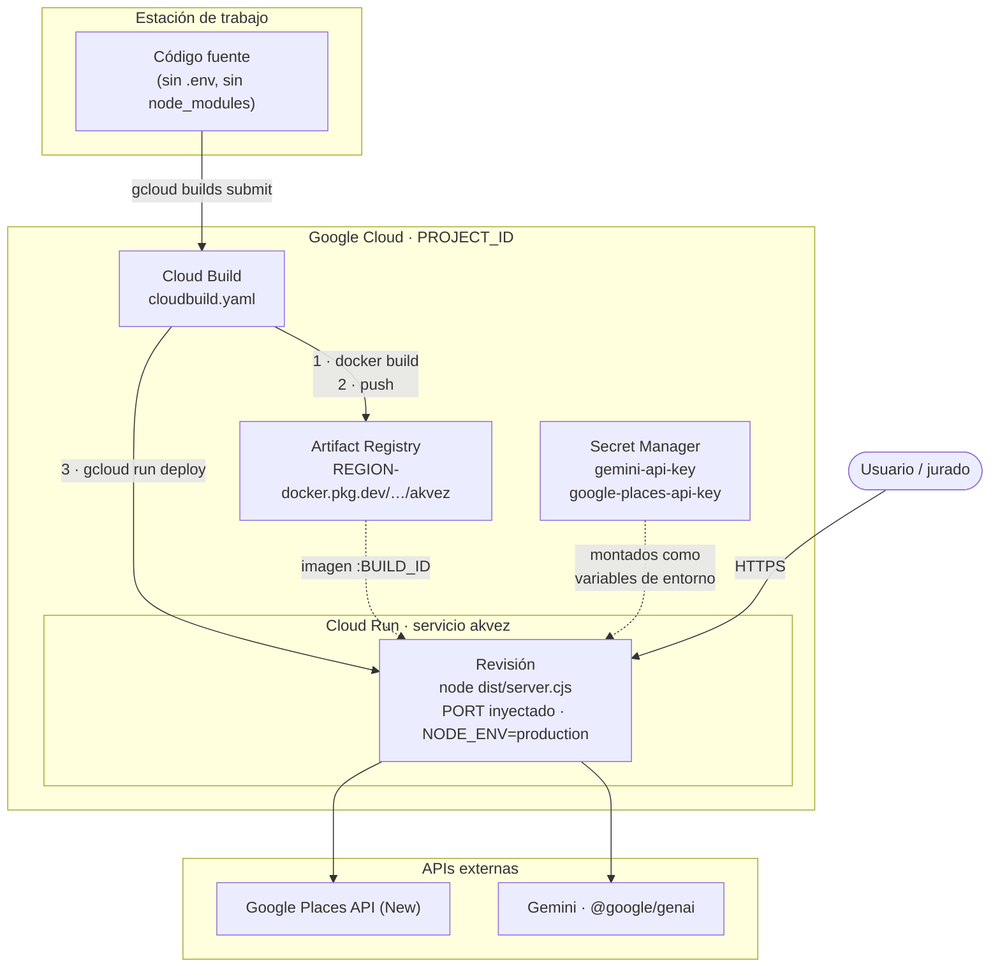

# H-03A — Cloud Deployment Audit

| Campo | Valor |
| --- | --- |
| Documento | **H-03A — Cloud Deployment Audit** |
| Clasificación | **Registro de implementación** — fuera de la Clasificación Oficial de ADS-00 · **no es Blueprint** |
| Estado | ✅ **Artefactos creados y validados hasta donde el entorno lo permite** · ⏸️ **Sin desplegar, por decisión de alcance** |
| Fecha | 2026-08-05 |
| Sprint | **H-03A — Cloud Deployment** · eje **Cloud** de la hackathon |
| Antecedentes | AKVEZ-HACKATHON-ROADMAP §3.5 · H-01 · DEV-01B §7.3 *(T-14)* |

> **Cero cambios funcionales.** No se ha modificado `domain/`, `application/`, el Opportunity Score, la integración con Gemini, los prompts, la UI, los DTOs ni el Blueprint. Los tres artefactos creados son **aditivos y externos al código de aplicación**.

---

# 1. Objetivo y resultado

**Objetivo:** convertir AKVEZ en una aplicación desplegable en Google Cloud Run sin alterar su comportamiento.

**Resultado:** existe una ruta completa y documentada. **No se ha desplegado**, conforme al encargo.

| Entregable del alcance | Estado |
| :-: | --- |
| **1. Dockerfile multi-stage** | ✅ Creado — 3 etapas |
| **2. `.dockerignore`** | ✅ Creado |
| **3. `cloudbuild.yaml`** | ✅ Creado — *aplica*: es la vía que evita depender del Docker local |
| **4. Variables por Secret Manager** | ✅ Resuelto **sin cambio de código** — §4 |
| **5. Configuración de Cloud Run** | ✅ Declarada en el paso `deploy` de `cloudbuild.yaml` — §5 |
| **6. Documentación de despliegue** | ✅ Este documento — §7 |

## 1.1 Por qué no hizo falta tocar el código

**AKVEZ ya cumplía las tres condiciones que Cloud Run exige.** El sprint fue de empaquetado, no de adaptación:

| Requisito de Cloud Run | Estado previo | Evidencia |
| --- | :-: | --- |
| **Escuchar el puerto que inyecta la plataforma** | ✅ Ya resuelto | `getPort()` lee `process.env.PORT` — `shared/config/env.ts`. Cierre de **T-14** |
| **Escuchar en `0.0.0.0`, no en `localhost`** | ✅ Ya resuelto | `app.listen(PORT, "0.0.0.0", …)` — `startServer.ts:37` |
| **Producir un artefacto autónomo** | ✅ Ya resuelto | `npm run build` → `dist/` + `dist/server.cjs`; `npm start` → `node dist/server.cjs` |

> **Diagnóstico del roadmap confirmado:** AKVEZ estaba *«a un `Dockerfile` de ser desplegable»* (§3.5). Lo estaba literalmente.

---

# 2. Arquitectura final del despliegue

## 2.1 Vista general



## 2.2 Anatomía de la imagen

```
┌──────────────────────────────────────────────────────────────┐
│ Etapa 1 · builder            node:22-alpine                  │
│   npm ci            (dependencias completas, incl. dev)      │
│   npm run build     → vite build   → dist/index.html         │
│                                      dist/assets/            │
│                     → esbuild      → dist/server.cjs         │
└──────────────────────────────────────────────────────────────┘
                              │ dist/
┌──────────────────────────────────────────────────────────────┐
│ Etapa 2 · production-deps    node:22-alpine                  │
│   npm ci --omit=dev  (solo dependencias de ejecución)        │
└──────────────────────────────────────────────────────────────┘
                              │ node_modules/
                              ▼
┌──────────────────────────────────────────────────────────────┐
│ Etapa 3 · runtime            node:22-alpine                  │
│   NODE_ENV=production · PORT=8080 · USER node                │
│   /app/node_modules  ← etapa 2                               │
│   /app/dist          ← etapa 1                               │
│   /app/package.json                                          │
│   CMD ["node", "dist/server.cjs"]                            │
└──────────────────────────────────────────────────────────────┘

Fuera de la imagen final: código fuente · tests · toolchain de build ·
TypeScript · Vitest · documentación · .env
```

## 2.3 Las dos decisiones que gobiernan la imagen

### ⚠️ 2.3.1 `vite` es dependencia de **arranque**, no solo de build

`dist/server.cjs` se empaqueta con `--packages=external`: **el bundle no contiene sus dependencias, las exige en tiempo de ejecución.** Los `require` externos del artefacto compilado son exactamente tres:

| Módulo | Origen | Por qué está en la imagen |
| --- | --- | --- |
| `express` | `dependencies` | Servidor HTTP |
| `@google/genai` | `dependencies` | Cliente Gemini |
| **`vite`** | `dependencies` | **`startServer.ts:3` lo importa de forma estática** |

> **`startServer.ts` importa `createServer` de `vite` en la cabecera del módulo.** En producción **nunca se invoca** —lo protege `if (!isProduction())`, `startServer.ts:23`— pero el `require` **sí se resuelve al cargar el proceso**. Si el módulo no está instalado, el contenedor **muere al arrancar**, no al primer request.
>
> **Funciona porque `vite` está declarado en `dependencies`, no en `devDependencies`** *(`package.json:25`)*, y por tanto sobrevive a `npm ci --omit=dev` — **verificado**, §6.2.
>
> 🔴 **Consecuencia para el futuro:** mover `vite` a `devDependencies` —que parece la limpieza obvia— **rompería el contenedor en producción**. Queda anotado en el Dockerfile y registrado como riesgo **R-1**.

### 2.3.2 `NODE_ENV=production` se fija en la imagen, no en el despliegue

`startServer.ts:23` decide con esa variable **si sirve `dist/` como estático o si arranca Vite en modo middleware.** Sin ella, el contenedor levantaría un servidor de desarrollo.

Se declara **en el `Dockerfile`** *(la imagen es de producción por construcción)* **y además** en `--set-env-vars` del despliegue *(explícito y auditable en la consola de Cloud Run)*. La redundancia es deliberada: ninguno de los dos sitios es suficiente por sí solo para quien lee solo uno de ellos.

---

# 3. Archivos creados — 4

| # | Archivo | Naturaleza |
| :-: | --- | --- |
| **1** | `Dockerfile` | Imagen multi-stage de 3 etapas |
| **2** | `.dockerignore` | Contexto de build |
| **3** | `cloudbuild.yaml` | Pipeline build → push → deploy |
| **4** | `docs/hackathon/H-03A — Cloud Deployment Audit.md` | Este documento |

**Archivos modificados: ninguno.** **Archivos eliminados: ninguno.**

---

# 4. Variables de entorno

## 4.1 Inventario

| Variable | Origen en el despliegue | ¿La lee el código? | Criticidad |
| --- | --- | :-: | :-: |
| **`GEMINI_API_KEY`** | **Secret Manager** → `gemini-api-key:latest` | ✅ `getGeminiApiKey()` | 🟡 Degradable — hay respaldo heurístico |
| **`GOOGLE_PLACES_API_KEY`** | **Secret Manager** → `google-places-api-key:latest` | ✅ `getGooglePlacesApiKey()` | 🔴 **Imprescindible** — sin ella no hay negocios reales |
| **`NODE_ENV`** | `--set-env-vars` + `ENV` del Dockerfile | ✅ `getNodeEnv()` / `isProduction()` | 🔴 **Imprescindible** — decide el modo de servido |
| **`PORT`** | **Inyectada por Cloud Run** *(8080)* | ✅ `getPort()` | 🔴 Imprescindible — ya resuelta *(T-14)* |
| ~~`APP_URL`~~ | — | ❌ **Ningún fichero la consulta** | ⚪ **No se despliega** |

> **`APP_URL` se omite deliberadamente.** Está en `.env.example` como herencia de AI Studio y **no la lee ninguna línea del código** —confirmado en AKVEZ-02 §1.1 y verificado de nuevo en este sprint por búsqueda en el árbol: solo aparece en `.env.example` y en documentación—. Declararla en Cloud Run sería configuración muerta.

## 4.2 Por qué Secret Manager no exigió tocar código

**`server/shared/config/env.ts` es la única frontera del backend con `process.env`** (ADR-04 §11 · DEV-00 RI-9). Cloud Run monta cada secreto **como variable de entorno del proceso**, que es exactamente la forma que ese módulo ya consume.

> **El secreto no viaja dentro de la imagen** —se resuelve en el arranque de cada revisión— **y el código no sabe que existe Secret Manager.** La frontera de configuración que el Blueprint ya imponía es lo que hizo gratuito este punto del alcance.

## 4.3 Lo que deliberadamente **no** se hizo

| Descartado | Motivo |
| --- | --- |
| **Cargar `dotenv` en `server.ts`** | **No autorizado** *(decisión abierta desde H-01.2 · H-02 D-2)* y **no necesario en Cloud Run**, que inyecta el entorno directamente. Sigue afectando solo a la ejecución **local** |
| **Montar secretos como volumen** | Exigiría leer ficheros: cambio de código en `shared/config` |
| **Inyectar secretos en el build** | Los grabaría en una capa de la imagen |

---

# 5. Configuración de Cloud Run

| Parámetro | Valor | Justificación |
| --- | --- | --- |
| `--port` | `8080` | Convención de Cloud Run; coincide con `EXPOSE` y el `ENV PORT` de la imagen |
| `--cpu` | `1` | Suficiente: el trabajo es E/S contra APIs externas |
| `--memory` | `512Mi` | Node + Express + estáticos. `vite` está instalado pero no se carga en producción |
| `--min-instances` | `0` | Coste cero en reposo. **Implica arranque en frío** — riesgo **R-4** |
| `--max-instances` | `3` | **Cortafuegos de cuota**: acota cuántas instancias pueden consumir Places API en paralelo |
| `--timeout` | `300` | Una búsqueda recorre varias zonas y analiza en tandas; el margen evita cortes en vivo |
| `--allow-unauthenticated` | *activado* | La demo necesita URL pública. **La aplicación no tiene autenticación propia** — riesgo **R-3** |
| `--set-secrets` | 2 secretos | §4 |
| `--set-env-vars` | `NODE_ENV=production` | §2.3.2 |

**Sonda de arranque:** se usa la **TCP por defecto** sobre el puerto del contenedor. El endpoint `GET /api/health` existe (`routes/index.ts:18`) y sirve para **verificación manual** tras el despliegue (§7, paso 6); no se configura como sonda HTTP para no introducir una gestión del servicio por YAML que este sprint no necesita.

---

# 6. Validaciones

## 6.1 Suite del proyecto — sin regresión

| Validación | Resultado |
| --- | :-: |
| `npx tsc --noEmit` | ✅ **Sin errores** |
| `npm run lint` *(alias de `tsc --noEmit`)* | ✅ **Sin errores** |
| `npm test` | ✅ **197/197** · 26 ficheros |

> **El resultado era esperable y sigue siendo información:** ningún artefacto de este sprint entra en el grafo de compilación ni en el de pruebas. **La ausencia de cambio es la prueba de que el sprint no tocó el producto.**

## 6.2 Validación de los supuestos del contenedor

**Se validó cada supuesto sobre el que se apoya el `Dockerfile`, ejecutando el mismo contrato que ejecuta la imagen:**

| # | Supuesto | Cómo se comprobó | Resultado |
| :-: | --- | --- | :-: |
| **1** | `npm run build` produce el artefacto esperado | Ejecutado | ✅ `dist/index.html`, `dist/assets/`, `dist/server.cjs` *(135 kB)* |
| **2** | El bundle solo exige `express`, `@google/genai` y `vite` | Inspección de los `require` de `dist/server.cjs` | ✅ Tres externos, más nativos de Node |
| **3** | `npm ci --omit=dev` conserva esos tres | `npm ci --omit=dev --dry-run` | ✅ Elimina `typescript`, `vitest`, `@types/*`, `autoprefixer`… · **no elimina `vite`, `express` ni `@google/genai`** |
| **4** | `NODE_ENV=production PORT=8080 node dist/server.cjs` arranca y sirve | Ejecutado en local | ✅ `Servidor LeadFlow corriendo en http://0.0.0.0:8080` |
| **5** | El servicio responde el health check | `GET /api/health` | ✅ **HTTP 200** — `{"status":"ok","message":"Servidor LeadFlow activo."}` |
| **6** | Sirve la SPA y sus estáticos en producción | `GET /`, `GET /assets/index-*.js`, `GET /biblioteca` | ✅ **200**, **200**, **200** *(fallback SPA correcto)* |

> **El paso 4 es la validación relevante:** `CMD ["node", "dist/server.cjs"]` con `NODE_ENV=production` y `PORT` inyectado es **exactamente** lo que hará el contenedor. El comportamiento en el que se apoya el despliegue está verificado por ejecución, no por lectura.

## 6.3 🔴 Lo que **no** pudo validarse — y por qué

> **`docker` y `gcloud` no están instalados en el entorno de desarrollo actual.** Ambos comandos fallan con *command not found*.

| Sin validar | Consecuencia |
| --- | --- |
| **La construcción de la imagen** | El `Dockerfile` está verificado **por inspección** contra un contrato de arranque que sí está probado, **no por un `docker build` real** |
| **El pipeline de Cloud Build** | La sintaxis de `cloudbuild.yaml` no ha sido aceptada por el servicio |
| **El despliegue** | Fuera de alcance por decisión del encargo |

**Esto no es un fallo del sprint —el encargo pide dejarlo listo, no desplegarlo— pero sí acota qué significa «listo»:** la ruta está completa y razonada; **la primera ejecución real seguirá siendo la primera ejecución real.** El checklist de §8 está escrito para esa ejecución.

---

# 7. Procedimiento de despliegue

> **Prerrequisitos:** un proyecto de Google Cloud con facturación activa y `gcloud` autenticado (`gcloud auth login`).
>
> Sustituya `PROJECT_ID` y, si procede, `REGION` *(por defecto `us-central1`)*.

### Paso 1 — Seleccionar el proyecto y habilitar las APIs

```bash
gcloud config set project PROJECT_ID

gcloud services enable \
  run.googleapis.com \
  cloudbuild.googleapis.com \
  artifactregistry.googleapis.com \
  secretmanager.googleapis.com \
  places.googleapis.com \
  generativelanguage.googleapis.com
```

### Paso 2 — Crear el repositorio de imágenes

```bash
gcloud artifacts repositories create akvez \
  --repository-format=docker \
  --location=us-central1 \
  --description="Imágenes de AKVEZ"
```

### Paso 3 — Crear los secretos

```bash
printf '%s' 'VALOR_DE_LA_CLAVE_GEMINI' | \
  gcloud secrets create gemini-api-key --data-file=-

printf '%s' 'VALOR_DE_LA_CLAVE_PLACES' | \
  gcloud secrets create google-places-api-key --data-file=-
```

> **`printf` en lugar de `echo`:** `echo` añade un salto de línea que quedaría **dentro** del secreto y viajaría en la cabecera de autenticación. Es un fallo silencioso y molesto de diagnosticar.
>
> **Para rotar una clave** *(no recreelo)*:
> ```bash
> printf '%s' 'NUEVO_VALOR' | gcloud secrets versions add gemini-api-key --data-file=-
> ```
> El servicio apunta a `:latest`; la nueva versión entra **en el siguiente despliegue**, no en las instancias vivas.

### Paso 4 — Conceder permisos

```bash
PROJECT_NUMBER=$(gcloud projects describe PROJECT_ID --format='value(projectNumber)')

# La cuenta de servicio del runtime debe poder leer los secretos.
for SECRET in gemini-api-key google-places-api-key; do
  gcloud secrets add-iam-policy-binding "$SECRET" \
    --member="serviceAccount:${PROJECT_NUMBER}-compute@developer.gserviceaccount.com" \
    --role="roles/secretmanager.secretAccessor"
done

# La cuenta de Cloud Build debe poder desplegar en Cloud Run.
gcloud projects add-iam-policy-binding PROJECT_ID \
  --member="serviceAccount:${PROJECT_NUMBER}-compute@developer.gserviceaccount.com" \
  --role="roles/run.admin"

gcloud iam service-accounts add-iam-policy-binding \
  "${PROJECT_NUMBER}-compute@developer.gserviceaccount.com" \
  --member="serviceAccount:${PROJECT_NUMBER}-compute@developer.gserviceaccount.com" \
  --role="roles/iam.serviceAccountUser"
```

> ⚠️ **La cuenta de servicio de Cloud Build depende de la configuración del proyecto.** En proyectos recientes es la de Compute por defecto; en otros, `PROJECT_NUMBER@cloudbuild.gserviceaccount.com`. **Confírmelo antes de ejecutar** — es el origen más habitual de un `PERMISSION_DENIED` en el paso `deploy`.

### Paso 5 — Construir y desplegar

```bash
gcloud builds submit --config cloudbuild.yaml
```

Para sobreescribir región o nombre de servicio:

```bash
gcloud builds submit --config cloudbuild.yaml \
  --substitutions=_REGION=us-central1,_SERVICE_NAME=akvez
```

### Paso 6 — Verificar

```bash
SERVICE_URL=$(gcloud run services describe akvez \
  --region=us-central1 --format='value(status.url)')

echo "$SERVICE_URL"

# 1 · El proceso está vivo
curl -s "$SERVICE_URL/api/health"
#   → {"status":"ok","message":"Servidor LeadFlow activo."}

# 2 · La SPA se sirve (confirma NODE_ENV=production)
curl -s -o /dev/null -w '%{http_code}\n' "$SERVICE_URL/"
#   → 200

# 3 · Las credenciales llegaron al proceso: una búsqueda real
#     debe devolver metadata.usedFallbackEngine === false
curl -s -X POST "$SERVICE_URL/api/prospect/search" \
  -H 'Content-Type: application/json' \
  -d '{"niche":"restaurantes","city":"Bogotá"}' | head -c 400
```

> **La verificación 3 es la única que distingue un despliegue correcto de uno aparentemente correcto.** Los pasos 1 y 2 pasan igual **sin credenciales**: el sistema responde HTTP 200 con análisis de respaldo *(R-64 — el fallo parcial nunca aborta el conjunto)*. **Un despliegue sin claves parece sano.**

### Paso 7 — Diagnóstico, si algo falla

```bash
gcloud run services logs read akvez --region=us-central1 --limit=100
```

| Síntoma | Causa probable |
| --- | --- |
| **El contenedor no arranca** | Un módulo de ejecución falta en la imagen — §2.3.1 |
| **La revisión no despliega y cita el secreto** | Falta `secretAccessor` — paso 4 |
| **Responde, pero se ve el HTML sin estilos o falla el `/`** | `NODE_ENV` no llegó como `production` |
| **Responde 200 pero siempre con respaldo** | Las claves no llegaron, o la API no está habilitada / sin facturación |

---

# 8. Checklist de despliegue

### Antes de construir

- [ ] Proyecto de Google Cloud seleccionado y **con facturación activa**
- [ ] Las **6 APIs** del paso 1 habilitadas
- [ ] **Places API (New)** habilitada y verificada con una búsqueda real *(pendiente desde H-01)*
- [ ] **Modelo de Gemini verificado como existente** *(pendiente desde H-01 — riesgo R-2 del roadmap)*
- [ ] Repositorio `akvez` creado en Artifact Registry, en la **misma región** que el servicio
- [ ] Los **2 secretos** creados, **sin salto de línea final**
- [ ] `roles/secretmanager.secretAccessor` concedido sobre **ambos** secretos
- [ ] Cuenta de servicio de Cloud Build **confirmada** y con `run.admin` + `iam.serviceAccountUser`
- [ ] `npx tsc --noEmit` limpio · `npm test` **197/197**
- [ ] **Ningún `.env` en el árbol de trabajo** *(cubierto por `.gitignore` y `.dockerignore`, comprobar igualmente)*

### Durante el primer build

- [ ] El paso `build` termina sin error *(nunca se ha ejecutado — §6.3)*
- [ ] **`npm ci` de la etapa 1 completa los scripts de instalación** de `esbuild` — sin ellos, `vite build` falla. **Riesgo R-2**
- [ ] El paso `push` publica las etiquetas `:BUILD_ID` y `:latest`
- [ ] El paso `deploy` crea una revisión y devuelve una URL

### Después de desplegar

- [ ] `GET /api/health` → **HTTP 200**
- [ ] `GET /` devuelve la SPA con estilos → confirma `NODE_ENV=production`
- [ ] Navegación por las 3 pantallas sin errores en consola
- [ ] 🔴 **Una búsqueda real devuelve `metadata.usedFallbackEngine === false`** — la única prueba de que las claves llegaron
- [ ] Los negocios devueltos son **reales y de la ciudad pedida**
- [ ] Tiempo de una búsqueda completa **medido y anotado** *(ritmo de la demo en vivo)*
- [ ] Consumo de cuota de Places tras una búsqueda **verificado**
- [ ] URL pública **anotada** para el guion de demo
- [ ] Logs revisados: sin errores repetidos ni reinicios

---

# 9. Riesgos

| # | Riesgo | Prob. | Impacto | Mitigación |
| :-: | --- | :-: | :-: | --- |
| **R-1** | 🔴 **Mover `vite` a `devDependencies`** — la limpieza aparentemente obvia — **impide arrancar el contenedor**, porque `startServer.ts` lo importa estáticamente *(§2.3.1)* | 🟡 Media | 🔴 **Crítico** | **Anotado en el `Dockerfile`, en §2.3.1 y aquí.** Se cerraría de verdad con un import dinámico dentro de la rama de desarrollo — **cambio de código, fuera de alcance** |
| **R-2** | **`npm ci` sin ejecutar los scripts de instalación de `esbuild`.** npm ≥ 11.6 introduce aprobación explícita de esos scripts; `node:22-alpine` incorpora npm 10.x y **no está afectada**, pero un cambio de imagen base lo activaría y **`vite build` fallaría** | 🟡 Media | 🟡 Alto | Base pinada a `node:22-alpine`; verificación explícita en el checklist del primer build |
| **R-3** | ⚠️ **El servicio es público y la aplicación no tiene autenticación.** Cualquiera con la URL puede lanzar búsquedas **contra la cuota de Places del proyecto** | 🔴 **Alta** | 🟡 Alto | `--max-instances=3` acota el paralelismo. **Para exposición prolongada: retirar `--allow-unauthenticated`, o poner un límite de presupuesto y alertas.** **Decisión del PO** |
| **R-4** | **Arranque en frío** con `--min-instances=0`: la primera petición tras un periodo de inactividad paga el arranque del contenedor | 🔴 Alta | 🟡 Medio | **Para la demo en vivo: `--min-instances=1` un rato antes**, y una petición de calentamiento antes de empezar |
| **R-5** | **Imagen más grande de lo necesario:** `vite` y su cadena *(rollup, esbuild)* viajan en producción por lo dicho en R-1 | 🟢 Baja | 🟢 Bajo | Se acepta. Afecta al tiempo de despliegue, no al comportamiento |
| **R-6** | **`node:22-alpine` es una etiqueta móvil:** dos builds separados en el tiempo pueden no partir de la misma base | 🟡 Media | 🟡 Medio | Para reproducibilidad estricta, **pinar por digest** (`node:22-alpine@sha256:…`). **No se hizo: exige un digest verificado, y no hay Docker en el entorno** |
| **R-7** | **Persistencia en memoria** — los 5 adapters son `inMemory*`. **Cada revisión nueva, cada escalado y cada arranque en frío vacía la Biblioteca de Leads** | 🔴 **Alta** | 🟡 Medio | **Conocido y aceptado** *(roadmap §8)*. En Cloud Run se agrava: **con varias instancias, dos peticiones pueden ver bibliotecas distintas.** `--max-instances=3` no lo evita |
| **R-8** | **El despliegue parece sano sin credenciales:** HTTP 200 con respaldo heurístico *(R-64)* | 🔴 Alta | 🔴 **Crítico en demo** | **La verificación 3 del paso 6 es obligatoria**, no opcional |

---

# 10. Cuestiones abiertas para el PO

| # | Cuestión | Por qué requiere decisión |
| :-: | --- | --- |
| **1** | **¿El servicio queda público** *(`--allow-unauthenticated`)*? | Está así por necesidad de la demo. **Expone la cuota de Places a Internet** — R-3 |
| **2** | **¿Se autoriza cargar `dotenv`** en `server.ts`? | **Sigue abierta desde H-01.2.** No afecta a Cloud Run; afecta a **ejecutar y probar en local antes de desplegar** |
| **3** | **¿Se pina la imagen base por digest?** | Reproducibilidad estricta frente a mantenimiento — R-6 |
| **4** | **¿Se ajusta `--min-instances` para el día de la demo?** | Coste continuo frente a arranque en frío en vivo — R-4 |

---

# 11. Referencias

**Código:** `Dockerfile` · `.dockerignore` · `cloudbuild.yaml` · `package.json:8-9,25` · `server.ts` · `server/bootstrap/startServer.ts:3,23,30,37` · `server/shared/config/env.ts` · `server/routes/index.ts:18` · `server/routes/healthRoute.ts` · `vite.config.ts` · `.env.example`.

**Documentos:** AKVEZ-HACKATHON-ROADMAP §3.5, §5 *(H-01.5)* · H-01 — Demo Readiness Audit · H-03-F1 — Runtime Validation Report · AKVEZ-02 — Runtime Validation Audit §1.1-1.2 · DEV-01B §7.3 *(T-14)* · ADR-04 §11 · DEV-00 R-64, RI-9.
